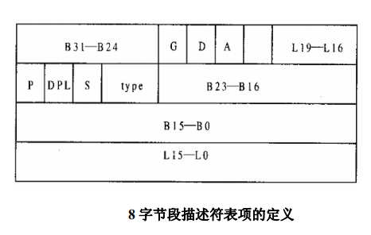
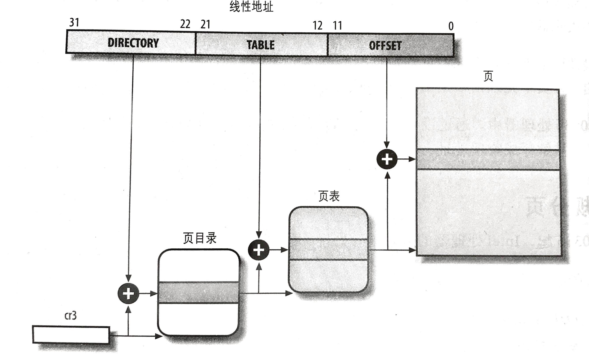
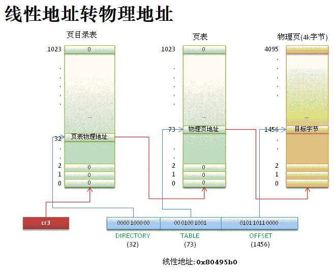

## 内存寻址

### 内存地址

我们偶尔会引用内存地址作为访问内存单元内容的一种方式，但是，当使用 80x86 微处理器时，我们必须区分以下三种不同的地址：

#### **逻辑地址（logical address）**

包含在机器语言指令中用来**规定一个操作数或一条指令的地址**。

每个逻辑地址都由一个段（segment）和偏移量（offset或displacement）组成，偏移量指明了从段开始的地方到实际地址之间的距离。

#### **线性地址（linear address）**

线性地址也称为**虚拟地址**（virtual address）。

线性地址是一个32位无符号整数，可以用来表示高达4GB的地址，也就是，高达4294967296个内存单元。线性地址通常用十六进制数字表示，值的范围从0x00000000到0xffffffff。

#### **物理地址（physical address）**

用于内存芯片级内存单元寻址。它们与从微处理器的地址引脚发送到内存总线上的电信号相对应。物理地址由32位或36位无符号整数表示。

#### 地址转换

内存控制单元（MMU）通过**分段单元把一个逻辑地址转换成线性地址**；

然后，第二个**分页单元把线性地址转换成一个物理地址**。


### 分段单元

分段单元**把逻辑地址转换成线性地址**。

#### 段选择符和段寄存器

逻辑地址由两部分组成：**一个段标识符和一个指定段内相对地址的偏移量**。**段选择符并不直接指向段,而是指向段描述符表中定义段的段描述符。**

段标识符是一个16 位长的字段，称为段选择符（Segment Selector），而偏移量是一个32 位长的字段。

为了快速方便地找到段选择符，处理器提供段寄存器，**段寄存器的唯一目的是存放段选择符**。这些段寄存器称为cs、ss、ds、es、fs 和gs。尽管只有 6 个段寄存器，但程序可以把同一个段寄存器用于不同的目的，方法是先将其值保存在内存中，用完后再恢复。

6 个寄存器中 3 个有专门的用途：

- cs 代码段寄存器，指向包含程序指令的段。
- ss 栈段寄存器，指向包含当前程序栈的段。
- ds 数据段寄存器，指向包含静态数据或者全局数据段。

其他3 个段寄存器作一般用途，可以指向任意的数据段。

cs 寄存器还有一个很重要的功能：它含有一个两位的字段，用以指明CPU 的当前特权级（Current Privilege Level，CPL）。值为 0 代表最高优先级，而值为 3 代表最低优先级。Linux 只用 0 级和 3 级，分别称之为内核态和用户态。

#### 段描述符（Segment Descriptor）

**每个段由一个 8 字节的段描述符表示**，它描述了段的特征。**段描述符放在全局描述符表**（Global Descriptor Table ,GDT）**或局部描述符表**（Local Descriptor Table, LDT）中。

80386 **CPU中增设了两个寄存器**：一个是全局性的段描述表寄存器GDTR，另一个是局部性的段描述表寄存器LDTR，**分别可以用来指向存储在内存中的一个段描述结构数组，或者称为段描述表**。由于这两个寄存器是新增设的，不存在与原有的指令是否兼容的问题，访问这两个寄存器的专用指令便设计成“特权指令”。


在此基础上，段寄存器的高13位（低3位另作它用）用作访问段描述表中具体结构的下标(index)，如下图所示：


**通常只定义一个GDT**，而**每个进程**除了存放在GDT 中的段之外如果还需要创建附加的段，就**可以有自己的LDT**。GDT在主存中的地址和大小存放在GDTR控制寄存器中，当前正被使用的LDT 地址和大小放在LDTR控制寄存器中。

GDTR或LDTR中的段描述表指针和段寄存器中给出的下标结合在一起，才决定了具体的段描述表项在内存中的什么地方，也可以理解成，**将段寄存器内容的低3位屏蔽掉（里面是段表述表寄存器选择和特权级别设置）后与GDTR或LDTR中的基地址相加得到描述表项的起始地址。**

因此就无法通过修改描述表项的内容来玩弄诡计，从而起到保护的作用。每个段描述表项的大小是8个字节，**每个描述表项含有段的基地址和段的大小**，再加上其它一些信息，其结构如下图所示。



结构中的 B31 ~ B24 和 B23 ~ B16分别为**基地址**的 bit16 ~ bit23 和 bit24 ~ bit31，

L19 ~ L16和L15 ~ L0则为**段长度**的 bit10 ~ bit15 和 bit16 ~ bit19


#### 逻辑地址->线性地址


分段单元（segmentationunit）执行以下操作：

1. **先检查段选择符的TI字段，以决定段描述符保存在哪一个描述符表中。**TI字段指明描述符是在GDT 中（在这种情况下，分段单元从GDTR寄存器中得到GDT的线性基地址）还是在激活的LDT中（在这种情况下，分段单元从LDTR寄存器中得到LDT 的线性基地址）。
2. **从段选择符的 index 索引字段计算段描述符的地址**，index 字段的值乘以8（一个段描述符的大小，左移3位，从13位转为16位），**这个结果与GDTR或LDTR寄存器中的内容相加**。
3. **把逻辑地址的偏移量与段描述符的Base 字段的值**相加就得到了线性地址。


### 分页单位

**分页单元把线性地址转换成物理地址。** 其中的一个关键任务是**把所请求的访问类型与线性地址的访问权限相比**较，如果这次内存访问是无效的，就**产生一个缺页异常**。

为了效率起见，**线性地址被分成以固定长度为单位的组，称为页**（page）。**页内部连续的线性地址被映射到连续的物理地址中。**这样，内核可以指定一个页的物理地址和其存取权限，而不用指定页所包含的全部线性地址的存取权限。我们遵循通常习惯，使用术语“页”既指一组线性地址，又指包含在这组地址中的数据。

**分页单元把所有的RAM 分成固定长度的页框**（有时叫做物理页）。每一个页框包含一个页，也就是说**一个页框的长度与一个页的长度一致。**页框是主存的一部分，因此也是一个存储区域。区分一页和一个页框是很重要的，前者只是一个数据块，可以存放在任何页框或磁盘中。每个页（虚拟地址）和页框（物理地址）大小为4KB。

把线性地址映射到物理地址的数据结构称为页表（page table）。**页表存放在主存中，并在启用分页单元之前必须由内核对页表进行适当的初始化。**MMU以页为单位管理系统的页表，也是最小单位。

#### 线性地址->物理地址

从80386 起，**Intel 处理器的分页单元处理4KB 的页。**

32 位的线性地址被分成 3 个域：

- **Directory**（目录）：最高10 位
- **Table**（页表）：中间10 位
- **Offset**（偏移量）：最低12 位



**线性地址的转换分两步完成，每一步都基于一种转换表，第一种转换表称为页目录表，第二种转换表称为页表**。

使用这种**二级模式的目的在于减少每个进程页表所需RAM的数量**。如果使用简单的一级页表，那将需要高达2<sup>20</sup>个表项（在每项 4 个字节时，需要 4MB RAM）来表示**每个**进程的页表（如果进程使用全部4GB线性地址空间），即使一个进程并不使用那个范围内的所有地址。**二级模式通过只为进程实际使用的那些虚拟内存区请求页表来减少内存容量。**

**每个活动进程必须有一个分配给它的页目录。**不过，没有必要马上为进程的所有页表都分配RAM。**只有在进程实际需要一个页表时才给该页表分配RAM会更为有效率。**

**正在使用的页目录的物理地址存放在控制寄存器 cr3 中。**线性地址内的Directory 字段决定页目录中的目录项，而目录项指向适当的页表。地址的Table 字段依次又决定页表中的表项，而**表项含有页所在页框的物理地址**。

Offset 字段决定页框内的相对位置。由于**它是12 位长，故每一页含有4096 字节的数据**。

Directory 字段和 Table 字段都是10 位长，因此页目录和页表都可以多达1024 项。那么**一个页目录可以寻址到高达1024×1024×4096=2<sup>32</sup>个存储单元**，这和我们对32 位地址所期望的一样。



#### 举例

这个简单的例子将有助于阐明常规分页是如何工作的。

我们假定内核已给一个正在运行的进程分配的线性地址空间范围是 0x20000000 到 0x2003ffff。

这个空间正好由64页组成。我们不必关心包含这些页的页框的物理地址，事实上，其中的一些页甚至可能不在主存中。我们只关注页表项中剩余的字段。


让我们从分配给进程的线性地址的最高10 位（分页单元解释为Directory 字段）开始。这两个地址都以 2 开头后面跟着0，因此高10 位有相同的值，即0x080 或十进制的128。因此，这两个地址的Directory 字段都指向进程页目录的第129项。相应的目录项中必须包含分配给该进程的页表的物理地址。

如果没有给这个进程分配其它的线性地址，则页目录的其余 1023 项都填为0。

中间 10 位的值（即Table 字段的值）范围从0 到 0x03f，或十进制的从 0 到 63。因而只有页表的前 64 个表项是有意义的，其余 960 个表项都填0。

假设进程需要读线性地址 0x20021406 中的字节。这个地址由分页单元按下面的方法处理:

1. Directory 字段的 0x80 （0010,0000,00->00/1000/0000）用于选择页目录的第 0x80 目录项, 此目录项指向和该进程的页相关的页表。
2. Table 字段 0x21 用于选择页表的第 0x21 表项, 此表项指向包含所需页的页框。
3. 最后，Offet 字段0x406 用于在目标页框中读偏移量为0x406 中的字节。

**如果页表第0x21 表项的Present 标志为0，则此页就不在主存中；在这种情况下，分页单元在线性地址转换的同时产生一个缺页异常。**

无论何时，当进程试图访问限定在0x20000000 到0x2003ffff 范围之外的线性地址时，都将产生一个缺页异常，因为这些页表项都填充了0，尤其是它们的Present 标志都被清0。

因为这时该页并没有在内存中，因此必须从磁盘请求。一次缺页便是一个**中断(trap)**。**当发生缺页时，内核必须选择一个页框，然后将其内容(页)写回到磁盘，从而用程序刚刚请求的页的内容来填充它。**


## 内存管理

### 综述

内存管理是运行在计算机上的应用程序通过软硬件协作来访问内存的一种方法。内存管理子系统的职责为：**进程请求内存时分配可用内存，进程释放内存后回收内存，以及跟踪系统中内存的使用状况。**

操作系统的生命周期划分为两个阶段：正常执行阶段和自举阶段。**自举阶段使用临时内存**；而正常运行阶段使用的内存有两种情况：**一种是有一部分固定的内存分配给内核代码和数据，另一种是为动态内存请求分配内存。**动态内存请求源于进程的创建和空间的扩张。我们着重介绍操作系统正常运行时对内存的管理。

最简单的内存管理系统是**运行进程对所有内存具有访问权**的系统。以这样方式运行的进程必须包含对所需要的硬件进行操作的全部代码，必须能找到自己的内存地址，而且还必须能将自身的数据载入内存。这种方式不但给开发人员造成了很重的负担，而且还要保证进程与可用内存的大小合适。这些苛刻的要求对于日益复杂化的程序需求来说显然很不现实，所以要将内存管理这个棘手的任务交给操作系统来对付，可用内存会在操作系统和用户进程之间划分。

当代操作系统既要求能够使多个程序共享系统资源，同时还要求内存限制对程序开发者透明。在此需求下，虚拟内存（Virtual memory）应运而生，**虚拟内存支持程序访问比系统物理可用内存大得多的内存空间，而且也使得多个程序共享内存变得更再效。**物理内存（或叫核心内存）是系统中由RAM芯片控制的可用内存。**虚拟内存依靠透明地使用磁盘空间，得以使程序运行起来好像它们使用比系统物理内存更多的内存空间。**磁盘空间（相比物理内存价格更低廉，容量也更大）可作为物理内存的扩充。我们之所以称其为虚拟内存就是因为磁盘存储体有效地充当内存,但它本身并不是内存。下图描述了多级数据存储体的层次关系。


使用虚拟内存时，**程序数据被分割成基本单元**，这些单元可以在磁盘与内存间来回移动。这样，程序正使用的那部分就可以置于内存中，以便快速被访问，而未用的部分则被临时存放在磁盘，如此来减轻待访问数据存在磁盘上导致读取时间过长的问题。**这些数据单元(或者说虚拟内存块)被称作页(Page)。**

同理，**物理内存也需要被划分成用于保存这些页的区，这些区被称作页面\页框(Page Frame)**。当进程请求访问一个地址时，该地址所在的页被载入内存，对页中任一数据的请求都会产生对该页的访问。**如果页中的任一地址以前都没有被访问过，说明该页尚未被装入内存。**对页中地址第一次访问便会产生一个失败或缺页(page fault)，因为这时该页并没有在内存中，因此必须从磁盘请求。**一次缺页便是一个中断(trap)。当发生缺页时，内核必须选择一个页面，然后将其内容(页)写回到磁盘，从而用程序刚刚请求的页的内容来填充它。**

当程序从内存中存取数据时，会使用地址来指出需要访问的内存位置。该地址被称作虚拟地址(virtual address)，它们组成进程虚拟地址空间(virtual address space)。每个进程都有自己独立的虚拟地址范围，这样做的**好处是可防止非法读取或写覆盖其他进程的数据。**虚拟内存允许进程“使用”超过可用物理内存的内存空间，因此**操作系统可以给每个进程提供独立的虚拟线性地址空间。**

**虚拟地址空间的大小取决于体系结构的字长**，如果处理器的寄存器可容纳32位数值，那么运行该程序的处理器支持的进程虚拟地址空间由2<sup>32</sup>个地址构成。**虚拟内存不但扩大了可寻址的内存范围，而且也使得用户空间的开发者不必担心物理内存的本质所带来的限制，比如开发者不需要管理内存中的任何漏洞。**以32位的系统为例，其虚拟地址空间的范围是0~4G,如果系统有 2G 的物理内存，那么它的物理地址范围是 0 ~ 2G。而程序可能有4GB之巨，但是必须被装入可用内存中才能运行，因此整个程序将被存放在磁盘上，只有当需要时页才会被载入到内存。

将页在内存到磁盘之间调入调出的机制被称作分页机制（paging），**分页包括程序虚拟地址到物理内存地址的转换**。

**内存管理器是操作系统中负责维护虚拟地址和物理地址之间的关系，并且实现分页机制**。对内存管理来说，页是基本的内存单元；MMU （Memory Management Unit,内存管理单元）是完成实际的地址转换工作硬件部件，**内核提供了页表（对可用页进行索引的列表）以及MMU在执行地址转换时要访问的相关地址**。上述这些数据都会在页面载入内存时被更新。


### 页

作为内存管理器管理的基本内存单元和内存管理的基本单位，页的许多状态需要被记录下来。比如内核需要知道什么时候页可以被回收。为此，**内核使用页描述符`page struct`，内存中每个物理页都对应一个页描述符。**

```c
struct page 
{
    unsigned long 			flags; 		// 32位的位图，每一位表示页面的一个属性
    atomic_t 				count ; 	// 页的引用计数
    struct list_head 		list; 		// 页表的双向链表
    struct address_space 	*mapping;
    unsigned long 			index;
    struct list_head 		lru; 		// 链接最少使用的页表，可能会被回收
    union{
        struct pte_chain  *chain;
        pte_addr_t direct
   }						pte;
    unsigned long 			private;
   
    #if definde (WANT_PAGE_VIRTUAL)
    void 					*virtual; 	// 指向页的虚拟地址
    #endif
}

```

重点字段：

- flag用于存放页的状态。
- count：count字段相当于计数器，**统计一个页使用或引用的次数**。数值0表示页空闲，即页面是可重用的；正数表示访问该页数据的进程数；当计数值变为-1时，就说明当前内核并没有引用这一页。
- virtual：**virtual是一个指向页所对应虚拟地址的指针**。通常情况下，它就是页在虚拟内存中的地址。但是，有些内存并不永久映射到内核地址空间上（高端内存），在这种情况下，这个域的值为NULL，需要的时候，必须动态映射这些页。

### 区

由于硬件的限制，内核并不能对所有的页一视同仁。有些页框位于内存中特定的物理地址上，所以不能将其用于一些特定的任务。由于存在这种限制，所以**内核把页框划分为不同的区（zone）。内核使用区对具有相似特性的页进行分组。**

Linux必须处理如下两种由于**硬件存在缺陷**而引起的内存寻址问题：

- 一些硬件只能用某些特定的内存地址来执行DMA（直接内存访问）。
- 一些体系结构的内存的物理寻址范围比虚拟寻址范围大的多，这就有一些内存不能永久的映射到内核空间上。

**内存管理区是由页框（或叫物理页）组成**，这意味着，页面的分配来自特定的内存管理区。在Linux系统中存在三个内存管理区：

- ZONE_DMA ：这个区包含的页能用来执行DMA操作。
- ZONE_NORMAL ：具有虚拟映射的非DMA页，这个区包含的都是能正常映射的页。
- ZONE_HIGHMEM ： 这个区包含“**高端内存**”，其中的页并不能永久地映射到内核地址空间。

区的实际使用和分布是与体系结构相关的。比如某些体系结构在内存的任何地址上执行DMA都没有问题。
