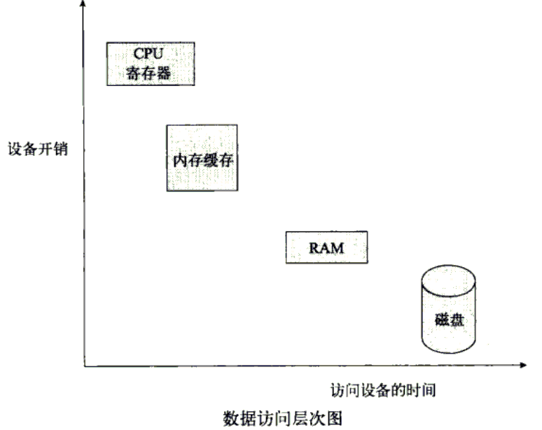
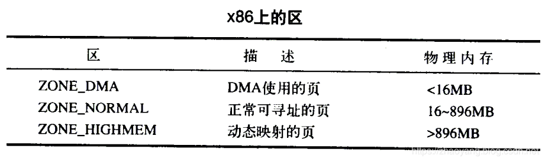
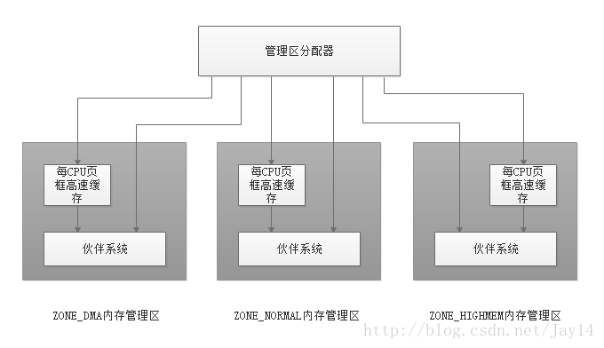
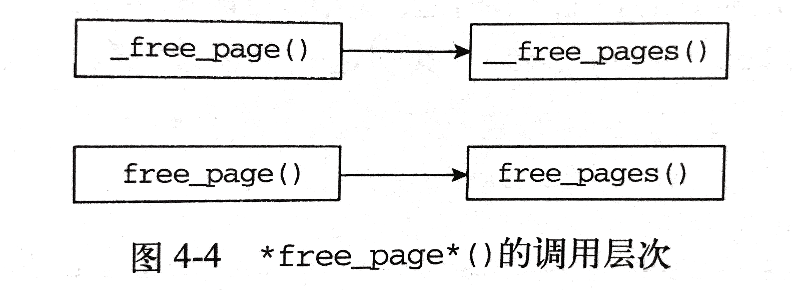

## 内存结构

### 综述

内存管理是运行在计算机上的应用程序通过软硬件协作来访问内存的一种方法。内存管理子系统的职责为：**进程请求内存时分配可用内存，进程释放内存后回收内存，以及跟踪系统中内存的使用状况。**

操作系统的生命周期划分为两个阶段：正常执行阶段和自举阶段。**自举阶段使用临时内存**；而正常运行阶段使用的内存有两种情况：**一种是有一部分固定的内存分配给内核代码和数据，另一种是为动态内存请求分配内存。**动态内存请求源于进程的创建和空间的扩张。我们着重介绍操作系统正常运行时对内存的管理。

最简单的内存管理系统是**运行进程对所有内存具有访问权**的系统。以这样方式运行的进程必须包含对所需要的硬件进行操作的全部代码，必须能找到自己的内存地址，而且还必须能将自身的数据载入内存。这种方式不但给开发人员造成了很重的负担，而且还要保证进程与可用内存的大小合适。这些苛刻的要求对于日益复杂化的程序需求来说显然很不现实，所以要将内存管理这个棘手的任务交给操作系统来对付，可用内存会在操作系统和用户进程之间划分。

当代操作系统既要求能够使多个程序共享系统资源，同时还要求内存限制对程序开发者透明。在此需求下，虚拟内存（Virtual memory）应运而生，**虚拟内存支持程序访问比系统物理可用内存大得多的内存空间，而且也使得多个程序共享内存变得更再效。**物理内存（或叫核心内存）是系统中由RAM芯片控制的可用内存。**虚拟内存依靠透明地使用磁盘空间，得以使程序运行起来好像它们使用比系统物理内存更多的内存空间。**磁盘空间（相比物理内存价格更低廉，容量也更大）可作为物理内存的扩充。我们之所以称其为虚拟内存就是因为磁盘存储体有效地充当内存,但它本身并不是内存。下图描述了多级数据存储体的层次关系。



使用虚拟内存时，**程序数据被分割成基本单元**，这些单元可以在磁盘与内存间来回移动。这样，程序正使用的那部分就可以置于内存中，以便快速被访问，而未用的部分则被临时存放在磁盘，如此来减轻待访问数据存在磁盘上导致读取时间过长的问题。**这些数据单元(或者说虚拟内存块)被称作页(Page)。**

同理，**物理内存也需要被划分成用于保存这些页的区，这些区被称作页面\页框(Page Frame)**。当进程请求访问一个地址时，该地址所在的页被载入内存，对页中任一数据的请求都会产生对该页的访问。**如果页中的任一地址以前都没有被访问过，说明该页尚未被装入内存。**对页中地址第一次访问便会产生一个失败或缺页(page fault)，因为这时该页并没有在内存中，因此必须从磁盘请求。**一次缺页便是一个中断(trap)。当发生缺页时，内核必须选择一个页面，然后将其内容(页)写回到磁盘，从而用程序刚刚请求的页的内容来填充它。**

当程序从内存中存取数据时，会使用地址来指出需要访问的内存位置。该地址被称作虚拟地址(virtual address)，它们组成进程虚拟地址空间(virtual address space)。每个进程都有自己独立的虚拟地址范围，这样做的**好处是可防止非法读取或写覆盖其他进程的数据。**虚拟内存允许进程“使用”超过可用物理内存的内存空间，因此**操作系统可以给每个进程提供独立的虚拟线性地址空间。**

**虚拟地址空间的大小取决于体系结构的字长**，如果处理器的寄存器可容纳32位数值，那么运行该程序的处理器支持的进程虚拟地址空间由2<sup>32</sup>个地址构成。**虚拟内存不但扩大了可寻址的内存范围，而且也使得用户空间的开发者不必担心物理内存的本质所带来的限制，比如开发者不需要管理内存中的任何漏洞。**以32位的系统为例，其虚拟地址空间的范围是0~4G,如果系统有 2G 的物理内存，那么它的物理地址范围是 0 ~ 2G。而程序可能有4GB之巨，但是必须被装入可用内存中才能运行，因此整个程序将被存放在磁盘上，只有当需要时页才会被载入到内存。

将页在内存到磁盘之间调入调出的机制被称作分页机制（paging），**分页包括程序虚拟地址到物理内存地址的转换**。

**内存管理器是操作系统中负责维护虚拟地址和物理地址之间的关系，并且实现分页机制**。对内存管理来说，页是基本的内存单元；MMU （Memory Management Unit,内存管理单元）是完成实际的地址转换工作硬件部件，**内核提供了页表（对可用页进行索引的列表）以及MMU在执行地址转换时要访问的相关地址**。上述这些数据都会在页面载入内存时被更新。


### 页

作为**内存管理器管理的基本内存单元和内存管理的基本单位**，页的许多状态需要被记录下来。比如内核需要知道什么时候页可以被回收。为此，**内核使用页描述符`page struct`，内存中每个物理页都对应一个页描述符。**

```c
struct page 
{
    unsigned long 			flags; 		// 32位的位图，每一位表示页面的一个属性
    atomic_t 				count ; 	// 页的引用计数
    struct list_head 		list; 		// 页表的双向链表
    struct address_space 	*mapping;
    unsigned long 			index;
    struct list_head 		lru; 		// 链接最少使用的页表，可能会被回收
    union{
        struct pte_chain  *chain;
        pte_addr_t direct
   }						pte;
    unsigned long 			private;
   
    #if definde (WANT_PAGE_VIRTUAL)
    void 					*virtual; 	// 指向页的虚拟地址
    #endif
}

```

重点字段：

- flag用于存放页的状态。
- count：count字段相当于计数器，**统计一个页使用或引用的次数**。数值0表示页空闲，即页面是可重用的；正数表示访问该页数据的进程数；当计数值变为-1时，就说明当前内核并没有引用这一页。
- virtual：**virtual是一个指向页所对应虚拟地址的指针**。通常情况下，它就是页在虚拟内存中的地址。但是，有些内存并不永久映射到内核地址空间上（高端内存），在这种情况下，这个域的值为NULL，需要的时候，必须动态映射这些页。

### 区

由于硬件的限制，内核并不能对所有的页一视同仁。有些页框位于内存中特定的物理地址上，所以不能将其用于一些特定的任务。由于存在这种限制，所以**内核把页框划分为不同的区（zone）。内核使用区对具有相似特性的页进行分组。**

Linux必须处理如下两种由于**硬件存在缺陷**而引起的内存寻址问题：

- 一些硬件只能用某些特定的内存地址来执行DMA（直接内存访问）。
- 一些体系结构的内存的物理寻址范围比虚拟寻址范围大的多，这就有一些内存不能永久的映射到内核空间上。

**内存管理区是由页框（或叫物理页）组成**，这意味着，页面的分配来自特定的内存管理区。在Linux系统中存在三个内存管理区：

- ZONE_DMA ：这个区包含的页能用来执行DMA操作。
- ZONE_NORMAL ：具有虚拟映射的非DMA页，这个区包含的都是能正常映射的页。
- ZONE_HIGHMEM ： 这个区包含“**高端内存**”，其中的页并不能永久地映射到内核地址空间。

区的实际使用和分布是与体系结构相关的。比如某些体系结构在内存的任何地址上执行DMA都没有问题。




**Linux把系统的页划分为区，形成不同的内存池**，这样就可以根据用途进行分配了。

例如，ZONE_DMA内存池让内核有能力为DMA（直接内存存取）分配所需的内存。如果需要这样的内存，那么，内核就可以从ZONE_DMA 中按照请求的数目取出页。注意，区的划分没有任何物理意义，这只不过是内核为了管理页而采取的一种逻辑上的分组。

尽管某些分配可能需要从特定的区中获取页，但这并不是说，某种用途的内存一定要从对应的区获取。尽管用于DMA的内存必须从ZONE_DMA中进行分配，但是一般用途的内存却既能从ZONE_DMA分配，也能从ZONE_NORMAL分配。当然，**内核更希望一般用途的内存从常规区分配，这样能节省ZONE_DMA中的页，保证满足DMA的使用需求**。但是，如果可供分配的资源不够用了（如果内存已经变得很少了），那么，内核就会去占用其他可用区的内存。

每个区都用`struct zone`表示，定义在`＜linux/mmzone.h＞`中，我们只介绍下面一些重要的字段：

- lock：是一个自旋锁，它防止该结构被并发访问
- watermark数组持有该区的最小值、最低和最该水位值
- name：是一个以NULL结束的字符串表示这个区的名字。内核启动期间初始化这个值。三个区的名字分别为"DMA"、“Normal”、“HighMem”


### 页框

**页框（page frame）是存放页的基本内存单元**。只要进程请求内存，内核便会请求一个页面给它；同样的，如果页面不再被使用，那么内核便会将其释放，以便其他进程可以再使用。

内核通过被称为分区页框分配器的内核子系统，处理对连续页框组的内存分配请求。



其中，管理区分配器接受动态内存分配与释放的请求，每个管理区内，页框被名为伙伴气筒的

#### 获得页

内核提供了一种请求内存的底层机制，应提供了对它进行访问的几个接口，**所有的接口都以页为单位分配内存**，定义与于<linux/gfp.h>

调用层次图如下：


```c
/*
 * 该函数分配2的order次方个连续的物理页，并返回一个指针，该指针指向第一页
 * 的page结构体，如果出错，就返回NULL。
 */
struct page * alloc_pages(gfp_t gfl_mask,unsigned int order)

/*
 * 该函数分可以把给定的页转换成它的逻辑地址，
 * 该函数返回一个指针，指向给定物理页当前所在的逻辑地址。
 */
void * page_address(struct page *page)

/*
 * 该函数与alloc_pages()作用相同，
 * 不过它直接返回所请求的第一个页的逻辑地址。
 */ 
unsigned long __get_free_pages(gft_t gft_mask, unsigned int order)

/*
 * 如果只需要一页，可以使用下面两个封装好的函数
 * 这两个函数与其兄弟函数工作方式相同，只不过传递给order的值为0
 */         
struct page * alloc_page(gfp_t gfp_mask)
unsigned long __get_free_page(gfp_t gfp_mask)

/*
 * 如果需要让返回的页的内容全为0，可以使用下面的函数
 * 该函数与__get_free_page()工作方式相同，只是把分配好的页都填充成了0
 */          
unsigned long get_zeroed_page( unsigned int gfp_mask)

```

#### 释放页

当不再需要页时，可以使用下面的函数来释放它们：

```c
void __free_pages(struct page * page, unsigned int order)
void free_pages(unsigned long addr, unsigned int order)
void free_page(unsigned long addr)  
```

**释放页面时要谨慎，只能释放你自己的页**。传递了错误的struct page或地址，用了错误的order值，这些都可能导致系统崩溃。

调用层次图如下：



下面看一个示例，我们想要得到8个页：

```c
unsigned long page;
page = __get_free_pages(GFP_KERNEL,3); //GFP_KERNEL参数是gfp_mask标志的一个例子
if(!page){
      /* 没有足够的内存，返回错误 */
      return -ENOMEN;
}

// 释放8个页
free_pages(page,3);  // 2^3=8个页已经被释放，就不应该再访问存放在“page”中的地址了
```

**调用__get_free_pages()之后需要注意进行错误检查，防止内核分配内存失败**。

**当我们需要以页为单位的一族连续物理页时，尤其是你只需要一两页时，这些低级页函数很有用**，对于常用的以字节为单位的分配来说，内核提供的函数是kmalloc()。

