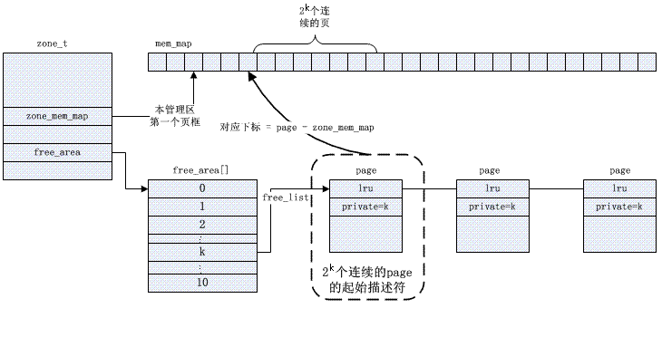
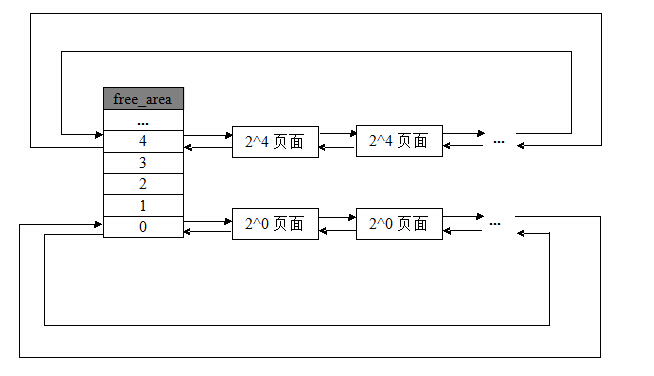
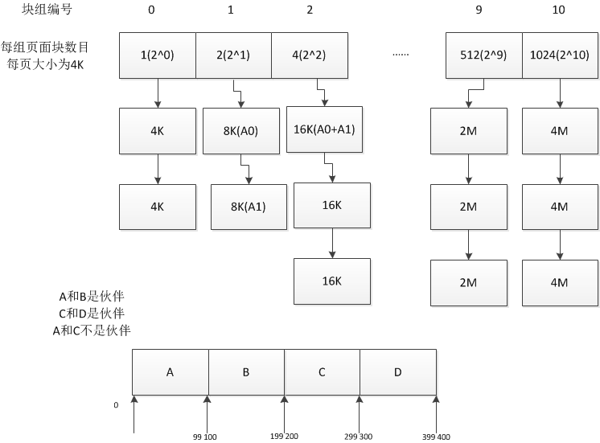

## 内存分配->buddy（深入理解LINUX内核）

### 页框

**页框（page frame）是存放页的基本内存单元**。只要进程请求内存，内核便会请求一个页面给它；同样的，如果页面不再被使用，那么内核便会将其释放，以便其他进程可以再使用。

之前说过每个页框的状态都记录在页描述符`page struct`，所有的页描述符都存放在`mem_map`。

### 页框管理

内核通过被称为**分区页框分配器**的内核子系统，处理对连续页框组的内存分配请求。


其中，管理区分配器**接受动态内存分配与释放的请求**，每个管理区内，页框被名为**伙伴系统**的部分来处理，为了更好的性能，一小部分页框保留在**高速缓存**中用于快速满足对单个页框的分配请求。


### 外碎片

每当页面被分配和回收时，系统都要遇到名为**外部碎片**的内存碎片问题。

这是由于<font color = red>**可用页面散布于整个内存空间中，即使系统可用页面总数足够多，但也无法分配大块连续页面**。</font>

内核应该为**分配一组连续**的页框而建立一种健壮、高效的分配策略。频繁的请求和释放不同大小的一组连续页框，必然导致在已分配页框的块内分散了许多小块的空闲页框。 这样，**即使这些页框是空闲的，其他需要分配连续页框的应用也很难得到满足。**


从本质上来说，避免外碎片的方法有两种：

- 利用**分页单元**把一组**非连续的空闲页框映射到连续的线性地址**区间。(vmalloc)
- 开发一种适当的技术来**记录现存的空闲连续页框块的情况**，以尽量避免为满足对小块的请求而把大的空闲块进行分割。

基于以下三种原因，内核首选第二种方法：

- **在某些情况下，连续的页框确实是必要的，因为连续的线性地址不足以满足请求**。比如给DMA处理器分配缓冲区的时候，DMA会忽略分页单元而直接访问地址总线，因此，所请求的缓冲区就必须位于连续的页框中。
- **频繁的修改页表势必导致平均访问内存次数的增加**，因为会频繁的刷新TLB的内容。（读取内容跨越多页？）
- **内核通过4MB的页可以访问大块连续的物理内存**。


### 伙伴系统

Linux使用著名的 **伙伴系统**(buddy system) 这样的内存管理算法来**解决外部碎片**问题。

**伙伴系统把内存中的空闲块组成11个链表。每个链表都指向不同大小的内存块，虽然大小不同，但都是 2<sup>n</sup>** 。每个块链表分别包含大小为1，2，4，8，16，32，64，128，256，512和1024个连续页框的页框块。

每个页框块的**第一个页框的物理地址是该块大小的整数倍**。 例如：大小为16个页框的块，其起始地址是 16*2<sup>12</sup>的倍数。其中，2<sup>12</sup> = 4KB是一个常规页的大小。


#### 分配

当从伙伴系统时，**从最小的空闲块链表中分配页面**，这样保证了较大的内存块可留给更大的内存请求。若没有，则从更大块分配，并将其拆开，多余部分放入对应链表。

假设要请求一个 128 个页框的块(0.5M)。

1. 算法首先会在128个页框的链表中检查是否有一个空闲块。如果没有找到，那么算法会查找下一个更大的页块。
2. 继续在256个页框的链表中找一个空闲块。如果存在这样的块，那么内核就把256的页框分成两等分，一半用做满足请求，另一半插入到 128 个页框的链表中。
3. 如果在256个页框中没有找到空闲块，那么就继续找更大的块——512个页框的块。如果在其中找到空闲块，那么内核就把512个页框的块的128个页框用做请求，然后从剩余的384个页框中拿出256个插入到256个页框的链表中，再把最后的128个插入到128个页框的链表中。(应该是先拆成两个256进链表，再从链表拿一个拆成两个128)
4. 如果512个页框的链表中仍没有空闲块，继续向1024个页框的链表查找，如果仍然没有，则返回错误。

#### 释放

当分配的块被**释放**时，伙伴系统**搜索与所释放块大小相等的可用空闲内存块**，如果找到**相邻**的空闲块，**那么**就将它们**合并成两倍于自身大小的一个新内存块**。

这些可合并的内存块（所释放块和与其相邻的空闲块）就称为伙伴，所以也就有了伙伴系统一说。之所以要这么做，是因为内核需要确保只要页面被释放，就能获得更大的可用内存块。

分配过程的逆过程就是页框块的释放过程，也是该算法名字的由来。**内核试图把大小为 b 的一对空闲块伙伴合并为一个大小为 2b 的单独块。**满足一下条件的两个块称为伙伴。

- 两个块具有**相同的大小**， 记作 b。
- 它们的物理**地址是连续**的。
- 第一块的第一个页框的物理地址是 2b*2<sup>12</sup> 的倍数。

并且该算法是<font color=red>**迭代**</font>的，**如果它成功合并所释放的块，那么它会试图继续合并 2b的块来形成更大的块。**


#### 数据结构

Linux2.6为每个管理区使用不同的伙伴系统，内核空间分为三种区：DMA、NORMAL、HIGHMEM**，对于每一种区，都有对应的伙伴算法**。

每个伙伴系统使用的主要数据结构如下：

- 每个管理区都关系到mem_map元素的子集，子集中的第一个元素和元素的个数分别由管理区描述符 zone_mem_map 和 size 字段指定。
- 包含有11个元素、元素类型为 free_area 的一个数组，每个元素对于一种块大小，该数组存放在管理区描述符的 free_area 字段中。




```c
#define MAX_ORDER 11
 
struct zone {
  ……
	struct free_area	free_area[MAX_ORDER];		// 共11个链表
	……
} 
 
struct free_area {
	struct list_head	free_list[MIGRATE_TYPES];	//每个块的头
	unsigned long		nr_free;  					//该组类别块空闲的个数
};
```

前面说到**伙伴算法把所有的空闲页框分组为11块链表，内存分配的最大长度便是2<sup>10</sup>页面。**

上面两个结构体向我们揭示了伙伴算法管理结构。

- zone结构中的free_area数组，大小为11，分别存放着这11个组。
- free_area结构体里面又标注了该组别空闲内存块的情况。
  



我们考虑管理区描述符中 **free_area 数组的第 k 个元素，它标识所有大小为2<sup>k</sup>的空闲块**。这个元素的 free_list 字段是双向循环链表的头，这个双向循环链表集中了**每个大小为 2<sup>k</sup>页的空闲块对应的第一个页描述符**。

更精确的说，该链表**包含每个空闲页块(大小为 2<sup>k</sup>)的起始页框的页描述符**；指向链表中相邻元素的指针存放在页描述符的lru字段中。

除了链表头外，free_area 数组的第k个元素同样包含字段nr_free，它指定了大小为 2<sup>k</sup>页的空闲块的个数。当然，如果没有大小为 2<sup>k</sup>的空闲页框块，则nr_free等于 0 且 free_list 为空( free_list 的两个指针都指向它自己的 free_list 字段)。

最后，一个 2<sup>k</sup>的空闲页块的**第一个页的描述符的private字段存放了块的 order，也就是数字 k。正是由于这个字段，当页块被释放时，内核可以确定这个块的伙伴是否也空闲，**如果是的话，它可以把两个块结合成大小为2<sup>k+1</sup>页的单一块。


整个分配图示，大概如下：

