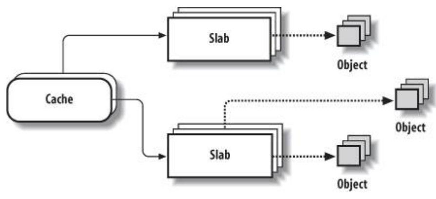
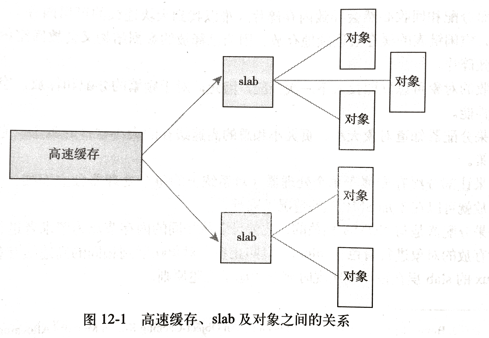

## SLAB

### 综述

slab 是 Linux 操作系统的一种内存分配机制。其工作是**针对一些经常分配并释放的对象**，如进程描述符等，这些对象的大小一般比较小，<font color=red>**如果直接采用伙伴系统来进行分配和释放，不仅会造成大量的内存碎片，而且处理速度也太慢**</font>。

分配和释放**数据结构**是所有内核中最普遍的操作之一。Linux内核提供了slab层（也就是所谓的slab分配器），slab分配器扮演了**通用数据结构缓存层**的角色。

而slab分配器是**基于对象**进行管理的，**相同类型的<font color=red>对象</font>归为一类**(如进程描述符就是一类)，每当要申请这样一个对象，slab分配器就从一个slab列表中分配一个这样大小的单元出去，而当要释放时，将其重新保存在该列表中，而不是直接返回给伙伴系统，从而避免这些内碎片。

- slab分配器并**不丢弃已分配的对象**，而是释放并把它们保存在内存中。

- 当以后又要**请求新的对象时，就可以从内存直接获取**而不用重复初始化。


**Slab分配器为了减少内存分配、初始化、销毁和释放的代价，通常会维护经常使用的内存区的一个现成的缓存区**。这个缓存区维护看分配的、初始化的以及准备部署的内存区。当请求进程不再需要内存区时，就会把释放的内存送回缓存区中。

实际上，**slab分配器由许多缓存组成**，不同的缓存存储大小不同的内存区。缓存可以是**专用**的(specialized)，也可能是**通用**的(general purpose)，专用缓存存储保存**特定对象**的内存区，比如各种描述符，像进程描述符(`task_struct`)就存放在slab分配器维护的缓存中，该缓存存储的内存区的大小为` task_struct `结构体的大小`sizeof (task_struct) `。同样，`inode` 和` dentry `数据结构也存放在缓存中。一般来讲，**通用缓存是预定义大小的内存区组成**，其大小可以是：32、64、128、256、512、1024、2048、4 096、8192、16 384、32768、65536 和131 072字节。


对象高速缓存的组织如下图所示，**高速缓存的内存区被划分为多个slab，每个slab由一个或多个连续的页框组成，这些页框中既包含已分配的对象，也包含空闲的对象**。我们之后会对其进行详细讲解。



slab分配器有以下三个基本目标：

- 减少伙伴算法在分配小块连续内存时所产生的**内部碎片**；
- **将频繁使用的对象缓存起来**，减少分配、初始化和释放对象的时间开销。
- 通过**着色技术**调整对象以更好的使用硬件高速缓存；


### 设计原则

- **频繁使用的数据结构**也会频繁分配和释放，因此应当缓存它们。
- 频繁分配和回收必然会导致内存碎片（难以找到大块连续的可用内存）。为了避免这种现象，**空闲链表的缓存会连续地存放**。因为已释放的数据结构又会放回空闲链表，因此不会导致碎片。
- **回收的对象可以立即投入下一次分配**，因此，对于频繁的分配和释放，空闲链表能够提高其性能。
- 如果分配器知道对象大小、页大小和总的高速缓存的大小这样的概念，它会做出更明智的决策。
- 如果让部分缓存专属于单个处理器（对系统上的每个处理器独立而惟一），那么，分配和释放就可以在不加SMP锁的情况下进行。
- **设计对存放的对象进行着色（colored），以防止多个对象映射到相同的高速缓存行（cacheline）。**（提高部分，可不看）


### 设计

**slab层把不同的<font color=red>对象</font>划分为所谓<font color=red>高速缓存（cache）组</font>**，其中每个高速缓存都存放**同一类型**的对象。**每种对象类型对应一个高速缓存**。例如，一个高速缓存用于存放进程描述符（`task_struct` 结构的一个空闲链表），而另一个高速缓存存放索引节点对象（`struct inode`）。注意，**kmalloc() 接口建立在slab层之上，使用了一组通用高速缓存。**

然后，**这些高速缓存又被划分为slab** （这也是这个子系统名字的来由）。**slab由一个或多个物理上连续的页组成。**一般情况下，slab也就仅仅由一页组成。**每个高速缓存可以由多个slab组成。**



每个 slab 都包含一些对象成员，这里的对象指的是被缓存的数据结构。每个slab处于三种状态之一：

- 满 ：没有空闲的对象（slab中的所有对象都已被分配）
- 部分满：有一些对象已分配出去，有些对象还空闲着。
- 空：没有分配出任何对象（slab中的所有对象都是空闲的）

### 对象

object是slab内存分配器对外提供的申请内存的基本单位。slab内存分配器从buddy system申请了buddy之后，会将其拆分成一个个object，并缓存在kmem cache实例的cpu_cache中，用户申请内存时，其实获取的就是一个个object。

一旦object缓存耗尽，就会重新从buddy system申请slab，并将其拆分成object，放入内存池。


### 分配对象过程

1. 当内核的某一部分需要一个新的对象时，先从部分满的slab中进行分配。
2. 如果没有部分满的 slab，就从空的slab中进行分配**。**
3. 如果没有空的slab，就要创建一个slab了。
4. 当内核用完对象后，slab分配器再把该对象**标记为空闲**。

这种策略能减少碎片。

### 高速缓存描述符

**每个高速缓存都通过`struct kmem_cache_s`缓存描述符来描述，描述符中包含缓存的许多信息。**这些信息中大多数值都是由函数kmem_cache_create()在缓存创建时设置或计算获得的，该函数定义在（mm/slab.c）我们先来看看缓存描述符中的一些字段以及它们存储的信息。

`struct kmem_cache_s`对应一种对象，每种对象对应一个`struct kmem_cache_s`。对象存于slab中。

```c
/**
 * 高速缓存描述符
 */
struct kmem_cache_s {
	···
	struct kmem_list3	lists;	//包含三个链表的结构体,三个链表对应满 空 半满的slabs，每个链表里存着slab_s
	
	unsigned int		objsize;
	unsigned int	 	flags;	/* constant flags */
	unsigned int		num;	/* # of objs per slab */
	
	/* order of pgs per slab (2^n) */
	unsigned int		gfporder;

	/* force GFP flags, e.g. GFP_DMA */
	unsigned int		gfpflags;

	size_t				colour;			/* cache colouring range */
	unsigned int		colour_off;		/* colour offset */
	unsigned int		colour_next;	/* cache colouring */
	kmem_cache_t		*slabp_cache;
	unsigned int		slab_size;
	unsigned int		dflags;			/* dynamic flags */

	/* constructor func */
	void (*ctor)(void *, kmem_cache_t *, unsigned long);

	/* de-constructor func */
	void (*dtor)(void *, kmem_cache_t *, unsigned long);
	const char		*name;
	struct list_head	next;
};
```

- **list字段中包含三个链表头**，其中每个链表头**对应的slab所处的三种状态**之一：部分、完全和空闲，缓存正是通过这个数据结构引用slab。**list本身是有slab描述符的list字段维护者的双向链表。**
- obsize：存放缓存中**对象的大小**（以字节为单位），该值取决于缓存创建时请求的大小以及对其的需要。
- flag：存放标志掩码，掩码描述缓存的固有特性
- num：该字段存放缓存中**每个 slab 所包含的对象数目**。
- name：name存放高速缓存名称。在创建slab时指定的名称，要与链表中。其他slab的名称进行比较，看是否有重名。
- next：**指向缓存描述符单链表中下一个缓存描述的指针**。

这个结构相当的大，Slab Allocator中对**每种”对象”都有一个对应的cache**。**每个cache管理多个slab**。

**Slab才是真正存放”对象”的地方。管理这些”对象”的结构就是slab描述符。**

slab高速缓存分为两大类，普通高速缓存和专用高速缓存。

专用高速缓存是根据内核所需，通过指定具体的对象而创建。

### 通用缓存描述符

通用缓存总是**成对出现**，其中存放预定大小的对象。**一个缓存从DMA内存区分配对象，另一个缓存从普通内存区中分配**。

**`struct cache_sizes` 存放通用缓存大小的所有信息**

slab缓存是在系统自举是被静态初始化，以确保缓存描述符存储空间可用。

```c
/* Size description struct for general caches. */
struct cache_sizes {
	size_t		 cs_size;			// 包含的内存对象的大小
	kmem_cache_t	*cs_cachep;		// 指向普通内存缓存描述符
	kmem_cache_t	*cs_dmacachep;	// 指向DMA内存缓存描述符
};
```

- cs_size：      		该字段存放该缓存中所包含的内存对象的大小
- cs_cachep：          该字段存放指向普通内存缓存描述符的指针，这种缓存存放的对象分配自 ZONE_NORMAL内存区。
- cs_dmacachep：  该字段存放指向DMA内存缓存描述符的指针，DMA内存缓存存放的对象分配自ZONE_DMA。

普通高速缓存并不针对内核中特定的对象，它**首先会为`kmem_cache`结构本身提供高速缓存**，这类缓存保存在`cache_cache`变量中(**cache_cache 缓存便是专门用来存放缓存描述符对象的**)，该变量即代表的是cache_chain链表中的第一个元素；另一方面，它为内核提供了一种通用高速缓存。

它**从 cache_cache 普通高速缓存中为新的高速缓存分配一个高速缓存描述符，并把这个描述符插入到高速缓存描述符的cache_chain链表中**（当获得了用于保护链表避免被同时访问的cache_chain_sem信号量后，插入操作完成）。

### slab描述符

高速缓存中的每个slab都有自己的 `struct slab_s`（等价于slab_t类型）的描述符。slab描述符可以存放在两个可能的地方。

- **外部slab描述符**：存放在slab外面，这种slab处于由cache_sizes所指向的**普通高速缓存中**。
- **内部slab描述符**：存放在slab内部，位于分配给**slab的第一个页框的起始位置**。

<font color=red>**当对象小于512字节时，或者当内碎片在slab内部为slab及对象描述符留下足够的空间时，slab 分配器选择第二种方案**</font>。


```c
typedef struct slab_s {
        struct list_head    list;		// 用于高速缓存描述符中的lists中的slabs_full、slabs_partial或 slabs_free链表的next和prev
        unsigned long    	colouroff;
        void    			*s_mem;     /* including colour offset */
        unsigned int      	inuse;  	/* num of objs active in slab */
        kmem_bufctl_t     	free;
  } slab_t;
```

- list：指向slab描述符的三个双向循环链表中的一个（在高速缓存描述符中的slabs_full、slabs_partial或 slabs_free链表）
- clouroff：slab中第一个对象的偏移
- **s_mem**：指向 slab 中**第一个”对象”**（或被分配或空闲）。
- inuse：当前所分配的slab中的对象个数。对于满或者部分满的slab，该值为正值；对于空闲slab，该值为0。
- free：指向slab中的第一个空闲对象（如果有）。kmem_bufctl_t 数据类型链接处于同一slab中的所有对象。
  

### 本地CPU空闲对象链表

现在说说本地CPU空闲对象链表。这个在kmem_cache结构中用cpu_cache表示，整个数据结构是struct array_cache，它的目的是将释放的对象加入到这个链表中，我们可以先看看数据结构：

```c
struct array_cache {
    /* 可用对象数目 */
    unsigned int avail;
    /* 可拥有的最大对象数目，和kmem_cache中一样 */
    unsigned int limit;
    /* 同kmem_cache，要转移进本地高速缓存或从本地高速缓存中转移出去的对象的数量 */
    unsigned int batchcount;
    /* 是否在收缩后被访问过 */
    unsigned int touched;
    /* 伪数组，初始没有任何数据项，之后会增加并保存释放的对象指针 */
    void *entry[];    /*
};
```

​	因为每个CPU都有它们自己的硬件高速缓存，当此CPU上释放对象时，可能这个对象很可能还在这个CPU的硬件高速缓存中，所以**内核为每个CPU维护一个这样的链表，当需要新的对象时，会优先尝试从当前CPU的本地CPU空闲对象链表获取相应大小的对象。**这个本地CPU空闲对象链表在系统初始化完成后是一个空的链表，只有释放对象时才会将对象加入这个链表。当然，链表对象个数也是有所限制，其最大值就是limit，链表数超过这个值时，会将batchcount个数的对象返回到所有CPU共享的空闲对象链表(也是这样一个结构)中。

　　注意在array_cache中有一个entry数组，里面保存的是指向空闲对象的首地址的指针，注意这个链表是在kmem_cache结构中的，也就是kmalloc-8有它自己的本地CPU高速缓存链表，dquot也有它自己的本地CPU高速缓存链表，每种类型kmem_cache都有它自己的本地CPU空闲对象链表。

### 总结

#### 分配

1. 系统首先会从本地CPU空闲对象链表中尝试获取一个对象用于分配；
2. 如果失败，则尝试来到所有CPU共享的空闲对象链表链表中尝试获取；
3. 如果还是失败，就会从SLAB中分配一个；
4. 这时如果还失败，kmem_cache会尝试从页框分配器中获取一组连续的页框建立一个新的SLAB，然后从新的SLAB中获取一个对象。

#### 释放

1. 首先会先将对象释放到本地CPU空闲对象链表中，
2. 如果本地CPU空闲对象链表中对象过多，kmem_cache会将本地CPU空闲对象链表中的batchcount个对象移动到所有CPU共享的空闲对象链表链表中，
3. 如果所有CPU共享的空闲对象链表链表的对象也太多了，kmem_cache也会把所有CPU共享的空闲对象链表链表中batchcount个数的对象移回它们自己所属的SLAB中，
4. 这时如果SLAB中空闲对象太多，kmem_cache会整理出一些空闲的SLAB，将这些SLAB所占用的页框释放回页框分配器中。

