我的项目

1.  **双缓存日志，日志刷写策略，分级设计，信息格式化**
     双缓存前后端作用：减少加锁时间 增加性能

2. **定时器设计**

3. **缓冲Buffer设计**

4. **ET LE?**
   epoll把epoll实例创建、events增删改还有events轮询都分开了，这样的话epoll实例就可以被同一个进程中的所有线程共享。epoll跟poll一样，使用链表节点记录监听events，但是它有三个链表型结构（就绪链表、辅助链表、红黑树），首先想**要监听的events的节点被放到红黑树里**，这样可以加快events节点的访问。**events就绪之后会被挂载到就绪链表里去**。ep_send_events_proc中，当epoll_wait**从内核空间向用户空间写出就绪events的时候，会遍历就绪链表并获取发生的关心的events**，没有关心的events发生则无视（**所以LT中处理完成的事件不会使得epoll_wait返回**）。同时这个时候可能还会发生新的就绪events，这个时候已就绪的events不再添加到就绪链表里去，而是使用辅助链表**eventpoll.ovflist**... 
   在epoll_wait调用中，epoll会**遍历就绪队列**里的每一个events节点，然后通过**文件的poll方法**再次获取事件的**最新状态revents**，然后把**该events节点从就绪链表中删除**。当revents中包含我们关心的事件events的话，**LT模式还会把该节点重新加入到就绪队列里**，而ET模式也就是edge边界模式不会。这么做有什么影响呢，emmm...让我举个例子，假设我们监听一个管道可读，当事件就绪之后，我们只读了部分内容，还有部分内容没有读。**当我们再次epoll_wait的时候，对LT模式来说，就绪队列里还有这个事件的节点，再次获取状态，对！还是可读的，所以还是不从就绪队列里删除，然后返回这个这个事件**；对ET模式来说，就绪队列里没有这个事件的节点了，所以也就不会再对它进行通知了。那LT模式中的这个事件节点什么时候被删除呢，**假设第一次epoll_wait的时候，我们把管道里的内容全部读完了，下次epoll_wait遍历到这个节点然后重新获取它的状态的时候，它已经不再就绪了，因为管道空了**，**这个时候LT模式就不会再把这个节点重新添加到就绪队列里了**。
   即如果是LT模式，那么每次向用户交付events之后，再次把该epitem挂载到eventpoll中的就绪队列上，下一次epoll_wait()时不休眠直接进入到ep_send_events_proc()中来，通过获取资源文件的最新状态然后与我们关心的events比较：

   1. 如果资源状态还是满足我们关心的events（可能是资源又就绪了，也有可能是上次就绪的资源未消费完），那么还是把它再次交付；
   2. 如果不再满足我们关心的events（上一次的就绪资源已经消费完并且还没有再次就绪），那么将它从就绪队列上卸载之后（下一轮的ep_send_events_proc中，当epoll_wait**从内核空间向用户空间写出就绪events的时候，会遍历就绪链表并获取发生的关心的events**，没有关心的events发生则无视）可就不再重新挂载了...

   **ET不一定会效率高**，比如在read一个管道时，需要用while包裹起来保证一次全部读完直到EAGAIN，这样导致在**一次能read完的情况下多read一次**。
   我使用了LT模式。
   ET不一定会效率高，比如在read一个管道时，需要用while包裹起来保证一次全部读完直到EAGAIN，这样导致在一次能read完的情况下多read一次。

5. **粘包**

6. **测试**
7. **Reactor** 
           Reactor模式是同步I/O，处理I/O操作的依旧是产生I/O的程序；Proactor是异步I/O，产生I/O调用的用户进程不会等待I/O发生，具体I/O操作由操作系统完成。
           Reactor为同步非阻塞模型，Proactor为异步非阻塞模型。核心区别在于I/O具体是由产生I/O的主线程完成还是交给操作系统来完成。 
           异步I/O需要操作系统支持，Linux异步I/O为AIO，Windows为IOCP。
           **在Reactor中，**事件分离器负责等待文件描述符或socket为读写操作准备就绪，然后将就绪事件传递给对应的处理器，最后由处理器负责完成实际的读写工作。
   **作用**
           Reactor是一种事件处理模式，事件驱动应用程序使用Reactor架构来同步地等待一个或多个指示事件的发生，然后分离并分派一个或多个服务请求给事件处理程序中合适的钩子（回调）方法。
   通过这种方式将事件分离分派机制与服务程序中与指示相关的具体处理机制分开。
   **结构** Reactor由5个部分组成：

  * ***句柄*：指用于识别网络连接或文件打开的事件源，由操作系统提供，在linux中一般指**文件描述符**。**

  * ***同步事件分离程序*：一般指对一个函数（**select， poll， epoll**）的封装。用于等待句柄集发生一个或多个事件。在句柄集中没有事件发生时函数会被阻塞。（Epoller）**

  * ***事件处理程序*：用于指定一系列接口，代表了**一系列可用操作（钩子方法，回调）的集合**，用于处理发生于相关句柄上的事件。（Channel）**

  * ***具体事件处理程序*：**实现了应用程序提供的具体服务**，每个具体事件处理程序与一个句柄相关联，实现了处理对应句柄的事件的钩子方法，这些事件通过相关联的句柄进行接收。（Acceptor Connection）**

  * ***反应器*：Reactor模式的核心，用于**①注册和删除事件处理程序即相应句柄的接口，②运行应用的事件处理循环（EventLoop），③有就绪事件到来时，分发事件到之前注册的回调函数上处理
  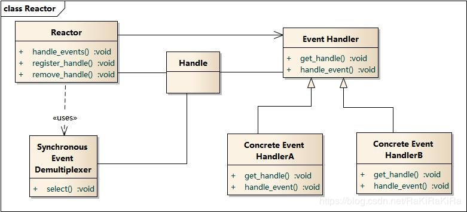**处理方式**
  1. 应用启动，将关具体事件处理程序注册给反应器。
  2. 运行反应器的时间处理循环，调用同步事件分离程序，等待指示事件在句柄集发生
  3. 事件到来，同步事件分离程序返回到反应器
  4. 反应器根据就绪的句柄找到对应的事件处理程序并分派相应的钩子方法。
  5. 钩子方法调用服务。
     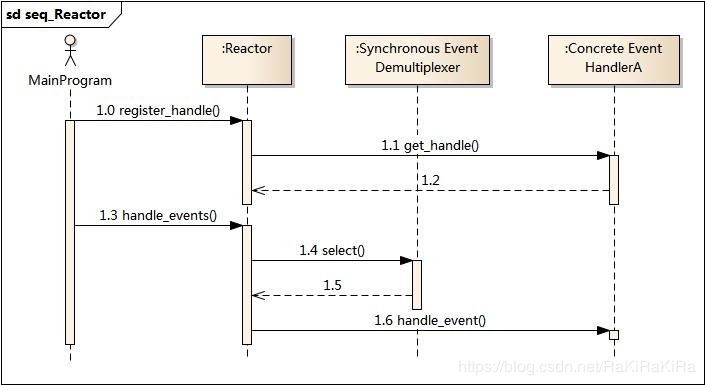


8. **Round-robin**

9. **用到了什么智能指针，为什么用智能指针，shared_ptr和unique_ptr介绍一下，原理，线程安全**
   **RAII是什么？全称呢？和智能指针什么关系？**

10. **在多线程/线程池模式中可能出现一个fd的多个连接触发，导致同一fd在多个线程中处理，当一个进行close时会导致全部关闭，send revc也可能出问题，如何处理（即sockfd状态管理？ChannelMap?）**

11. **心跳设计**

12. **SIGPIPE**

13. **优雅关闭**
    **优雅关闭即关闭时只处理旧的，不接收新的**, 在处理完已有数据后再进行真正的关闭。
    Muduo TcpConnection **没有提供 close，而只提供 shutdown** ，这么做是为了收发数据的完整性。
    TCP 是一个全双工协议，同一个文件描述符既可读又可写， shutdownWrite() 关闭了“写”方向的连接，保留了“读”方向，这称为 TCP half-close。如果直接 close(socket_fd)，那么 socket_fd 就不能读或写了。
    用 shutdown 而不用 close 的效果是，如果对方已经发送了数据，这些数据还“在路上”，那么 muduo 不会漏收这些数据。换句话说，muduo 在 TCP 这一层面解决了“当你打算关闭网络连接的时候，如何得知对方有没有发了一些数据而你还没有收到？”这一问题。当然，这个问题也可以在上面的协议层解决，双方商量好不再互发数据，就可以直接断开连接。
      等于说 muduo 把“主动关闭连接”这件事情分成两步来做，**如果要主动关闭连接，它会先关本地“写”端，等对方关闭之后，再关本地“读”端。**练习：阅读代码，回答“如果被动关闭连接，muduo 的行为如何？” 提示：muduo 在 read() 返回 0 的时候会回调 connection callback，这样客户代码就知道对方断开连接了。
      Muduo 这种关闭连接的方式对对方也有要求，那就是**对方 read() 到 0 字节之后会主动关闭连接（无论 shutdownWrite() 还是 close()）**，一般的网络程序都会这样，不是什么问题。当然，这么做有一个潜在的安全漏洞，万一对方故意不不关，那么 muduo 的连接就一直半开着，消耗系统资源。
      完整的流程是：**我们发完了数据，于是 shutdownWrite，发送 TCP FIN 分节，对方会读到 0 字节，然后对方通常会关闭连接，这样 muduo 会读到 0 字节，然后 muduo 关闭连接。**
      另外，如果有必要，对方可以在 read() 返回 0 之后继续发送数据，这是直接利用了 half-close TCP 连接。muduo 会收到这些数据，通过 message callback 通知客户代码。
      那么muduo 什么时候真正 close socket 呢？在 TcpConnection 对象析构的时候。TcpConnection 持有一个 Socket 对象，**Socket 是一个 RAII handler，它的析构函数会 close(sockfd_)。**这样，如果发生 TcpConnection 对象泄漏，那么我们从 /proc/pid/fd/ 就能找到没有关闭的文件描述符，便于查错。
      muduo 在 read() 返回 0 的时候会回调 connection callback，然后把 TcpConnection 的引用计数减一，如果 TcpConnection 的引用计数降到零，它就会析构了。

  14. **C10K问题本质？**
      C10K问题本质是操作系统问题，创建线程多了，数据频繁拷贝（I/O，内核数据拷贝到用户进程空间、阻塞），进程/线程上下文切换消耗大，从而导致操作系统崩溃。

  15. **为什么不面向对象？**

  16. **读取网页内容使用mmap，原理？**
      **定义**：Linux通过将一个虚拟内存区域与一个磁盘上的对象(object)关联起来，以初始化这个虚拟内存区域的内容，这个过程称为内存映射(memory mapping)
      在Linux中，VM系统通过将虚拟内存分割为称作虚拟页(Virtual Page，VP)大小固定的块来处理磁盘(较低层)与上层数据的传输，一般情况下，每个页的大小默认是4096字节。同样的，物理内存也被分割为物理页(Physical Page，PP)，也为4096字节。
      在mmap之后，**并没有在将文件内容加载到物理页上，只上在虚拟内存中分配了地址空间**。当进程在访问这段地址时（通过mmap在写入或读取时FileA），**若虚拟内存对应的page没有在物理内存中缓存，则产生"缺页"，由内核的缺页异常处理程序处理，将文件对应内容，以页为单位(4096)加载到物理内存**，注意是只加载缺页，但也会受操作系统一些调度策略影响，加载的比所需的多，这里就不展开了。
      
      **详细原理：**
        ***（一）进程启动映射过程，并在虚拟地址空间中为映射创建虚拟映射区域***
        1、进程在**用户空间调用库函数mmap**，原型：void \*mmap(void \*start, size_t length, int prot, int flags, int fd, off_t offset)；
        2、在当前进程的虚拟地址空间中，**寻找一段空闲的连续的虚拟地址**；
        3、为此虚拟区**分配一个vm_area_struct结构**，接着对这个结构的各个域进行了初始化；
        4、将新建的虚拟区结构（vm_area_struct）**插入进程的虚拟地址区域链表或树中**mm-&gt;mmap；

        **（二）调用内核空间的系统调用函数**mmap**（不同于用户空间函数），实现文件物理地址和进程虚拟地址的一一映射关系***
        5、为映射分配了新的虚拟地址区域后，通过待映射的文件指针，在文件描述符表中找到对应的文件描述符，**通过文件描述符，链接到内核“已打开文件集”中该文件的文件结构体（struct file）**，每个文件结构体维护着和这个已打开文件相关各项信息。
        6、通过该文件的文件结构体，**链接到file_operations模块，调用内核函数mmap**，其原型为：int mmap(struct file \*filp, struct vm_area_struct \*vma)，不同于用户空间库函数。
        7、内核mmap函数通过**虚拟文件系统inode模块定位到文件磁盘物理地址**。
        8、通过remap_pfn_range函数**建立页表，即实现了文件地址和虚拟地址区域的映射关系**。此时，这片**虚拟地址并没有任何数据关联到主存中**。

        ***（三）进程发起对这片映射空间的访问，引发缺页异常，实现文件内容到物理内存（主存）的拷贝***
        *注：前两个阶段仅在于创建虚拟区间并完成地址映射，但是并没有将任何文件数据的拷贝至主存。真正的文件读取是当进程发起读或写操作时。*
        9、进程的读或写操**作访问虚拟地址空间**这一段映射地址**时**，**通过查询页表，发现这一段地址并不在物理页面上**。因为目前只建立了地址映射，真正的硬盘数据还没有拷贝到内存中，因此**引发缺页异常**。
        10、缺页异常进行一系列判断，确定无非法操作后，**内核发起请求调页过程**。
        11、调页过程**先在交换缓存空间（swap cache）中寻找需要访问的内存页**，**如果没有则调用nopage函数把所缺的页从磁盘装入到主存中。**
        12、之后进程即可对这片主存进行读或者写的操作，**如果写操作改变了其内容，一定时间后系统会自动回写脏页面到对应磁盘地址**，也即完成了写入到文件的过程。
        注：修改过的脏页面并不会立即更新回文件中，而是有一段时间的延迟，可以调用msync()来强制同步, 这样所写的内容就能立即保存到文件里了。

17. **mmap相对于write/read的好处（从原理解释）**
    read/write：
      1、进程发起读文件请求。
      2、内核通过查找进程文件符表，定位到内核已打开文件集上的文件信息，从而找到此文件的inode。
      3、inode在address_space上查找要请求的文件页是否已经缓存在页缓存中。如果存在，则直接返回这片文件页的内容。
      4、如果不存在，则通过inode定位到文件磁盘地址，将数据从磁盘复制到页缓存。之后再次发起读页面过程，进而将页缓存中的数据发给用户进程。

    总结来说，**常规文件操作为了提高读写效率和保护磁盘，使用了页缓存机制。**这样造成读文件时需要先将文件页从磁盘拷贝到页缓存中，由于页缓存处在内核空间，不能被用户进程直接寻址，所以还需要将页缓存中数据页再次拷贝到内存对应的用户空间中。这样，通过了两次数据拷贝过程，才能完成进程对文件内容的获取任务。
    而**使用mmap读取文件**中，创建新的虚拟内存区域和建立文件磁盘地址和虚拟内存区域映射这两步，没有任何文件拷贝操作。而**之后访问数据时发现内存中并无数据而发起的缺页异常过程，可以通过已经建立好的映射关系，只使用一次数据拷贝**，就从磁盘中将数据传入内存的用户空间中，供进程使用。
    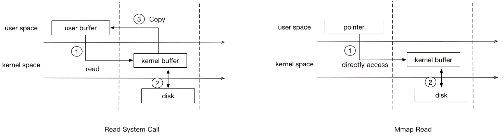

写操作也是一样，待写入的buffer在内核空间不能直接访问，必须要先拷贝至内核空间对应的主存（kernel buffer），再写回磁盘中（延迟写回），也是需要两次数据拷贝。
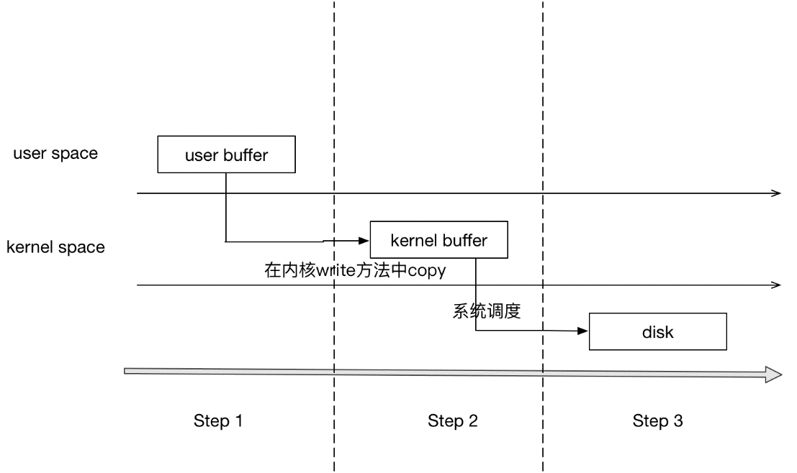
mmap时，写入文件流程：
Step1：进程(用户态)将需要写入的数据直接copy到对应的mmap地址(内存copy)
Step2：
2.1) 若mmap地址未对应物理内存，则产生缺页异常，由内核处理
2.2) 若已对应，则直接copy到对应的物理内存
Step3：由操作系统调用，将脏页回写到磁盘（通常这是异步的）
总而言之，**常规文件操作需要从磁盘到页缓存再到用户主存的两次数据拷贝**。而mmap操控文件，只需要**从磁盘到用户主存的一次数据拷贝过程**。说白了，mmap的关键点是实现了用户空间和内核空间的数据直接交互而省去了空间不同数据不通的繁琐过程。因此mmap效率更高。

mmap时，写入文件流程：
  Step1：进程(用户态)将需要写入的数据直接copy到对应的mmap地址(内存copy)
  Step2：
    2.1) 若mmap地址未对应物理内存，则产生缺页异常，由内核处理
    2.2) 若已对应，则直接copy到对应的物理内存
  Step3：由操作系统调用，将脏页回写到磁盘（通常这是异步的）

mmap系统调用与read/write调用的区别在于：
    1. mmap只需要一次系统调用，后续操作不需要系统调用
        2. 访问的数据不需要在page cache和用户缓冲区之间拷贝

16. BlockingQueue作用
    任务由生产者生产完成，然后交由消费者（通常是业务相关的处理器）进行消费，完成任务的处理。由于**生产者和消费者的处理能力不可能完全一致**，参考实际生活中生产线或工厂库存，**可使用Queue来对二者进行隔离**。生产者将任务生产完毕之后，不是直接交由消费者来进行立即消费，而是将其加入到Queue中；消费者从Queue中获取任务，然后进行任务分配处理。通过Queue进行隔离之后，生产者和消费者的数目可以不同，通常而言，消费者会是任务处理中的瓶颈，因此这种方式更适宜少生产者，多消费者的业务场景。

# 1语言基础（C++）
  1. **指针和引用的区别**

    指针和引用都是一种内存地址的概念，但指针是一个实体，而引用是一个别名。
    
          int x = 1;     //源代码   
          00401048   mov dword ptr [ebp-4],1  //反汇编代码 把1赋值给ebp（栈底指针）-4的地址    
          int &b = x;    //源代码  
         0040104F   lea eax,[ebp-4]          //反汇编代码 把ebp-4的地址赋值给寄存器eax  
         00401052   mov dword ptr [ebp-8],eax//反汇编代码 把寄存器eax里的值赋值给ebp-8的这块地址 指针

  它指向一块内存，指针的内容是所指向的内存的地址。引用的本质就是所引用对象的地址
  在程序编译的时候，将指针和引用添加到符号表中，指针是把“指针变量名－指针变量的地址”放到符号表中，指针包含的内容是可以改变，有const和非const的区别，甚至可以为空；而对于引用来说，它只是一块内存的别名，添加符号表时，是将“引用变量名－引用对象的地址”加入到符号表中。符号表一经完成不能改变。所以引用必须而且只能在定义时被绑定到一块内存上，后续不能更改，也不能为空，也没有const和非const的区别，
  sizeof指针得到的是指针类型的大小，sizeof引用得到的是它所代表的对象的大小。
  在参数传递中，指针需要被解引用后才可以对对象进行操作，而直接对引用进行的修改都会作用到引用所指对象上。

  2. 堆和栈的区别

    **答：从管理方式上，** 
    
    栈是由编译器自动管理，无需我们手动控制； 
    对于堆，开辟和释放工作由程序员控制，所以有内存泄漏等情况的发生。 
    **从申请大小上，** 
    栈是有高地址向低地址扩展的，是一块连续的内存区域，所以栈的栈顶地址或者大小 是一开始就分配好的。在使用过程中，比如递归调用层数过多，那么就有可能造成栈溢出，所以栈能获得的空间比较少； 
    堆是向高地址扩展的，是链表组织的方式，所以有可能是不连续的，他的大小只受限于有效的虚拟内存大小，所以堆能开辟的空间较大。 
    **从碎片问题上，** 
    栈是没有碎片的情况，因为他有严格的出栈入栈，不会存在一个内存块从栈的中间位置弹出，是连续的内存空间； 
    堆有碎片的情况，频繁的调用new/delete分配释放内存，必然会造成内存碎片，不连续。 
    **从分配方式上，** 
    堆都是动态分配的 ，堆是向高地址方向生长
    栈大多是静态分配的，也可以动态分配，可以由alloc函数分配。 栈是向低地址方向生长
    **从分配效率上，** 
    计算机会在底层对栈提供支持，比如有专门的寄存器分配，用来存放栈的地址，压栈出栈的指令等； 
    堆是由c/c++函数库提供的，机制比较复杂（未了解）


    3. new和delete是如何实现的，new 与 malloc的异同处
  答：都可以用来在堆上分配和回收空间。new和delete是操作符，malloc和free是函数。
  **1）new 和delete：**
  执行new实际上执行三个过程：1. 分配未初始化的内存空间（operator new =&gt;malloc）；2. 使用对象的构造函数对空间进行初始化；3. 返回空间的首地址。如果在第一步分配空间中出现问题，则抛出std::bad_alloc异常，或被某个设定的异常处理函数捕获处理；如果在第二步构造对象时出现异常，则自动调用delete释放内存。
  执行delete实际上也有两个过程：1. 使用析构函数对对象进行析构；2.回收内存空间（free）。
  new 和delete   new[] 和delete[]成对出现，动态分配变量或数组变量内存。
  **2）new和malloc **
  以上也可以看出new和malloc的区别，new得到的是经过初始化的空间，而malloc得到的是未初始化的空间。所以new是new一个类型，而malloc则是malloc一个字节长度的空间。delete和free同理，delete不仅释放空间还析构对象，delete一个类型，free一个字节长度的空间。
  **3）为什么有了malloc／free还需要new／delete：**
  因为对于非内部数据类型而言，光用malloc／free无法满足动态对象的要求。对象在创建的同时需要自动执行构造函数，对象在消亡以前要自动执行析构函数。由于mallo／free是库函数而不是运算符，不在编译器控制权限之内，不能够把执行的构造函数和析构函数的任务强加于malloc／free，所以有了new／delete操作符。

  **4)malloc实现**

  https://blog.csdn.net/RaKiRaKiRa/article/details/101482556

    4. **C和C++的区别**
    
    5. **C++、Java的联系与区别，包括语言特性、垃圾回收、应用场景等（java的垃圾回收机制）**
    
    1）**指针**  Java语言让编程者无法找到指针来直接访问内存，即无指针，并增添了自动的内存管理功能，从而有效的防止了C++语言中指针操作失误的影响。但并非Java中没有指针，虚拟机内部还是使用了指针，只是外人不得使用，这有利于Java程序的安全。
    2）**多重继承**  C++支持多重继承，Java不支持，但允许一个类继承多个接口，实现C++中多重继承的功能，又避免了C++中的多重继承实现方式带来的不便。
    3）**数据类型及类**  Java是完全面向对象的语言，所有的函数和变量必须是类的一部分。除了基本数据类型之外，其余的都作为类对象，包括数组。对象将数据和方法结合起来，把它们封装在类中，这样每个对象都可以实现自己的特点和行为。而C++允许将函数和变量定义为全局的。此外，Java中取消了C++中的struct和union（多个变量共用一个存储空间，已达到节省空间的作用）。
    4）**自动内存管理**  Java程序中所有对象都是用new操作符建立在内存堆栈上，Java自动进行无用内存回收操作，不需要程序员进行删除。而C++中必须由程序员释放内存资源，增加了程序设计者的负担。Java中当一个对象不再被用到时，无用内存回收器将给他们加上标签以示删除。Java里无用内存回收程序是以线程方式在后台运行的，利用空闲时间工作。
    5）**操作符重载**  Java不支持操作符重载。操作符重载被认为是C++的突出特性，Java中虽然大体可以实现这个功能，但是操作符重载的方便性仍然丢失了一些。Java语言不支持操作符重载是为了保持Java语言尽可能的简单。
    6）**预处理功能**  Java不支持预处理功能。C++在编译过程中都有一个预编译阶段，Java虚拟机没有与处理器。
    7）Java不支持**缺省函数参数**，C++支持。
    8）**字符串**  C++中字符串是以Null终止符代表字符串的结束，而Java的字符串是用类对象（string和stringBuffer）来实现的。
    9）**goto语句**  Java中不提供goto语句，虽然指定goto作为关键字，但不支持它的使用，使程序简洁易读。
    10）**类型转换**  C++中有自动强制转换，例如，在C++中可以将浮点值赋值给整型变量，并去掉其尾数。Java不支持自动强制类型转换，如果需要，必须由程序强制类型转换。
    11）**异常**  Java的异常机制用于捕获例外事件，增强系统容错能力。

  6. **Struct和class的区别**

    1）**继承时的默认权限**，struct继承时默认是public继承，class默认是private继承，而且要注意继承的默认权限是和子类的类型有关的，例如：struct：class （public）， class：struct （private）；
    2）**成员的默认访问权限**，struct的成员默认访问权限是public，class默认为private。
    3）class关键字可以用于定义模版参数，类似typename，但是struct关键字不能。

  7. **define 和const的区别（编译阶段、安全性、内存占用等）**

    define宏定义实际上是在预编译阶段进行处理，没有类型，也就没有类型检查，仅仅做的是遇到宏定义时进行字符串的展开，遇到多少次就展开多少次，而且这个简单的展开过程中，很容易出现“边界效应”，达不到预期的效果。因为define宏定义仅仅是展开，因此运行时系统并不为宏定义分配内存，但是从汇编的角度来讲，define却以立即数的方式保留了多份数据的拷贝。
    对于const来说，const是在编译期间进行处理的，const有类型，也有类型检查，程序运行时系统会为const常量分配内存，而且从汇编的角度讲，**const常量在出现的地方保留的是真正数据的内存地址，只保留了一份数据的拷贝，省去了不必要的内存空间**。而且，有时编译器不会为普通的const常量分配内存，而是直接将const常量添加到符号表中，省去了读取和写入内存的操作，效率更高。


  8. **符号表**
每个目标文件除了拥有自己的数据和二进制代码外，还提供三个表：未解决符号表，导出符号表，地址重定向表。
**未解决符号表**：提供了所有在该编译单元里引用但定义不是在本编译单元的符号及其出现的地址。
**导出符号表**：提供了本编译单元具有定义并且愿意提供给其他单元使用的符号及其地址。
**地址重定向表**：提供了本编译单元所有对自身地址的引用的记录。
Static声明的全局变量不置入**未解决符号表，**也不置入**导出符号表**，因此**其他单元无法使用**，属于内部链接。
extern声明的变量置入**未解决符号表**，而不置入导出符号表，属于外部链接
普通变化及其函数置入**导出符号表**。
  9. **在C++中const和static的用法（定义，用途）** *作用**/**用途** **TODO*
    **static：**定义为带有C static属性的本地过程变量不在栈中管理。**编译器为其在.data和.bss中定义分配空间，并在符号表中创建一个有唯一名字的本地链接器符号。**Static声明的全局变量不置入**未解决符号表，**也不置入**导出符号表**，因此**其他单元无法使用**，属于内部链接。
    **看csapp的elf和符号表，分析作用**
    1）**static全局变量**：该变量在**全局数据区（数据段）**分配内存，未经初始化的静态全局变量会被程序自动初始化，静态全局变量在声明它的整个文件中是可见的，而在**文件之外是不可见的**（隐蔽性）。**目的**：限定作用域为当前文件，其他文件不可访问该变量
    2）**static局部变量**：该变量在**全局数据区（数据段）**分配内存，静态局部变量在程序执行到该对象的声明时被首次初始化，以后的函数调用中不再进行初始化，静态局部变量一般在声明处初始化，如果没有显式初始化，会被程序自动初始化，静态局部变量始终驻留在全局数据区，直到程序运行结束。但其作用域为局部作用域，当定义它的函数或语句块结束时，其作用域随之结束。
    3）**static函数**：在函数的返回类型前加上static，就定义了静态函数，静态函数的声明在它的整个文件中是可见的，而在**文件之外是不可见的**。
    4）**static成员变量**：类的静态成员变量是和类相关的，而不是和类的对象相关的，存储在**全局数据区（数据段）**。即使没有类的对象，也可以使用static成员变量。声明为static的成员变量还具有持久性，即不因为对象是否存在而改变自身的存在性质，对于某些数据需要全体用户共享时，使用static是个不错的选择。
    要注意，静态数据成员存储在全局数据区，静态数据成员定义时需要分配空间，所以不能在类内部声明中定义，需要在类外进行初始化定义。
    static成员变量与static全局变量相比：

  a）静态数据成员没有进入程序的全局名字空间，因此不存在与程序中其他全局名字冲突的可能性；
  b）可以实现信息隐藏。静态数据成员可以是private成员，而全局变量不能。

  5）**static成员函数**：静态成员函数的目的**主要作为类作用域的全局函数**。不能访问类的非静态成员（因为非静态成员需要依赖对象而存在，可能静态成员存在而非静态成员并不存在）。this指针一般是与当前对象相连的，所以静态成员函数中也**没有this指针**。静态成员在多态上也没有实际意义，所以静态成员函数也**不能是virtual的**。
  static关键字用途太多，以致于让新手模糊。不过，总结起来就有两种作用，改变生命期和限制作用域。 

  l         修饰inline函数：限制作用域，其他文件不可访问该变量
  l         修饰普通函数：  限制作用域，其他文件不可访问该变量
  l         修饰局部变量：  改变生命期
  l         修饰全局变量：  限制作用域，其他文件不可访问该变量
  **const：**
  1）**const全局变量**：该变量在**常量存储区（.rodata gcc）**分配内存，需要在定义时进行初始化且不能改变，有时编译器将简单的const全局变量直接写入符号表中，不分配内存，更加高效。另外，const全局变量也是在文件的**内部使用**，如果想要被外部文件使用，const全局变量**可以在前面加上extern**来完成，static不允许。
  2）**const局部变量**：该变量存放在**栈区**当中，const对编译器进行了约束，约束编译器在局部变量的生存周期中不允许对其进行改变。
  3）**const成员变量**：const成员变量，只在某个对象生命周期内是常量，而对于整个类而言却是可以改变的。因为类可以创建多个对象，不同的对象其const数据成员的值可以不同。所以不能在类的声明中初始化const数据成员，因为类的对象没有被创建时，编译器不知道const数据成员的值是什么。const数据成员的**初始化只能在类的构造函数的初始化列表中进行**。
  4）**const成员函数**：const成员函数的主要目的是**防止成员函数修改对象的内容**， 实际是对this加const。要注意，const关键字和static关键字对于成员函数来说是不可以同时使用的，因为static关键字修饰静态成员函数不含有this指针，即不能实例化，const成员函数又必须具体到某一个函数。

  10. **extern 与 extern “C”**
      extern可以置于变量或者函数前，以标示变量或者函数的定义在别的文件中，提示编译器遇到此变量和函数时在其他模块中寻找其定义。此外extern也可用来进行链接指定。也就是说extern有两个作用
      第一个,**当它与"C"一起连用时**， C++语言在编译的时候为了解决函数的多态问题，**会将函数名和参数联合起来生成一个中间的函数名称**，而C语言则不会，因此会造成链接时找不到对应函数的情况，此时C函数就需要用extern “C”进行链接指定，**使用C的方式来处理函数**，如: extern "C" void fun(int a, int b);
      第二，当extern不与"C"在一起修饰变量或函数时，如在头文件中: extern int g_Int; **它的作用就是声明函数或全局变量的作用范围的关键字，其声明的函数和变量可以在本模块或其他模块中使用**，记住它是一个声明不是定义!也就是说B模块(编译单元)要是引用模块(编译单元)A中定义的全局变量或函数时，它只要包含A模块的头文件即可,在编译阶段，模块B虽然找不到该函数或变量，但它不会报错，它会在连接时从模块A生成的目标代码中找到此函数。 **extern 表明该变量在别的地方已经定义过了,在这里要使用那个变量.**

      extern声明的变量置入**未解决符号表**，而不置入导出符号表，属于外部链接

  11. **计算类的大小， 内存对齐**：
      考虑有虚函数时的虚表指针，虚继承时的偏移指针，多重继承（每一个继承都可能有虚表指针，偏移指针）
  12. **给一个代码，求输出结果class A{   public:   A(int x){}}问：A a = 1;是否正确, 如果正确, 那么它调用了哪些函数？这类题目更常见的是在基类和子类有不同实现方法。（虚函数相关）**
      正确  首先调用带有一个参数的构造函数，用1生成一个临时对象，然后调用赋值构造函数，利用临时对象构造出a。
  13. **STL 的 分配器**
      SGI设计了双层级配置器，第一级配置器直接使用malloc()和free()完成内存的分配和回收。第二级配置器则根据需求量的大小选择不同的策略执行。
      对于第二级配置器，**如果需求块大小大于128bytes，则直接转而调用第一级配置器**，使用malloc()分配内存。如果**需求块大小小于128bytes，第二级配置器中维护了16个自由链表，负责16种小型区块的次配置能力（8\~128）**。
      当有小于128bytes的需求块要求时，**首先**查看所需需求块大小所对应的链表中是否有空闲空间，如果有则直接返回。
      如果没有所需需求块大小，则向内存池中申请所需需求块大小默认20倍的内存空间，如果申请成功，则将其加入到自由链表中。若没有20倍大小但至少有一个需求块大小的空间则尝试尽可能多的分配需求块大小整数倍空间。
      如果内存池中没有空间，则现将剩余部分编入链表，使用malloc()从堆中进行申请，且申请到的大小是需求量的两倍（或二倍＋n附加量），一倍放在自由空间中，剩下放入内存池中。
      如果malloc()也失败，则会遍历自由空间链表，寻找“尚有未用区块，且区块够大”的freelist，找到一块就挖出一块交出。
      如果还是没有，仍交由malloc()处理，因为malloc()有out-of-memory处理机制或许有机会释放其他的内存拿来用，如果可以就成功，如果不行就报bad_alloc异常。 
  14. **迭代器traits**
      traits萃取迭代器的性质，value_type ,  difference_type, pointer, reference,iteratior_category。自己开发的容器，要有自己的迭代器，要继承有这五个部分的typedef，才能是自己的定义与原来的一些算法更兼容。另外，迭代器有五个类型：InputIterator, OutputIterator, ForwardIterator, BidirectionalIterator, 
      RandomAccessIterator,将迭代器分为几种类型是因为在算法中根据traits萃取出的不同迭代器类型，内部可以写出更加高效合适的实现功能的代码。
  15. **STL源码中的hash表的实现**
      Hash底层实现是通过**开链法**来实现的，hash table表格内的元素称为桶（bucket),而由桶所链接的元素称为节点（node),其中存入桶元素的容器为stl本身很重要的一种序列式容器——vector容器。之所以**选择vector为存放桶元素**的基础容器，主要是因为vector容器本身具有动态扩容能力，无需人工干预。
      **负载系数**（loading factor),意指元素个数除以表格大小。很显然，通过开链法，负载系数会大于1。同样在开链方法中，用于装载桶元素的vector容器**大小恒定为一个质数大小**，在具体实现中表现为28个从小到大的28个质数，如：53、97、193、389。。。等等。每次重新分配vector容器大小时，总是将新容器大小设定为第一个大于当前需要的新容器大小的质数值（上述28个质数中的其中一个）
      resize(...)方法：此api主要用于判断当前装载桶元素的vector容器是否需要重建（或者说是扩容），api的唯一参数即为**当前桶元素所链接所有节点个数**，即链表节点个数（包括当前桶元素），假定为new_num。将new_num值与当前装载桶元素vector容器的大小进行比较，如果大于则进行容器扩容，依次将所有的节点元素都根据其本身的hash值放置到新的容器对应的桶元素所在的链表中，每次都是从头部进入插入操作，如果小于或者等于，则直接**插入到其本身属于的桶元素所在的链表头部中**（减少时间）。从中我们可以看到每个桶元素所在的链表的元素个数最多为装载桶元素的vector容器的容量。否则就要进行重建工作。
      insert_unique_noresize(...)方法：此api主要用于往hashtable中插入新值，同时新值不允许重复，否则就不插入，立刻返回。事实上，在正式开始执行此方法之前，**首先需要运行前一个api:resize()方法**，确定vector容器是否需要重建。需要的话则执行，否则再是执行当前api。原理很简单，第一步，根据待插入的新值运行内置函数：bkt_num(new_value)，此方法主要是用于**确定当前新值归属于哪个桶元素所在的链表中**，方便之后插入操作。获取其所在的桶元素之后，**依次遍历当前桶元素所在的链表**，检查是否有与待插入的新值重复的元素，如果有，则直接退出当前函数，如果没有，则**将待插入的新值插入当前链表的头部**，完成新值的插入过程。
  16. **STL中unordered_map和map的区别**
      unordered_map底层是用**hash表**实现的，通过把一个key映射到hash表中的一个位置来存取value值。因此，unordered_map的元素是无序的。但因为内部实现了hash表，因此**查找速度是非常快**的，但是hash表的**建立比较费**时。即unordered_map对于查找问题会更高效一些。
      STL中的map底层是用**红黑树**实现的，由于红黑树具有自动排序的功能，所以map中的元素是有序的，这也是map的最大优点。内部实现一个红黑树，使得map的很多操作在logn的时间复杂度下就可以实现，因此效率也很高。但是也正因为使用了红黑树，每一个节点需要额外保存父节点，孩子节点以及颜色性质等信息，使得每一个节点都**占用大量的空间**。即map在**有顺序要求**的问题中，更加有效。


  17. **STL中vector的实现，容量扩展方法,为何这样设计**
      Vector是动态空间，随着元素的加入，它的内部机制会**自行扩充空间**以容纳新元素。vector维护的是一个**连续的线性空间**，而且**普通指针**就可以满足要求作为vector的迭代器（RandomAccessIterator）。vector的数据结构中其实就是三个迭代器构成的，一个指向目前使用空间头的start，一个指向目前使用空间尾的finish，一个指向目前可用空间尾的end_of_storage。当有新的元素插入时，如果目前容量够用则直接插入，如果容量不够，则容量扩充至两倍(gcc)或1.5倍(vs)，如果两倍容量不足，就扩张至足够大的容量。扩充的过程=是**重新申请一块连续空间**，将原有的数据拷贝到新空间中，再释放原有空间，完成一次扩充。需要注意的是，每次扩充是重新开辟的空间，所以扩充后，**原有的迭代器将会失效**。
      **1）为什么是成倍增长，而不是每次增长一个固定大小的容量呢？**
      如果已成倍方式增长。假定有 n 个元素,倍增因子为 m；需要重新分配内存的次数大约为 logm(n)； 第 i 次重新分配将会导致复制 mi(也就是当前的vector.size() 大小)个旧空间中元素; n 次 push_back 操作所花费的时间复制度为O(n)
      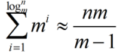
       如果一次增加固定值大小 。假定有 n 个元素,每次增加k个；第i次增加复制的数量为为：ki ；n 次 push_back 操作所花费的时间复杂度为O(n^2):
      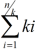
      **2) 为什么是以 2 倍或者 1.5 倍增长，**
      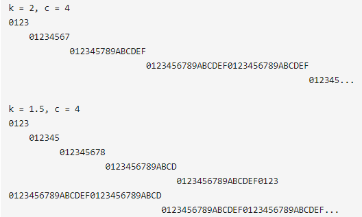
      可以看到，k = 1.5 在几次扩展之后，可以重用之前的内存空间。2比1.5好处是我只分配一次，可以管好久。即新分配次数少。
  18. **vector使用的注意点及其原因，频繁对vector调用push_back()对性能的影响和原因**。
      1）注意插入和删除元素后迭代器失效的问题；
      2）清空vector数据时，如果保存的数据项是指针类型，需要逐项delete，否则会造成内存泄漏。
      频繁调用push_back()影响：向vector的尾部添加元素，很有可能引起整个对象存储空间的重新分配，重新分配更大的内存，再将原数据拷贝到新空间中，再释放原有内存，这个过程是耗时耗力的，频繁对vector调用push_back()会导致性能的下降。
  19. **C++中的重载和重写的区别**：
      重载：翻译自overload，是指同一可访问区内被声明的几个具有不同参数列表的**同名函数**，依赖于C++函数名字的修饰会将参数加在后面，可以是参数类型，个数，顺序的不同。根据参数列表决定调用哪个函数，重载不关心函数的返回类型。template也是重载，由编译器该函数名
      重写（覆盖）：翻译自override，派生类中重新定义父类中除了函数体外完全相同的**虚函数**，注意被重写的函数不能是static的，一定要是虚函数，且其他一定要完全相同。要注意，重写和被重写的函数是在不同的类当中的，重写函数的访问修饰符是可以不同的，尽管virtual中是private的，派生类中重写可以改为public。
      重定义（隐藏）：派生类重新定义**父类中相同名字的非virtual函数**，参数列表和返回类型都可以不同，即父类中除了定义成virtual且完全相同的同名函数才不会被派生类中的同名函数所隐藏（重定义）。
  20. **C ++内存管理（热门问题）**
      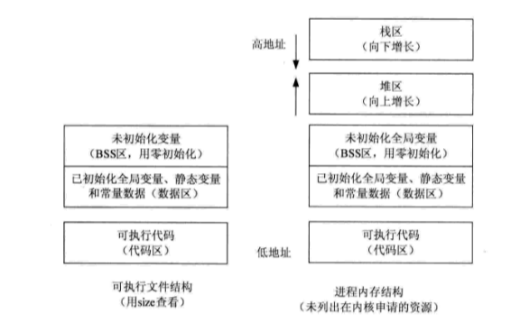
      栈内存的管理是由编译器完成的。（动态分配由alloca函数进行分配，但是栈的动态分配是由编译器进行释放，无需我们手工实现。
      堆空间的管理是由程序员进行的， new和malloc的内存都需要程序员手动释放内存，如果没有释放内存，就删除了指针，就造成了内存泄露。
      1)用new和malloc申请内存时，在使用前需要检查内存是否分配成功(!= NULL);
      2)在使用内存前需要进行初始化；
      3)防止内存释放后仍然使用它，主要有三种情况：

      ​	a)程序的对象调用关系过于复杂，实在难以搞清楚某个对象究竟是否已经释放了内存，此时应该重新设计数据结构，从根本上解决对象管理的混乱局面。
      ​	b)函数的return语句写错了，注意不要返回指向“栈内存”的“指针”或“引用”，因为该内存在函数体结束时已经被自动销毁。
      ​	c)使用free或delete释放了内存之后，没有将指针设置为NULL，导致产生“野指针”。
      ​	“野指针”的成因有三：指针变量没有被初始化，任何指针变量刚被创建时不会自动称为NULL指针，它的缺省值是随机的，它会乱指。所以，指针变量在创建的同时应当被初始化，要么将指针设置为NULL，要么让它指向合法的内存。指针被free或delete之后，没有设置为NULL，让人误以为是个合法指针。指针操作超越了变量的作用范围，如数组越界访问。

      4)指针的注意点：
      	a)指针指向常量存储区对象，是不允许对\*P的内容进行写操作的；
              b)资源泄漏：char \*p = new char[3]; p = “ab”; delete[] p; p早已指向了常量存储区的对象，delete[]对数组进行资源释放会出现错误。
              c)内存越界：char \*p = new char[3]; strcpy(p, “abcd”); delete[] p; strcpy是将“abcd”的内容拷贝到p所指向的内存空间，此处发生了越界，delete[] 析构对象后要释放的空间长度和原始申请的长度不同，释放报错。

  21. **介绍面向对象的三大特性，并且举例说明每一个。**
      **封装**：就是把客观事物封装成抽象的类，并且类可以把自己的数据和方法只让可以信的类或者对象操作，对不可信的进行信息隐藏。一个类就是一个封装了数据以及操作这些数据的代码的逻辑实体。在一个对象内部，某些代码或某些数据可以是私有的，不能被外界访问。通过这种方式，对象对内部数据提供了不同级别的保护，以防止程序中无关的部分意外的改变或错误的使用了对象的私有部分。
      **继承**：是指可以让某个类型的对象获得另一个类型的对象的属性的方法。它支持按级分类的概念。继承是指这样一种能力：它可以使用现有类的所有功能，并在无需重新编写原来的类的情况下对这些功能进行扩展。通过继承创建的新类称为“子类”或者“派生类”，被继承的类称为“基类”、“父类”或“超类”。继承的过程，就是从一般到特殊的过程。要实现继承，可以通过“继承”和“组合”来实现。继承概念的实现方式有两类：○1实现继承○2接口继承。实现继承是指直接使用基类的属性和方法而无需额外编码的能力；接口继承是指仅使用属性和方法的名称、但是子类必需提供实现的能力。
      **多态**：就是向不同的对象发送同一个消息，不同对象在接收时会产生不同的行为（即方法）。即一个接口，可以实现多种方法。（**静态多态与动态多态**的实质区别就是函数地址是早绑定还是晚绑定的。如果函数的调用，在编译器编译期间就可以确定函数的调用地址，并产生代码，则是静态的，即地址早绑定。而如果函数调用的地址不能在编译器期间确定，需要在运行时才确定，这就属于晚绑定。）
  22. **多态的实现（和下个问题一起回答）**
      多态可以分为静态多态和动态多态：
      **静态多态其实就是重载**，因为静态多态是指在编译时期在形成符号表的时候，**对函数名做了区分**，根据参数列表来决定调用哪个函数，也叫**编译时多态**；template也是静态多态。
      动态多态是指**通过子类重写父类的虚函数来实现的**，因为是在运行期间决定调用的函数，所以称为**动态多态**，一般情况下我们不区分这两个时所说的多态就是指动态多态。
      动态多态的实现与虚函数表，虚函数指针相关，下面详述。

  23. **C++虚函数相关（虚函数表，虚函数指针），虚函数的实现原理（热门，重要）**
      首先我们来说一下，C++中多态的**表象**，在基类的函数前加上virtual关键字，在派生类中重写该函数，**运行时**将会根据对象的实际类型来调用相应的函数。如果对象类型是派生类，就调用派生类的函数，如果是基类，就调用基类的函数。实际上，当一个类中包含虚函数时，编译器会为该类生成一个**虚函数表，保存该类中虚函数的地址**，同样，派生类继承基类，派生类中自然一定有虚函数，所以编译器也会为派生类生成自己的虚函数表。当我们定义一个派生类对象时，编译器检测该类型有虚函数，所以为这个派生类**对象生成一个虚函数指针**，**指向该类型的虚函数表**，这个虚函数指针的**初始化在构造函数**中完成的。后续如果有一个基类类型的指针，指向派生类，那么当调用虚函数时，从对象的前4个字节中取虚表地址，根据所指真正对象的虚函数表指针去寻找虚函数的地址，也就可以调用派生类的虚函数表中的虚函数。以此实现多态。
      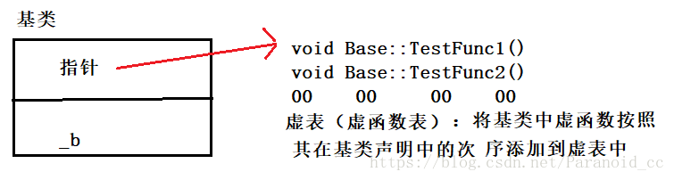
      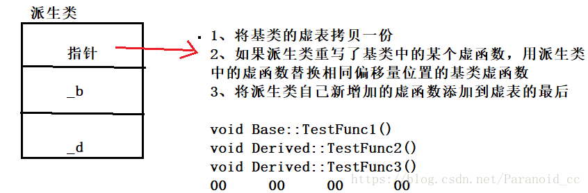
      **补充：**
      如果基类中没有定义成virtual，那么进行Base B; Derived D; Base \*p = D;
      p-&gt;function(); 这种情况下调用的则是**Base**中的function()。因为基类和派生类中都没有虚函数的定义，那么编译器就会认为不用留给动态多态的机会，就事先进行函数地址的绑定（**早绑定**），详述过程就是，定义了一个派生类对象，首先要构造基类的空间，然后构造派生类的自身内容，形成一个派生类对象，那么在进行类型转换时，直接截取基类的部分的内存，编译器认为类型就是基类，那么（函数符号表［不同于虚函数表的另一个表］中）绑定的函数地址也就是基类中函数的地址，所以执行的是基类的函数。
      （1）派生类重写基类的虚函数实现多态，要求**函数名、参数列表、返回值**完全相同
      （2）基类中定义了虚函数，在派生类中该函数**始终保持虚函数**的特性 
      （3）只有类的**非静态成员函数**才能定义为虚函数，静态成员函数不能定义为虚函数 
      （4）如果在类外定义虚函数，只能在声明函数时加virtual关键字，**定义时不用加** 
      （5）**构造函数不能定义为虚函数，**虽然可以将operator=定义为虚函数，但最好不要这么做，使用时容易混淆(?) 
      （6）不要在构造函数和析构函数中调用虚函数，在构造函数和析构函数中，对象是不完整的，可能会出现未定义的行为 
      （7）最好将基类的**析构函数声明为虚函数**。(析构函数比较特殊，因为派生类的析构函数跟基类的析构函数名称不一样，但是构成覆盖，这里编译器做了特殊处理) 
      （8）虚表是所有类对象实例**共用**的
  24. **实现编译器处理虚函数表应该如何处理**
      对于派生类来说，编译器建立虚函数表的过程其实一共是**三个步骤**：
      拷贝基类的虚函数表，如果是多继承，就**拷贝每个**有虚函数基类的虚函数表，当然还有**一个基类的虚函数表和派生类自身的虚函数表共用了一个虚函数表**，也称为某个基类为派生类的主基类；
      查看派生类中是否有**重写基类中的虚函数**，如果有，就替换成已经重写的虚函数地址；
      查看派生类是否有自身的虚函数，如果有，就**追加自身的虚函数到自身的虚函数表**中。
      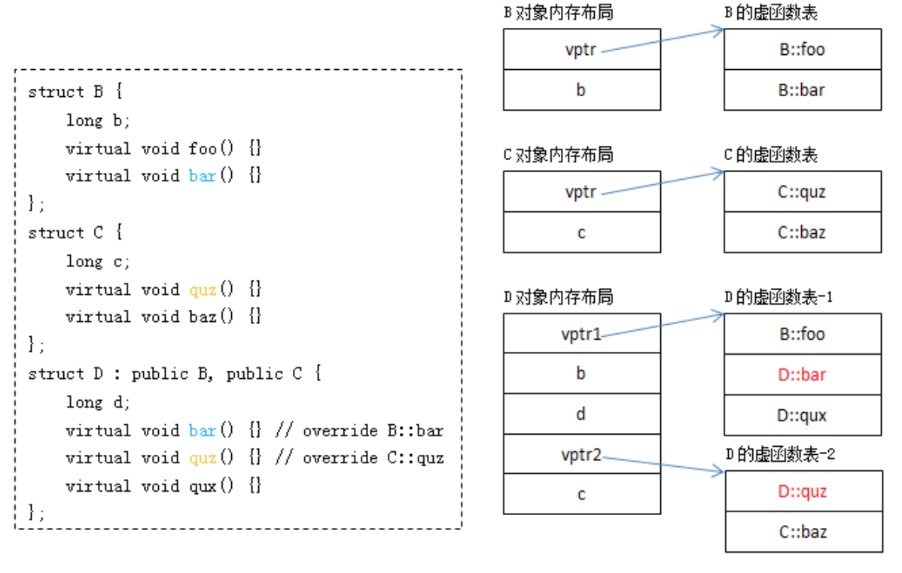
      编译器使用虚函数表的过程要注意的是：
      Derived \*pd = new D();  B \*pb = pd;  C \*pc = pd; 其中pb，pd，pc的指针位置是不同，要注意的是派生类的自身的内容要追加在**主**基类的内存块后。
      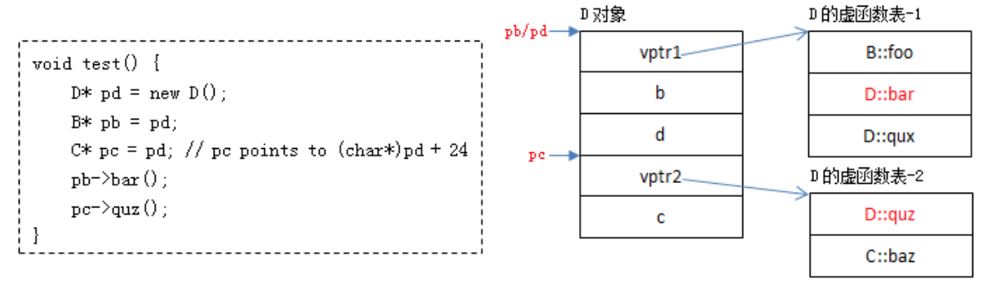
  25. **多继承与重复继承与虚继承**
      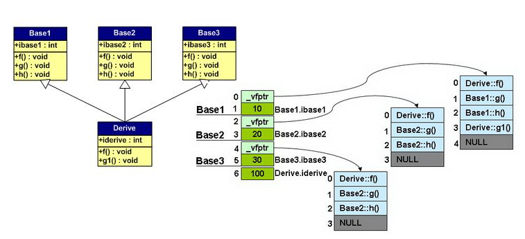
      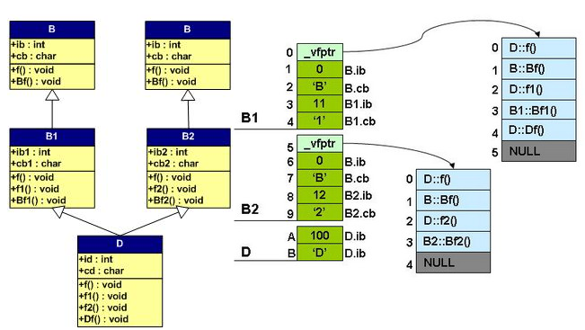

    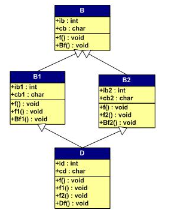 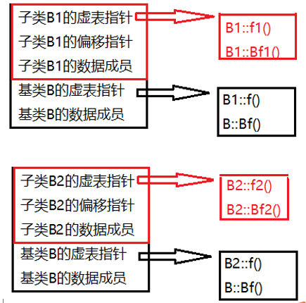
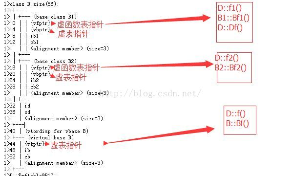
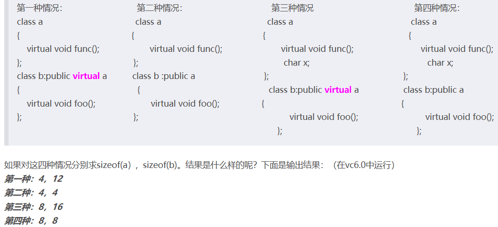

  26. **析构函数一般写成虚函数的原因**
为了降低内存泄漏的可能性。举例来说就是，一个基类的指针指向一个派生类的对象，在使用完毕准备销毁时，如果基类的析构函数没有定义成虚函数，那么编译器根据指针类型就会认为当前对象的类型是基类，调用基类的析构函数（该对象的析构函数的函数地址早就被绑定为基类的析构函数），**仅执行基类的析构**，派生类的自身内容将无法被析构，造成内存泄漏（即使只是int i;）。如果基类的析构函数定义成虚函数，那么编译器就可以根据实际对象，执行派生类的析构函数，再执行基类的析构函数，成功释放内存。
  27. **构造函数为什么不定义为虚函数**
1）虚函数调用只需要知道“部分的”信息，即只需要知道函数接口，而不需要知道对象的具体类型。但是，我们要创建一个对象的话，是需要知道对象的完整信息的。特别是，需要知道要创建对象的确切类型，因此，构造函数不应该被定义成虚函数；
2）而且从目前编译器实现虚函数进行多态的方式来看，虚函数的调用是通过实例化之后对象的虚函数表指针来找到虚函数的地址进行调用的，如果说构造函数是虚的，那么虚函数表指针则是不存在的，**无法找到对应的虚函数表来调用虚函数**，那么这个调用实际上也是违背先实例化后调用的准则的。
  28. **构造函数或者析构函数中调用虚函数会怎样**
**不应该**在构造函数或析构函数中调用虚函数的，因为这样的调用其实并不会带来所想要的效果。举例来说就是，有一个交易记录的基类，基类中定义了一个纪录本身信息的虚函数log()，在基类的构造函数中调用了这个虚函数。派生类中重写了这个虚函数，我们期望着根据对象的真实类型不同，而调用各自实现的虚函数，但实际上当我们创建一个派生类对象时，**首先会**创建派生类的基类部分，**执行基类的构造函数**，此时，**派生类的自身部分还没有被初始化**，对于这种还没有初始化的东西，C++选择当它们还不存在作为一种安全的方法。也就是说构造派生类的基类部分是，编译器会认为这就是一个基类类型的对象，然后**调用基类类型中的虚函数实现**，并没有按照我们想要的方式进行。即对象在派生类构造函数执行前并不会成为一个派生类对象。
在析构函数中也是同理，派生类执行了析构函数后，派生类的自身成员呈现未定义的状态，那么在执行基类的析构函数中是不可能调用到派生类重写的方法的。所以说，我们不应该在构在函数或析构函数中调用虚函数，就算调用一般也不会达到我们想要的结果。
**补充：**如果说非要在构造函数或析构函数中调用一个函数，那么不要将这个函数定义成virtual的，可以给函数提供一个参数，让派生类可以把自身特别的信息传递给基类，这样就可以实现了。即“令派生类将必要的构造信息向上传递给基类的构造函数，因为无法使用虚函数从基类向下调用”。
  29. **纯虚函数**
实际上，纯虚函数的出现就是为了让继承可以出现多种情况，
有时我们希望派生类只继承成员函数的接口，
有时我们又希望派生类既继承成员函数的接口，又继承成员函数的实现，而且可以在派生类中可以**重写**成员函数以实现多态，
有的时候又希望派生类在继承成员函数接口和实现的情况下，不能重写缺省的实现。
其实，声明一个纯虚函数的目的就是为了**让派生类只继承函数的接口**，而且派生类中必需提供一个这个纯虚函数的实现，否则含有纯虚函数的类将是抽象类，不能进行实例化。对于纯虚函数来说，我们其实是可以给它提供实现代码的，但是由于抽象类不能实例化，调用这个实现的唯一方式是在派生类对象中指出其class名称来调用（p-&gt;Base::function()）。
对于第二种情况，就是我们常常使用的impure virtual函数的方法让派生类可以继承基类的接口和缺省实现，而且在重写的作用下实现多态。但实际上有的时候，这种方式可能会造成问题，比如说，基类A中定义了一个虚函数f，派生类B继承A，B的含义具有f的性质，并进行了重写，但是当有一个新的类来C也继承A的时候，其实C没有f的性质，也被强制的具有了f的实现。
这个时候，我们就要做到第三种情况，**定义一个纯虚函数的接口，在定义一个非虚函数的缺省实现**，也可以加上这个缺省实现的访问权限例如protected。派生类中继承这个纯虚函数的接口，然后在自己需要的时候，再实现中加上对基类中缺省实现的调用，如果不用，就可以定义自己的方法，这样**将接口和实现可以分开来继承**，不对缺省的实现进行重写。

  30. **静态绑定和动态绑定的介绍**
说起静态绑定和动态绑定，我们首先要知道静态类型和动态类型，**静态类型**就是它在程序中被声明时所采用的类型，在编译期间确定。**动态类型**则是指“目前所指对象的实际类型”，在运行期间确定。
那么**静态绑定**，又名早绑定，绑定的是静态类型，所对应的函数或属性依赖于对象的静态类型，发生在**编译**期间。**动态绑定**，又名晚绑定，绑定的是动态类型，所对应的函数或属性依赖于动态类型，发生在**运行**期间。
比如说，**virtual函数是动态绑定的，非虚函数是静态绑定的，缺省参数值也是静态绑定的。**这里呢，就需要注意，我们不应该重新定义继承而来的缺省参数，因为即使我们重定义了，也不会起到效果。因为一个**基类的指针指向一个派生类对象**，在派生类的对象中针对虚函数的参数缺省值进行了重定义，但是缺省参数值是静态绑定的，静态绑定绑定的是静态类型相关的内容，所以会出现一种派生类的虚函数实现方式结合了基类的缺省参数值的调用效果，这个与所期望的效果不同。
**补充：**如果实在想在基类中提供缺省参数，**可以在基类中定义一个非虚函数，提供缺省参数值，然后在非虚函数中调用虚函数，并传递这个缺省参数值**。

  31. **引用是否能实现动态绑定，为什么引用可以实现**
这个问题是想问一个基类类型的引用绑定一个派生类类型的对象，是否能通过基类引用执行派生类对象中重写的虚函数么？如果是问这个，那么**可以**，因为在创建一个派生类对象时，派生类对象有一个指向自己的虚函数表的虚函数表指针，**基类类型的引用绑定到派生类对象上，在符号表上可以体现，将引用名和实际对象的内存地址绑定**，那么调用函数时，根据实际对象的虚函数表指针就可以执行实际对象的重写的虚函数了。 
  32. **深拷贝和浅拷贝的区别（举例说明深拷贝的安全性）**
当出现类的等号赋值时，会调用拷贝函数，在未定义显示拷贝构造函数的情况下，系统会调用默认的拷贝函数－即浅拷贝，它能够完成成员的一一复制。**当数据成员中没有指针时，浅拷贝是可行的。**但当数据成员中有指针时，如果采用简单的浅拷贝，则两类中的两个指针指向同一个地址，当对象快要结束时，会调用两次析构函数，而导致指野指针的问题。所以，这时必需采用深拷贝。
深拷贝与浅拷贝之间的区别就在于**深拷贝会在内存中另外申请空间来存储指针指向的数据**，从而也就解决来野指针的问题。简而言之，当数据成员中有指针时，必需要用深拷贝更加安全。**源对象与拷贝对象互相独立**，其中任何一个对象的改动都不会对另外一个对象造成影响

  33. **对象复用的了解，零拷贝的了解**  
      **对象复用**：这里是不是想问C++中执行深拷贝时的内存管理优化中的写时拷贝（Copy On Write）机制的相关内容？
      我们知道深拷贝是为了弥补浅拷贝的不足（当类成员中有指针时的不足），其实，写时拷贝是为了弥补深拷贝的不足。C++中使用了COW的典型例子是string，所谓写时拷贝就是，当你用一个string初始化另外一个string，或对另外一个string赋值时，首先是不会真正执行深拷贝，开辟新的空间的，只有在对两个string中任何一个进行写操作时，才会真正的开辟空间，执行一个拖延版的深拷贝。以此来优化内存的管理。与智能指针shared_ptr一样，COW是通过“引用计数”实现的，在分配空间的时候最多分配4个字节，用来记录有多少个指针指向块空间，当有新的指针指向这块空间时，引用计数加一，当要释放这块空间时，引用计数减一（假装释放），直到引用计数减为0时才真正释放这块空间。当有的指针要改变这块空间的值时，再为这个指针分配自己的空间（此时，旧的空间的引用计数减一，新分配的空间引用计数加一）。

      **零拷贝**（见MMAP）：就是在数据传输过程中尽量避免CPU无用拷贝的一种存储技术。使用mmap()函数代替read()，将数据从磁盘中拷贝到kernel read buffer内核缓冲区中；用gather操作代替write()，gather操作可以从多个不同的缓冲区中读取数据，DMA引擎是可以直接从kernel read buffer内核缓冲区中读取数据的，而不用先将数据从内核缓冲区拷贝到socket缓冲区后再进行读取操作。零拷贝就是尽量让无用的数据拷贝和CPU没有关系，直接利用有关系的内核操作，在数据传输的过程中只进行两次拷贝动作。

  34. **介绍C++所有的构造函数**
      1）**无参数构造函数**：如果没有明确写出无参数构造函数，编译器会自动生成默认的无参数构造函数，函数为空，什么也不做，如果不想使用自动生成的无参构造函数，必需要自己显示写出一个无参构造函数。
      2）**一般构造函数**：也称重载构造函数，一般构造函数可以有各种参数形式，一个类可以有多个一般构造函数，前提是参数的个数或者类型不同，创建对象时根据传入参数不同调用不同的构造函数。
      3）**拷贝构造函数**：拷贝构造函数的函数参数为对象本身的引用，用于根据一个已存在的对象复制出一个新的该类的对象，一般在函数中会将已存在的对象的数据成员的值一一复制到新创建的对象中。如果没有显示的写拷贝构造函数，则系统会默认创建一个拷贝构造函数，**但当类中有指针成员时，**最好不要使用编译器提供的默认的拷贝构造函数**，最好自己定义并且在函数中执行深拷贝。**
      注意，**赋值运算符的重载**类似拷贝构造函数，将＝右边的本类对象的值复制给＝左边的对象，它不属于构造函数，＝左右两边的对象必需已经被创建。如果没有显示的写赋值运算符的重载，系统也会生成默认的赋值运算符，做一些基本的拷贝工作。这里区分  
      A a1, A a2; a1 = a2;//调用赋值运算符 
      A a3 = a1; //调用拷贝构造函数，因为进行的是初始化工作，a3并未存在。

      4）**类型转换构造函数**：根据一个指定类型的对象创建一个本类的对象，也可以算是一般构造函数的一种，这里提出来，是想说有的时候不允许默认转换的话，要记得将其声明为explict的，来阻止一些隐式转换的发生。

  35. **什么情况下会调用拷贝构造函数（三种情况）**
      1）一个对象**以值传递**的方式**传入**函数体，需要拷贝构造函数创建临时对象压入到栈空间中。
      2）一个对象**以值传递**的方式从函数**返回**，需要执行拷贝构造函数创建临时对象作为返回值。
      3）一个对象需要通过另外一个对象进行初始化。
      **补充**：

    上面我们看到，拷贝构造函数影响着“值传递”的发生，这里也就有了一个办法可以**防止“值传递”**，我们声明一个**私有拷贝构造函数**，这样编译器没有默认的拷贝构造函数，我们声明的访问权限定义为私有，如果用户试图按照值传递或函数返回该类对象，将得到一个编译错误，从而可以避免按值传递或按值返回对象。
    **为什么拷贝构造函数的参数必需是引用传递，不能是值传递？**
    为了防止递归调用。当一个对象需要以值方式进行传递时，编译器会生成代码调用它的拷贝构造函数生成一个副本，如果类A的拷贝构造函数的参数不是引用传递，而是采用值传递，那么就又需要为了创建传递给拷贝构造函数的参数的临时对象，而又一次调用类A的拷贝构造函数，这就是一个**无限递归**。
    **拷贝构造函数的参数**：对于一个类X，如果一个构造函数的第一个参数是下列之一：X&amp; const X&amp; volatile X&amp; const volatile X&amp; 且没有其他参数或其他参数都有默认值，那么这个函数是拷贝构造函数。
    **一个类中可以存在多于一个的拷贝构造函数么？**
    类中可以存在超过一个的拷贝构造函数，但一但自己只定义了一个参数为X&amp;的拷贝构造函数，那就不能使用const X 或 volatile X 对对象实行拷贝初始化。如果一个类中没有定义拷贝构造函数，那么编译器会自动生成，这个自动生成的默认参数可能为X::X(const X&amp;) 或 X::X(X&amp;)，由编译器根据上下文决定。
    
    36. **结构体内存对齐方式和为什么要进行内存对齐？**
        首先我们来说一下结构体中**内存对齐的规则**：
        	1）对于结构体中的各个成员，第一个成员位于偏移为0的位置，以后的每个数据成员的偏移量必须是 **min(#pragma pack() 制定的数，数据成员本身长度)** 的倍数。
        	2）在所有的数据成员完成各自对齐之后，结构体或联合体本身也要进行对齐，整体长度是min(#pragma pack()制定的数，长度最长的数据成员的长度) 的倍数。
        那么**内存对齐的作用**是什么呢？
        	1）经过内存对齐之后，**CPU的内存访问速度大大提升**。因为CPU把内存当成是一块一块的，块的大小可以是2，4，8，16个字节，因此CPU在读取内存的时候是一块一块进行读取的，**块的大小称为内存读取粒度**。比如说CPU要读取一个4个字节的数据到寄存器中（假设内存读取粒度是4），如果数据是从0字节开始的，那么直接将0-3四个字节完全读取到寄存器中进行处理即可。如果数据是从1字节开始的，就首先要将前4个字节读取到寄存器，并再次读取4-7个字节数据进入寄存器，接着把0字节，5，6，7字节的数据剔除，最后合并1，2，3，4字节的数据进入寄存器，所以说，当内存没有对齐时，寄存器进行了很多额外的操作，大大降低了CPU的性能。
        	2）另外，还有一个就是，有的CPU遇到未进行内存对齐的处理直接拒绝处理，不是所有的硬件平台都能访问任意地址上的任意数据，某些硬件平台只能在某些地址处取某些特定类型的数据，否则抛出硬件异常。所以内存对齐还有利于平台移植。
        **补充**：对齐参数如何设置？可以设置为任意字节数对齐吗？
        VS编译器下，默认对齐参数为8；在Linux中，默认对齐参数为4，设置对齐参数可以在结构体struct之前加上  #pragma pack(对齐数)  ，在struct之后加上  #pragma pack;  便可以设置对齐参数。但是对齐参数不能任意设置，只能是内置类型已有的字节数，如：char(1), short(2), int(4), double(8), … 不能是3，5等任意数。
    
    37. **内存泄露的定义，如何检测与避免？**
        1）**定义**：内存泄漏简单的说就是申请了一块内存空间，使用完毕后没有释放掉。它的一般表现方式是程序运行时间越长，占用内存越多，最终用尽全部内存，整个系统崩溃。由程序申请的一块内存，且没有任何一个指针指向它，那么这块内存就泄漏了。
        2）**如何检测内存泄漏**
        首先可以通过观察猜测是否可能发生内存泄漏，Linux中使用swap命令观察还有多少可用的交换空间：
        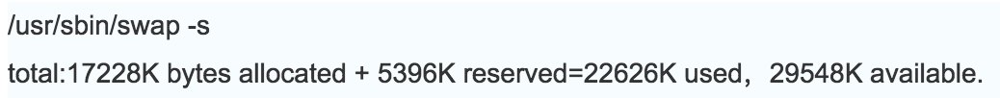
        在一两分钟内键入该命令三到四次，看看可用的交换区是否在减少。还可以使用其他一些/usr/bin/\*stat工具如netstat、vmstat等。如发现波段有内存被分配且从不释放，一个可能的解释就是有个进程出现了内存泄漏。或可以查看对应进程的maps表，看进程的堆或mmap段的虚拟地址空间是否持续增加
        **重载new/delete操作符**，用list或者map记录对内存的使用情况。建立一个malloc和free的队列，使用一个malloc就加入队列，记录对应的行号名和函数名，用一个free就释放出一个malloc，最后如果这个队列不为空，就说明存在内存泄漏。
        使用mtrace，在需要内存泄漏检测的代码开始调用void mtrace(void)。mtrace为malloc等函数安装hook，用于记录内存分配信息，在需要内存泄漏检查的代码的结束调用void muntrace(void)。**X需百度**
        当然也有用于内存调试，内存泄漏检测以及性能分析的软件开发工具**valgrind**这样的工具来进行内存泄漏的检测。
        **3）常见的内存错误：**
        （1）内存分配未成功，却使用了它
        （2）内存分配成功，但尚未初始化就引用它
        （3）内存分配成功且初始化，但操作越过了内存的边界
        （4）忘记释放内存，造成内存泄漏
        （5）释放了内存却继续使用它
        以发生的方式来分类：
        （1）常发性内存泄漏，发生内存泄漏的代码会被多次执行到，每次执行都会导致一块内存泄漏
        （2）偶发性内存泄漏
        （3）一次性内存泄漏，发送泄漏的代码只会被执行一次
        （4）隐式内存泄漏，程序在运行过程中不停地分配内存，但直到结束时才释放内存。
        4）**如何避免内存泄漏**？
        1)用new和malloc申请内存时，在使用前需要检查内存是否分配成功(!= NULL);
        2)在使用内存前需要进行初始化；
        3)在对内存进行操作时，要防止越界，如数组操作要注意下标范围；
        4)对于动态分配的内存，一定要手动释放，否则程序每运行一次就会丢失一部分内存，造成内存泄漏。（上面说使用智能指针降低内存泄漏的可能性）。
        5)防止内存释放后仍然使用它，主要有三种情况：
    
    a)程序的对象调用关系过于复杂，实在难以搞清楚某个对象究竟是否已经释放了内存，此时应该重新设计数据结构，从根本上解决对象管理的混乱局面。
    b)函数的return语句写错了，注意不要返回指向“栈内存”的“指针”或“引用”，因为该内存在函数体结束时已经被自动销毁。
    c)使用free或delete释放了内存之后，没有将指针设置为NULL，导致产生“野指针”。
    
    “野指针”的成因有三：
    指针变量没有被初始化，任何指针变量刚被创建时不会自动称为NULL指针，它的缺省值是随机的，它会乱指。所以，指针变量在创建的同时应当被初始化，要么将指针设置为NULL，要么让它指向合法的内存。
    指针被free或delete之后，没有设置为NULL，让人误以为是个合法指针。
    指针操作超越了变量的作用范围，如数组越界访问。
​	6)指针的注意点：
​		a)指针指向常量存储区对象，是不允许对\*P的内容进行写操作的；
  		b)资源泄漏：char \*p = new char[3]; p = “ab”; delete[] p; p早已指向了常量存储区的对象，delete[]对数组进行资源释放会出现错误，应使用strcpy
 		 c)内存越界：char \*p = new char[3]; strcpy(p, “abcd”); delete[] p; strcpy是将“abcd”的内容拷贝到p所指向的内存空间，此处发生了越界，delete[] 析构对象后要释放的空间长度和原始申请的长度不同，释放报错。

  38. 手写实现智能指针类

      ```cpp
      //  引用计数器类  用于存储指向同一对象的指针数
      template<typename T>
      class Counter
      {
      private:
      	//  数据成员
      	T* ptr;    //  对象指针
      	int cnt;   //  引用计数器
      	//  友元类声明
      	template<typename T>
      	friend class SmartPtr;
      	//  成员函数
      	//  构造函数
      	Counter(T* p)   //  p为指向动态分配对象的指针
      	{
      		ptr = p;
      		cnt = 1;
      	}
      	//  析构函数
      	~Counter()
      	{
      		delete ptr;
      	}
      };
      
      //  智能指针类  
      template<typename T>
      class SmartPtr
      {
      private:
      	//  数据成员
      	T* ptr;
      	Counter<T>* ptr_cnt;
      
      public:
      	//  普通构造函数  初始化计数类
      	SmartPtr(T* p) : ptr(p), ptr_cnt(new Counter<T>(p))
      	{
      	}
      	//  拷贝构造函数
      	SmartPtr(const SmartPtr& other) : ptr(other.ptr), ptr_cnt(other.ptr_cnt)
      	{
      		ptr_cnt->cnt++;
      	}
      	//  移动构造函数
      	SmartPtr(SmartPtr&& other) : 
          	ptr(std::move(other.ptr)), 
          	ptr_cnt(std::move(other.ptr_cnt))
      	{
      		other.ptr_cnt = nullptr;
      	}
      
      	//  赋值重载
      	SmartPtr& operator=(const SmartPtr& rhs)
      	{
      		if (ptr_cnt != rhs.ptr_cnt)
      		{
      			if (ptr_cnt != nullptr)
      			{
      				ptr_cnt->cnt--;
      				if (ptr_cnt->cnt == 0)
      					delete ptr_cnt;
      			}
      			ptr = rhs.ptr;
      			ptr_cnt = rhs.ptr_cnt;
      			rhs.ptr_cnt->cnt++;
      		}
      		return *this;
      	}
      
      	// 移动赋值重载	
      	SmartPtr& operator=(SmartPtr && rhs)
      	{
      		if (ptr_cnt != rhs.ptr_cnt)
      		{
      			std::swap(this, rhs);
      		}
      		return *this;
      	}
      
      	//  析构函数
      	~SmartPtr()
      	{
      		if (ptr_cnt != nullptr)
      		{
      			ptr_cnt->cnt--;
      			if (ptr_cnt->cnt == 0)
      				delete ptr_cnt;
      		}
      	}
      
      	T& operator*()     const { return *(ptr); }
      	T* operator&()     const { return ptr; }
      	size_t use_count() const { return ptr_cnt->cnt; }
      	bool unique()      const { return (ptr_cnt->cnt == 1); }
      	T* get()           const { return ptr; }
      };
      
      ```

  39. **遇到coredump要怎么调试**
      通过gdb对core文件进行分析来查看程序崩溃时的调用栈，来尝试定位问题。
      在一般的Linux系统中，默认是不会产生core dump文件的，通过ulimit -c 来查看coredump文件的大小，一般开始为0，可以设置core文件的大小，ulimit -c 1024(KB) 或者 ulimit -c unlimited，建议使用后者，不要把core文件大小进行限制，万一不够信息不全。
      然后 ./test 再次运行有问题的程序，用gdb分析core文件 gdb ./test 。

  40. **内存检查工具的了解**

  41. **模板的用法与适用场景**
      **1）模板用法**：模板可以分为**函数模板和类模板**，函数模板使得我们可以生成通用的函数，这些函数可以接受任意数据类型的参数，可返回任意类型的值，而不需要对所有可能的数据类型进行函数重载。类模板使得一个类可以有基于通用类型的成员，而不需要在类生成的时候定义具体的数据类型。
      对于定义完整的模板后，可以进行**特例化**，可以进行**全特化或偏特化**，全特化就是把所有的模板类型都特例指定，偏特化就是将部分模板类型参数特例指定，用法如下图所示
      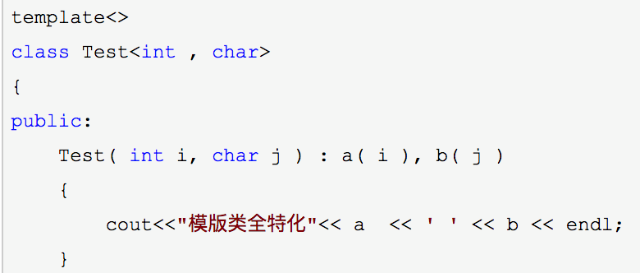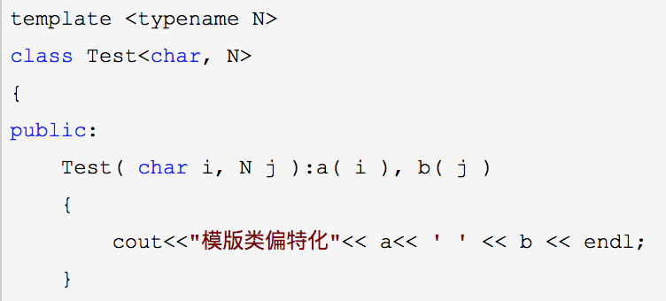
      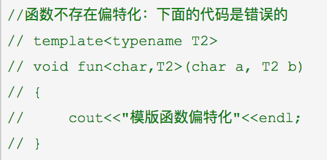
      **2）模板的适用场景**：这里说一下适用的四个场景，数据类型与算法分离的泛型编程，类型适配traits，函数转发，元编程。
      **数据类型和算法分离的泛型编程：**在模板编程中，最常见的适用场景就是用来将数据类型和算法分离，实现泛型编程。例如STL中使用了大量的模板应用，用来实现数据容器和算法的分离，是泛型编程的一个典范。
      **类型适配traits：**我们都知道多态是通过派生类继承基类重写虚函数实现的，但是如果有两个类，之间并没有共用基类的理论意义，我们不应该强加使用继承的方式，这时可以使用模板，两个类中定义一个同名函数，在定义一个类模板，就可以实现不同类调用不同的函数。例如：
      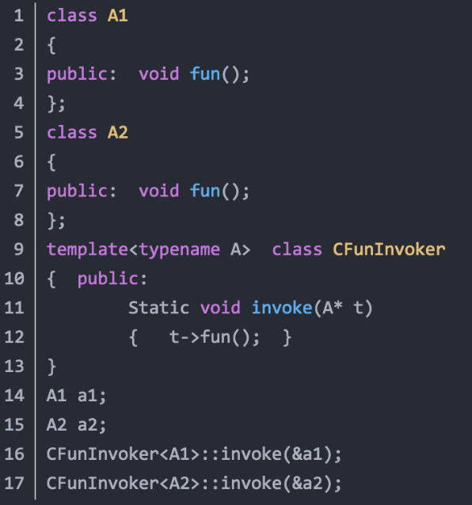
      但是也要考虑另外一种情况，如果想要使用Host&lt;A&gt;::fun() 和Host&lt;int&gt;::fun()，fun()中调用模板参数类型的dosomething()，但是因为int中没有办法定义一个fun()，上面的简单的模板就不好用了，为了解决这个问题，我们增加一个Traits类，它一定会对外提供一个dosomething的方法。对于普通类型，它就转发这个方法，于对int型，它作了特化，实现了一个空的dosomething的方法。因此无论是Host&lt;Traits&lt;A&gt;&gt; 还是Host&lt;Traits&lt;int&gt;&gt;，都可以通过编译，下面图示
      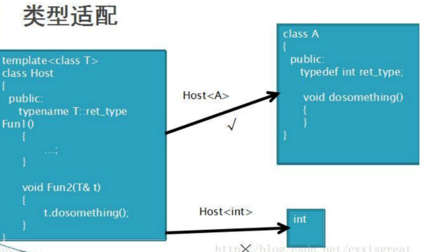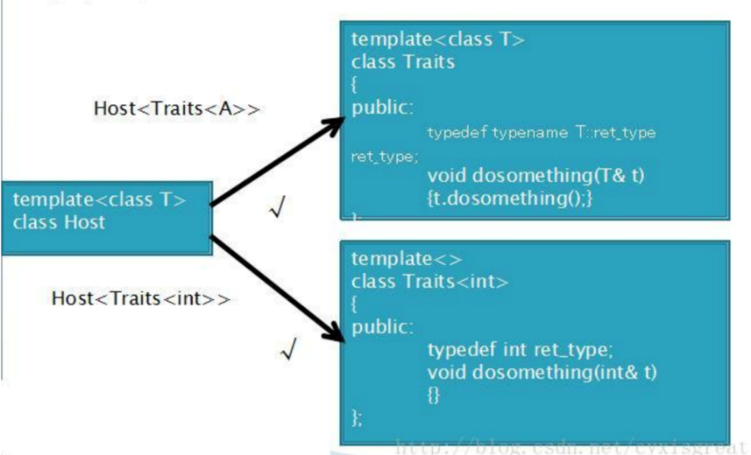
      事实上，STL中也大量的运用了traits，例如迭代器的性质，通过traits出不同的迭代器类型，可以在算法中提供不同的实现方案，以提高效率。
      **函数转发：**模板类使得我们可以通过模板类将函数指针以及它的参数类型记录下来，在需要的时候对函数进行调用。基于函数转发的应用有很多，例如，模板实现的C++委托，模板实现的C++反射，boots::function, boost::signal slot。凡是涉及到把函数指针存放起来，进行延迟调用的情况，都可以应用函数转发。下面给出一个简单的转发的示例：
      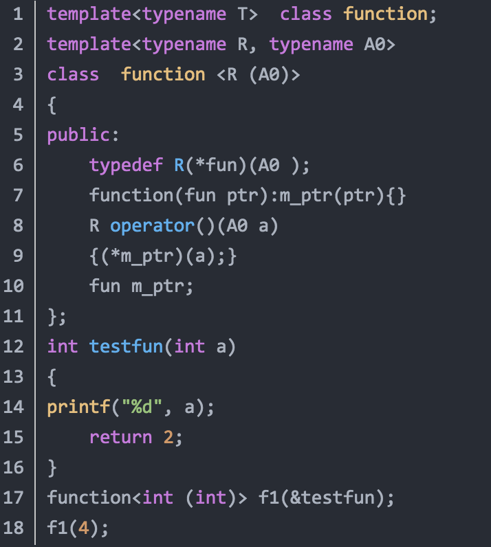
      下面一个是类成员函数的转发：
      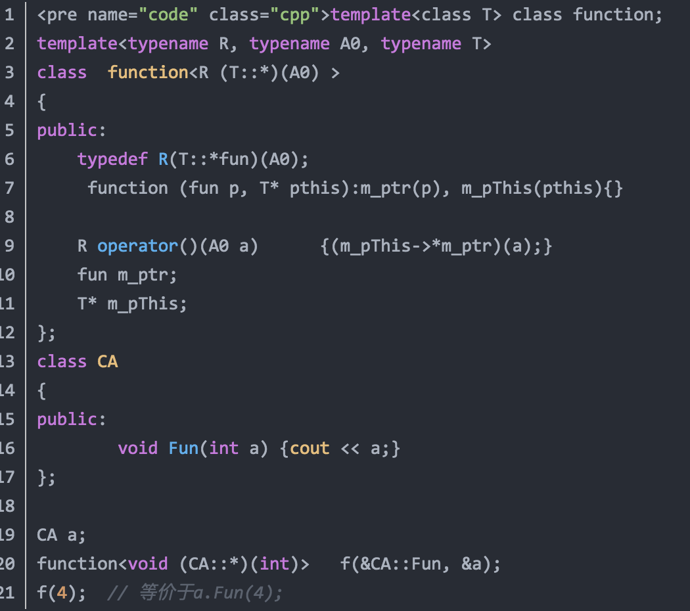
      上面的代码中，我们发现CA类对象不见了，. 或 -&gt;操作符不见了。函数转发实现了一层层的封装与绑定，最终伤调用者与CA类型隔离，实现了解耦。但是函数转发的这种封装性会使得调用效率降低。高效C++委托又是一个问题。
      **元编程：**这里只是简单的对元编程进行介绍，元编程的思想就是在编译期间实现对类型或数值的计算，利用模板特例化机制实现**编译期条件选择结构**，利用递归模板实现编译期循环结构，模板元程序则由编译器在编译期解释执行。
      举一个简单的例子，一段从1累加到100的程序。
      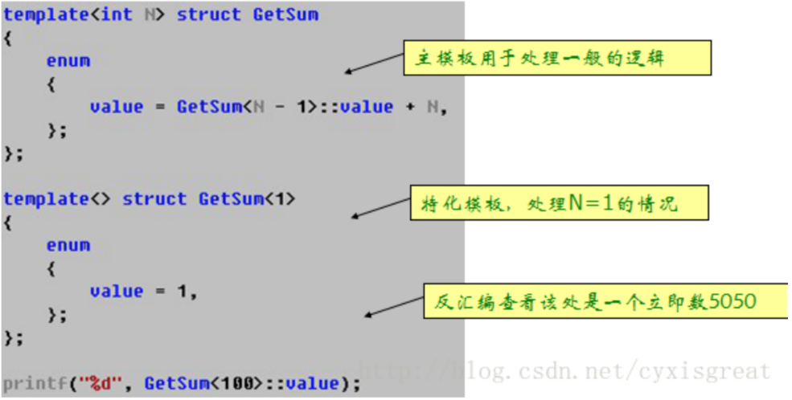
      主模板有一个整形的参数N， 主模板中的枚举值value取值会取得模板参数为N-1的模板类的value值，加上自身的N值。然后为N=1的时候特化处理value=1。这样在GetSum&lt;100&gt;这个类中它的value值就是5050。这个值不是在运行时候计算机算的，而是在编译时编译器已经算好了。这么长的C++代码最终编译出来的结果就和只写一句：
      。

  42. **成员初始化列表的概念，为什么用成员初始化列表会快一些（性能优势）？**
      1）概念：在类的构造函数中，不再函数体内对变量赋值，而在参数列表后，跟**一个冒号和初始化列表**。
      2）使用初始化列表的必要性：如果类中有const成员或引用类型的成员，由于**const对象和引用类型**都只能初始化，不支持赋值，所以这种情况**必需使用初始化列表**；类中含有其它类作为成员，**作为成员的类将赋值操作禁止了，也必需用初始化列表**；
      3）使用初始化列表的性能优势：从上面的必要性可以看出适用更多的情况。另外，如果类中包含其它类，在进入构造函数时，实际上已经构造了其它类的临时对象，然后在构造函数中再进行赋值操作，完成完整的构造函数。但如果使用初始化列表，则**可以省去构造临时对象**，直接完成初始化工作，效率更高。
      4）注意事项：构造对象的顺序**按照成员声明的顺序**，而不是成员初始化列表的顺序；静态对象只构造一次；所有全局对象在main()函数之前被构造，且一般按照声明的顺序构造。

  43. **用过C++11吗，知道C++11新特性吗？**
      **1. nullptr**
      nullptr 出现的目的是为了**替代NULL**。在某种意义上来说，传统C++会把NULL、0 视为同一种东西，这取决于编译器如何定义NULL，**有些编译器会将 NULL 定义为 ((void\*)0)，有些则会直接将其定义为 0**。C++ 不允许直接将 void \* 隐式转换到其他类型，但如果 NULL 被定义为 ((void\*)0)，那么当编译char \*ch = NULL;时，NULL 只好被定义为 0。而这依然会产生问题，将导致了 C++ 中重载特性会发生混乱，考虑：
      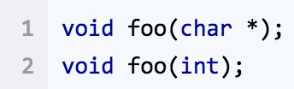
      对于这两个函数来说，**如果 NULL 又被定义为了 0 那么 foo(NULL); 这个语句将会去调用 foo(int)，从而导致代码违反直观**。为了解决这个问题，C++11 引入了 nullptr 关键字，专门用来区分空指针、0。nullptr 的类型为 nullptr_t，能够隐式的转换为任何指针或成员指针的类型，也能和他们进行相等或者不等的比较。
      当需要使用 NULL 时候，养成直接使用 nullptr的习惯。
      **2. 类型推导**
      C++11 引入了 **auto 和 decltype** 这两个关键字实现了类型推导，让编译器来操心变量的类型。
      **auto：**
      使用 auto 进行类型推导的一个最为常见而且显著的例子就是迭代器。在以前我们需要这样来书写一个迭代器：
      
      而有了 auto 之后可以：
      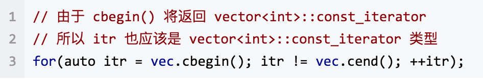
      注意：auto 不能用于函数传参，因此下面的做法是无法通过编译的（考虑重载的问题，我们应该使用模板）：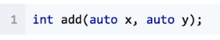此外，auto 还不能用于推导数组类型：
      **decltype：**
      decltype 关键字是为了解决 auto 关键字只能对变量进行类型推导的缺陷而出现的。它的用法和 sizeof 很相似： decltype(表达式)

      在此过程中，编译器分析表达式并得到它的类型，却不实际计算表达式的值。 有时候，我们可能需要计算某个表达式的类型，例如：
      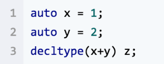
      **拖尾返回类型、auto 与 decltype 配合：**
      你可能会思考，auto 能不能用于推导函数的返回类型。考虑这样一个例子加法函数的例子，在传统 C++ 中我们必须这么写：
      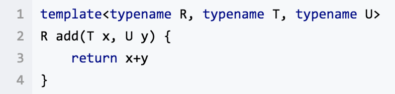
      这样的代码其实变得很丑陋，因为程序员在使用这个模板函数的时候，必须明确指出返回类型。但事实上我们并不知道 add() 这个函数会做什么样的操作，获得一个什么样的返回类型。在 C++11 中这个问题得到解决。虽然你可能马上回反应出来使用 decltype 推导 x+y 的类型，写出这样的代码：
      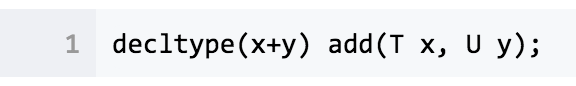
      但事实上这样的写法并不能通过编译。这是因为在编译器读到 decltype(x+y) 时，x 和 y 尚未被定义。为了解决这个问题，C++11 还引入了一个叫做**拖尾返回类型**（trailing return type），**利用 auto 关键字将返回类型后置**：
      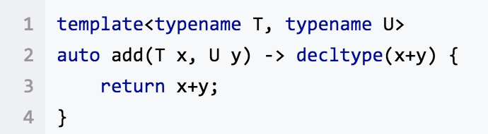
      从 C++14 开始是可以直接让普通函数具备返回值推导，因此下面的写法变得合法：
      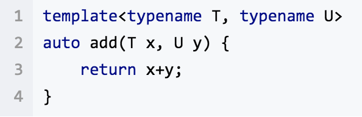
      **3. 区间迭代 ： 基于范围的 for 循环**
      C++11 引入了基于范围的迭代写法， 最常用的 std::vector 遍历将从原来的样子：
      
      变得非常的简单：
      
      **4. 初始化列表**（star）
      C++11 提供了统一的语法来**初始化任意的对象**，C++11 还把初始化列表的概念绑定到了类型上，并将其称之为 std::initializer_list，允许构造函数或其他函数像参数一样使用初始化列表，这就为类对象的初始化与普通数组和 POD 的初始化方法提供了统一的桥梁，例如：
      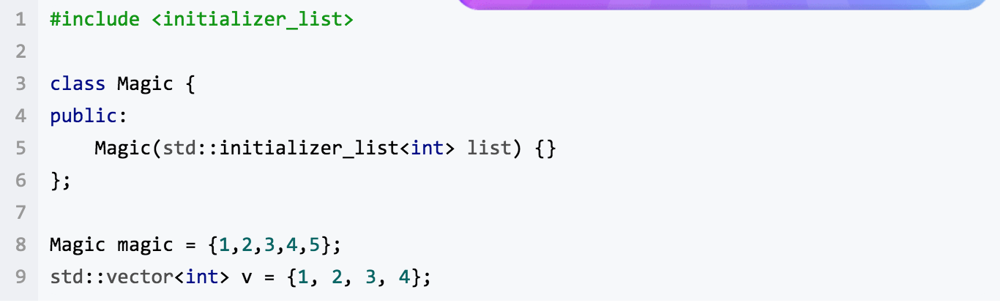
      **5. 模板增强**（star）
      **外部模板：**传统 C++ 中，模板只有在使用时才会被编译器实例化。只要在每个编译单元（文件）中编译的代码中遇到了被完整定义的模板，都会实例化**（如不同文件都将int做T，则多次重复实例出对应函数在文件头）**。这就产生了**重复实例化**而导致的编译时间的增加。C++11 引入了外部模板，扩充了原来的强制编译器在特定位置实例化模板的语法，使得能够**显式的告诉编译器何时进行模板的实例化**：
      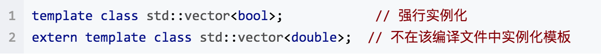
      **尖括号 “&gt;”：**在传统 C++ 的编译器中，&gt;&gt;一律被当做右移运算符来进行处理。但实际上我们很容易就写出了嵌套模板的代码：
      
      这在传统C++编译器下是不能够被编译的，而 C++11 开始，连续的右尖括号将变得合法，并且能够顺利通过编译。
      **类型别名模板：**在传统 C++中，typedef 可以为类型定义一个新的名称，但是却没有办法为模板定义一个新的名称。因为，模板不是类型。例如：
      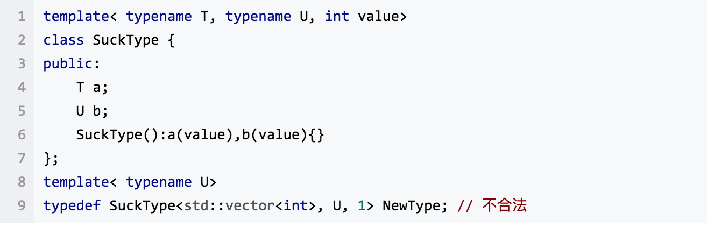
      C++11 使用 using 引入了下面这种形式的写法，并且同时支持对传统 typedef 相同的功效：
      
      **默认模板参数：**我们可能定义了一个加法函数：
      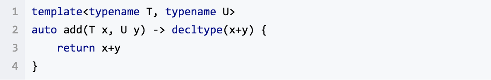
          使用时发现，要使用 add，就必须每次都指定其模板参数的类型。 在 C++11 中提供了一种便利，可以指定模板的默认参数：
      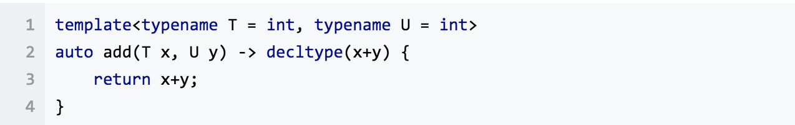
      **6. 构造函数**
      **委托构造（star）：**C++11 引入了委托构造的概念，这使得构造函数可以在同一个类中一个构造函数调用另一个构造函数，从而达到简化代码的目的：
      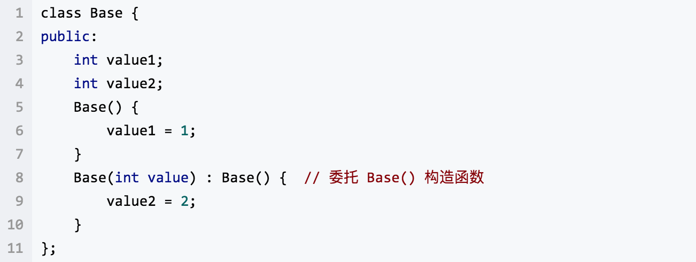
      **继承构造：**在继承体系中，如果派生类想要使用基类的构造函数，需要在构造函数中显式声明。 假若基类拥有为数众多的不同版本的构造函数，这样，在派生类中得写很多对应的“透传”构造函数。如下：
      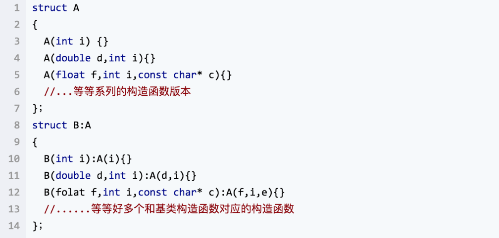
      C++11的继承构造：
      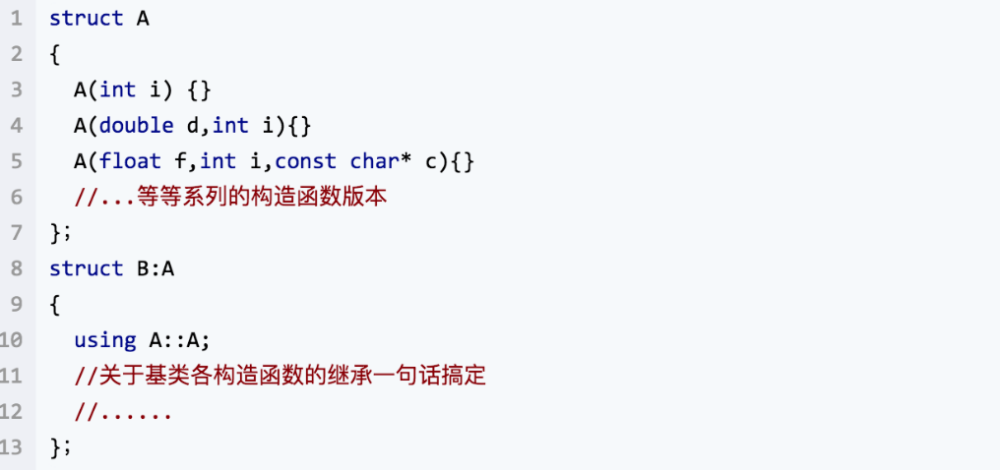
      如果一个继承构造函数不被相关的代码使用，编译器不会为之产生真正的函数代码，这样比透传基类各种构造函数更加节省目标代码空间。

      **7. Lambda 表达式**（star）
      Lambda 表达式，实际上就是提供了一个类似匿名函数的特性，而匿名函数则是在需要一个函数，但是又不想费力去命名一个函数的情况下去使用的。
      Lambda 表达式的基本语法如下：
      
        1) capture是**捕获列表**； 2) params是**参数表**；(选填) 3) opt是**函数选项**；可以填mutable,exception,attribute（选填）      mutable说明lambda表达式体内的代码可以修改被捕获的变量，并且可以访问被捕获的对象的non-const方法。      exception说明lambda表达式是否抛出异常以及何种异常。      attribute用来声明属性。 4) ret是**返回值类型**（拖尾返回类型）。(选填) 5) body是**函数体**。
      捕获列表：lambda表达式的捕获列表精细控制了lambda表达式能够访问的外部变量，以及如何访问这些变量。
        1) []不捕获任何变量。 2) [&amp;]捕获外部作用域中所有变量，并作为引用在函数体中使用（按引用捕获）。 3) [=]捕获外部作用域中所有变量，并作为副本在函数体中使用(按值捕获)。注意值捕获的**前提是变量可以拷贝**，且被捕获的变量在 lambda 表达式**被创建时拷贝**，而非调用时才拷贝。如果希望lambda表达式在调用时能即时访问外部变量，我们应当使用引用方式捕获。
      
        4) [=,&amp;foo]按值捕获外部作用域中所有变量，并按引用捕获foo变量。 5) [bar]按值捕获bar变量，同时不捕获其他变量。 6) [this]捕获当前类中的this指针，让lambda表达式拥有和当前类成员函数同样的访问权限。如果已经使用了&amp;或者=，就默认添加此选项。捕获this的目的是可以在lamda中使用当前类的成员函数和成员变量。
      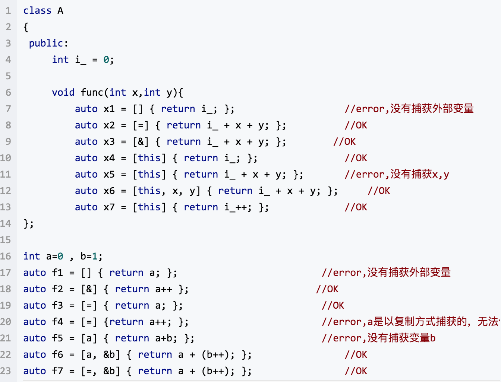
      **注意f4**，虽然按值捕获的变量值均复制一份存储在lambda表达式变量中，修改他们也并不会真正影响到外部，但我们却仍然无法修改它们。如果希望去修改按值捕获的外部变量，需要显示指明lambda表达式为mutable。被mutable修饰的lambda表达式就算没有参数也要写明参数列表。
      原因：**lambda表达式可以说是就地定义仿函数闭包的“语法糖”**。它的捕获列表捕获住的任何外部变量，最终会变为闭包类型的成员变量。按照C++标准**，lambda表达式的operator()默认是const的**，一个const成员函数是无法修改成员变量的值的。而mutable的作用，就在于取消operator()的const。
      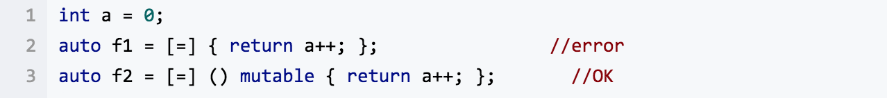
      lambda表达式的大致原理：每当你定义一个lambda表达式后，编译器会自动生成一个**匿名类**（这个类**重载了()运算符**，作为仿函数），我们称为闭包类型（closure type）。那么在运行时，这个lambda表达式就会返回一个匿名的闭包实例，是一个右值。所以，我们上面的lambda表达式的结果就是一个个闭包。对于复制传值捕捉方式，类中会相应添加对应类型的非静态数据成员。在运行时，会用复制的值初始化这些成员变量，从而生成闭包。
      lambda表达式是不能被赋值的：
      
      闭包类型禁用了赋值操作符，但是没有禁用复制构造函数，所以你仍然可以用一个lambda表达式去初始化另外一个lambda表达式而产生副本。
      在多种捕获方式中，最好不要使用[=]和[&amp;]默认捕获所有变量。
      默认引用捕获所有变量，你有很大可能会出现悬挂引用（Dangling references），因为引用捕获不会延长引用的变量的生命周期：
      
      上面函数返回了一个lambda表达式，参数x仅是一个临时变量，函数add_x调用后就被销毁了，但是返回的lambda表达式却引用了该变量，当调用这个表达式时，引用的是一个垃圾值，会产生没有意义的结果。上面这种情况，使用默认传值方式可以避免悬挂引用问题。
      但是采用默认值捕获所有变量仍然有风险，看下面的例子：
      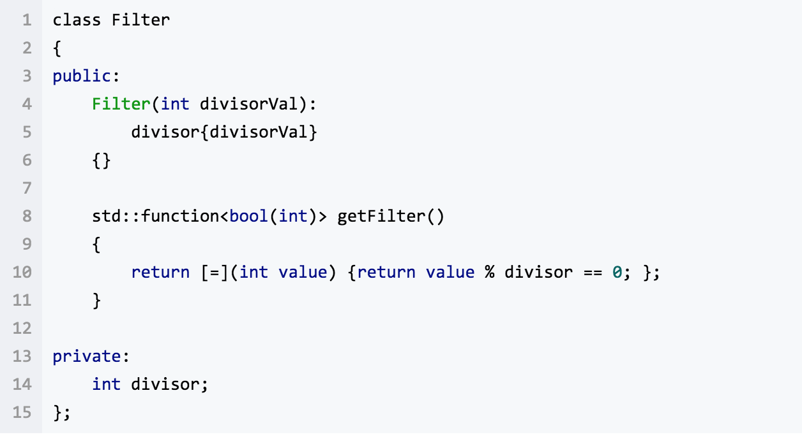
      这个类中有一个成员方法，可以返回一个lambda表达式，这个表达式使用了类的数据成员divisor。而且采用默认值方式捕捉所有变量。你可能认为这个lambda表达式也捕捉了divisor的一份副本，但是实际上并没有。因为数据成员divisor对lambda表达式并不可见，你可以用下面的代码验证：
      // 类的方法，下面无法编译，因为divisor并不在lambda捕捉的范围
      
      原代码中，lambda表达式实际上捕捉的是this指针的副本，所以原来的代码等价于：
      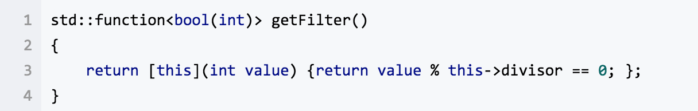
      尽管还是以值方式捕获，但是捕获的是指针，其实相当于以引用的方式捕获了当前类对象，所以lambda表达式的闭包与一个类对象绑定在一起了，这很危险，因为你仍然有可能在类对象析构后使用这个lambda表达式，那么类似“悬挂引用”的问题也会产生。所以，采用默认值捕捉所有变量仍然是不安全的，主要是由于指针变量的复制，实际上还是按引用传值。
      lambda表达式可以赋值给对应类型的函数指针。但是使用函数指针并不是那么方便。
      所以**STL定义在&lt; functional &gt;头文件提供了一个多态的函数对象封装std::function**，其类似于**函数指针**。它可以绑定任何类函数对象，**只要参数与返回类型相同**。如下面的返回一个bool且接收两个int的函数包装器：
      
      lambda表达式一个更重要的应用是其可以用于函数的参数，通过这种方式可以实现回调函数。
      最常用的是在STL算法中，比如你要统计一个数组中满足特定条件的元素数量，通过lambda表达式给出条件，传递给count_if函数：
      
      再比如你想生成斐波那契数列，然后保存在数组中，此时你可以使用generate函数，并辅助lambda表达式：
      
      当需要遍历容器并对每个元素进行操作时：
      
      大部分STL算法，可以非常灵活地搭配lambda表达式来实现想要的效果。
      **8. 新增容器**
      **std::array  ：** std::array 保存在栈内存中，相比堆内存中的 std::vector，我们能够灵活的访问这里面的元素，从而获得更高的性能。
      std::array 会在编译时创建一个固定大小的数组，std::array 不能够被隐式的转换成指针，使用 std::array只需指定其类型和大小即可
      **std::forward_list ：** std::forward_list 是一个列表容器，使用方法和 std::list 基本类似。 和 std::list 的双向链表的实现不同，std::forward_list 使用单向链表进行实现，提供了 O(1) 复杂度的元素插入，不支持快速随机访问（这也是链表的特点），也是标准库容器中唯一一个不提供 size() 方法的容器。当不需要双向迭代时，具有比 std::list 更高的空间利用率。
      **无序容器：**C++11 引入了两组无序容器： 
      std::unordered_map/std::unordered_multimap 和 std::unordered_set/std::unordered_multiset。
      无序容器中的元素是不进行排序的，内部通过 Hash 表实现，插入和搜索元素的平均复杂度为 O(constant)。
      **元组 std::tuple**


      **10. 语言级线程支持**
      **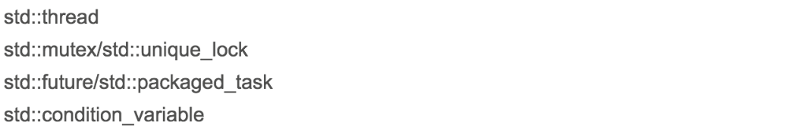**
      代码编译需要使用 -pthread 选项
      **11. 右值引用和move语义**（star）
      先看一个简单的例子直观感受下：
      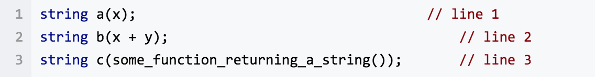
      如果使用以下拷贝构造函数：
      
      以上3行中，只有第一行(line 1)的x深度拷贝是有必要的，因为我们可能会在后边用到x，x是一个左值(lvalues)。
      第二行和第三行的参数则是右值，因为表达式产生的string对象是匿名对象，之后没有办法再使用了。
      C++ 11引入了一种新的机制叫做“右值引用”，以便我们通过重载直接使用右值参数。我们所要做的就是写一个以右值引用为参数的构造函数：
      
      我们没有深度拷贝堆内存中的数据，而是仅仅复制了指针，并把源对象的指针置空。事实上，我们“偷取”了属于源对象的内存数据。由于源对象是一个右值，不会再被使用，因此客户并不会觉察到源对象被改变了。在这里，我们并没有真正的复制，所以我们把这个构造函数叫做“转移构造函数”（move constructor），他的工作就是把资源从一个对象转移到另一个对象，而不是复制他们。
      有了右值引用，再来看看赋值操作符：
      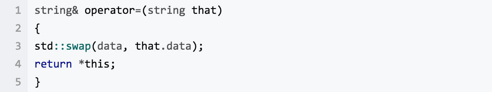
      注意到我们是直接对参数that传值，所以that会像其他任何对象一样被初始化，那么确切的说，that是怎样被初始化的呢？对于C++ 98，答案是复制构造函数，但是对于C++ 11，编译器会依据参数是左值还是右值在复制构造函数和转移构造函数间进行选择。
      如果是a=b，这样就会调用复制构造函数来初始化that（因为b是左值），赋值操作符会与新创建的对象交换数据，深度拷贝。这就是copy and swap 惯用法的定义：构造一个副本，与副本交换数据，并让副本在作用域内自动销毁。这里也一样。
      如果是a = x + y，这样就会调用转移构造函数来初始化that（因为x+y是右值），所以这里没有深度拷贝，只有高效的数据转移。相对于参数，that依然是一个独立的对象，但是他的构造函数是无用的（trivial），因此堆中的数据没有必要复制，而仅仅是转移。没有必要复制他，因为x+y是右值，再次，从右值指向的对象中转移是没有问题的。
      总结一下：复制构造函数执行的是深度拷贝，因为源对象本身必须不能被改变。而转移构造函数却可以复制指针，把源对象的指针置空，这种形式下，这是安全的，因为用户不可能再使用这个对象了。
      下面我们进一步讨论右值引用和move语义。
      C++98标准库中提供了一种唯一拥有性的智能指针std::auto_ptr，该类型在C++11中已被废弃，因为其“复制”行为是危险的。
      
      注意b是怎样使用a进行初始化的，它不复制triangle，而是把triangle的所有权从a传递给了b，也可以说成“a 被转移进了b”或者“triangle被从a转移到了b”。
      auto_ptr 的复制构造函数可能看起来像这样（简化）：
      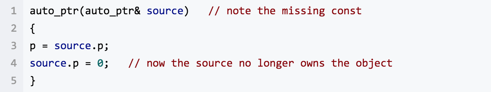
      auto_ptr 的危险之处在于看上去应该是复制，但实际上确是转移。调用被转移过的auto_ptr 的成员函数将会导致不可预知的后果。所以你必须非常谨慎的使用auto_ptr ，如果他被转移过。
      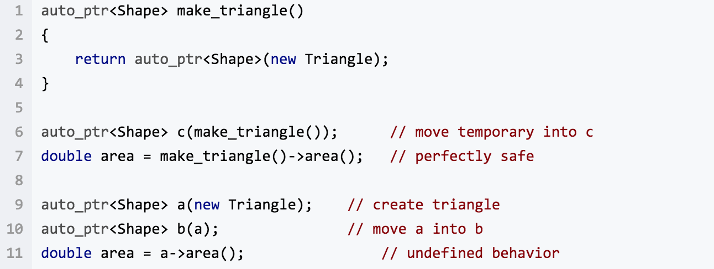
      显然，在持有auto_ptr 对象的a表达式和持有调用函数返回的auto_ptr值类型的make_triangle()表达式之间一定有一些潜在的区别，每调用一次后者就会创建一个新的auto_ptr对象。这里a 其实就是一个左值（lvalue）的例子，而make_triangle()就是右值（rvalue）的例子。
      转移像a这样的左值是非常危险的，因为我们可能调用a的成员函数，这会导致不可预知的行为。另一方面，转移像make_triangle()这样的右值却是非常安全的，因为复制构造函数之后，我们不能再使用这个临时对象了，因为这个转移后的临时对象会在下一行之前销毁掉。
      我们现在知道转移左值是十分危险的，但是转移右值却是很安全的。如果C++能从语言级别支持区分左值和右值参数，我就可以完全杜绝对左值转移，或者把转移左值在调用的时候暴露出来，以使我们不会不经意的转移左值。
      C++ 11对这个问题的答案是右值引用。右值引用是针对右值的新的引用类型，语法是X&amp;&amp;。以前的老的引用类型X&amp; 现在被称作左值引用。
      使用右值引用X&amp;&amp;作为参数的最有用的函数之一就是转移构造函数X::X(X&amp;&amp; source)，它的主要作用是把源对象的本地资源转移给当前对象。
      C++ 11中，std::auto_ptr&lt; T &gt;已经被std::unique_ptr&lt; T &gt;所取代，后者就是利用的右值引用。
      其转移构造函数：
      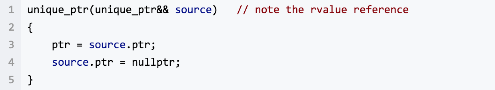
      这个转移构造函数跟auto_ptr中复制构造函数做的事情一样，但是它却只能接受右值作为参数。
      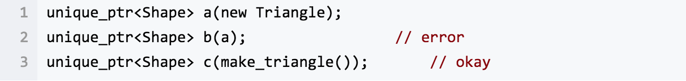
      第二行不能编译通过，因为a是左值，但是参数unique_ptr&amp;&amp; source只能接受右值，这正是我们所需要的，杜绝危险的隐式转移。第三行编译没有问题，因为make_triangle()是右值，转移构造函数会将临时对象的所有权转移给对象c，这正是我们需要的。
      **转移左值**
      有时候，我们可能想转移左值，也就是说，有时候我们想让编译器把左值当作右值对待，以便能使用转移构造函数，即便这有点不安全。出于这个目的，C++ 11在标准库的头文件&lt; utility &gt;中提供了一个模板函数std::move。实际上，std::move仅仅是简单地将左值转换为右值，它本身并没有转移任何东西。它仅仅是让对象可以转移。
      以下是如何正确的转移左值：
      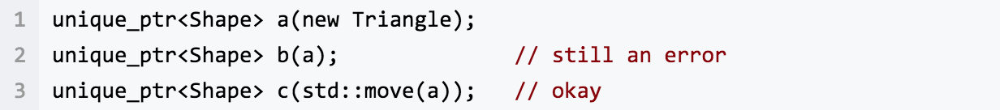
      请注意，第三行之后，a不再拥有Triangle对象。不过这没有关系，因为通过明确的写出std::move(a)，我们很清楚我们的意图：亲爱的转移构造函数，你可以对a做任何想要做的事情来初始化c；我不再需要a了，对于a，您请自便。
      当然，**如果你在使用了mova(a)之后，还继续使用a，那无疑是搬起石头砸自己的脚**，还是会导致严重的运行错误。
      总之，std::move(some_lvalue)将左值转换为右值（可以理解为一种类型转换），使接下来的转移成为可能。
      一个例子：
      
      上面的parameter，其类型是一个右值引用，只能说明parameter是指向右值的引用，而parameter本身是个左值。（Things that are declared as rvalue reference can be lvalues or rvalues. The distinguishing criterion is: if it has a name, then it is an lvalue. Otherwise, it is an rvalue.）
      因此以上对parameter的转移是不允许的，需要使用std::move来显示转换成右值。

  41. **C++的调用惯例（简单一点C++函数调用的压栈过程）**
在不指定调用惯例的情况下，默认使用cdecl调用惯例。

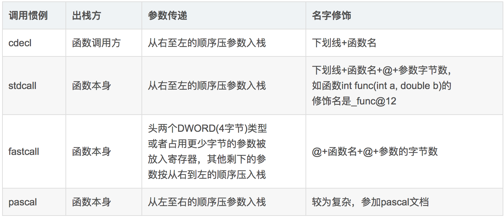
  42. **C++的四种强制转换**
C++的四种强制转换包括：static_cast, dynamic_cast, const_cast, reinterpret_cast
**static_cast**：明确指出类型转换，一般建议将隐式转换都替换成显示转换，因为没有动态类型检查，上行转换（派生类-&gt;基类）安全，下行转换（基类-&gt;派生类）不安全，所以主要执行非多态的转换操作；
**dynamic_cast**：专门用于派生类之间的转换，type-id必须是类指针，类引用或void\*，对于下行转换是安全的，当类型不一致时，转换过来的是空指针，而static_cast，当类型不一致时，转换过来的事错误意义的指针，可能造成非法访问等问题。
**const_cast**：专门用于const属性的转换，去除const性质，或增加const性质，是四个转换符中唯一一个可以操作常量的转换符。
**reinterpret_cast**：不到万不得已，不要使用这个转换符，高危操作。使用特点：1从底层对数据进行重新解释，依赖具体的平台，可移植性差；2可以将整形转换为指针，也可以把指针转换为数组；3可以在指针和引用之间进行肆无忌惮的转换。

  43. **ELF**
      section 是被链接器使用的，但是 segments 是被加载器所使用的。加载器会将所需要的 segment 加载到内存空间中运行。
      1) 可重定位的对象文件(Relocatable file)(没有segments)
      这是由汇编器汇编生成的 .o 文件。后面的链接器(link editor)拿一个或一些 Relocatable object files 作为输入，经链接处理后，生成一个可执行的对象文件 (Executable file) 或者一个可被共享的对象文件(Shared object file)。我们可以使用 ar 工具将众多的 .o Relocatable object files 归档(archive)成 .a 静态库文件。
      2) 可执行的对象文件(Executable file)
      3) 可被共享的对象文件(Shared object file) 就是所谓的动态库文件，也即 .so 文件。

      在ELF文件里面，每一个 sections 内都装载了性质属性都一样的内容，比方：
        1) .text section 里装载了可执行代码；
        2) .data section 里面装载了被初始化的数据；
        3) .bss section 里面装载了未被初始化的数据. bss不占据实际的磁盘空间，只在段表中记录大小，在符号表中记录符号。当文件加载运行时，才分配空间以及初始化。；
        4) 以 .rec 打头的 sections 里面装载了重定位条目；
        5) .symtab 或者 .dynsym section 里面装载了符号信息；
        6) .strtab 或者 .dynstr section 里面装载了字符串信息；
        7) 其他还有为满足不同目的所设置的section，比方满足调试的目的、满足动态链接与加载的目的等等。
      把带有相同属性(比方都是只读并可加载的)的 section 都合并成所谓 segments(段)。最重要的是三个 segment：代码段，数据段和堆栈段。

44. **动态链接 静态链接**
    **静态链接**
    所谓静态链接就是在**编译链接时直接将需要的执行代码拷贝到调用处**，优点就是在程序发布的时候就不需要依赖库，也就是不再需要带着库一块发布，程序可以独立执行，但是体积可能会相对大一些。
    **动态链接**
    所谓动态链接就是在编译的时候**不直接拷贝可执行代码**，而是通过记录一系列符号和参数，在程序运行或加载时将这些信息传递给操作系统，操作系统负责将需要的动态库加载到内存中，然后程序在运行到指定的代码时，**去共享执行内存中已经加载的动态库可执行代码，最终达到运行时连接的目的**。优点是多个程序可以共享同一段代码，而不需要在磁盘上存储多个拷贝，缺点是由于是运行时加载，可能会影响程序的前期执行性能。
    **对比：**
    1）动态链接库有利于**进程间资源共享**：当程序在运行中要调用某个动态链接库函数时，操作系统**首先查看所有正在运行的程序**，看内存中是否已经有此库函数的拷贝。有则共享，否则链接载入。动态链接会**有额外的开销**，但会**节省系统资源**。而多个程序需要静态链接一个库时，每个程序都要将对应库函数拷贝到代码段中。
    2）动态链接库使得库**升级简单**：静态库需要将使用库的程序全部重新编译。而动态库的**提供接口不变**，就可以重新用新生成的动态库替换。
    3）动态库可以由程序代码控制链接载入，可以指明在什么情况下只载入某个函数，**根据不同需求只有一小部分程序被载入。**
    4）静态库编译慢，运行快。动态库编译快，运行有额外开销。

45. 智能指针，RAII，实现，内存泄漏，线程安全

46. C++内存模型
    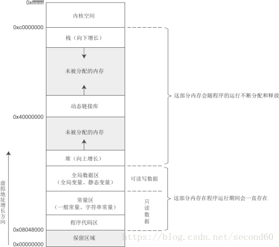
    (1)代码区.text：存放程序代码；
    (2).常量区.rodata： 存放**常量的区间**，如字符串常量等，注意在常量区存放的数据一旦经初始化后就不能被修改。 程序结束后由系统释放。**Const全局变量在gcc也属于常量区**
    (3)数据区.data .bss： 在编译器进行编译的时候就为该变量分配的内存,即**全局变量和静态变量**(用static声明的变量），存放在这个区的数据程序**全部执行结束后系统自动释放**，声明周期贯穿于整个程序执行过程。全局变量和静态变量的存储是放在一块的，**初始化的全局变量和静态变量在一块区域(.data)，未初始化的全局变量和未初始化的静态变量在相邻的另一块区域(.bss)**。
    (4)堆区：这部分**存储空间完全由程序员自己负责管理，它的分配和释放都由程序员自己负责**。这个区是唯一一个可以由程序员自己决定变量生存期的区间。可以用malloc,new申请对内存，并通过free和delete释放空间。如果程序员自己在堆区申请了空间，又忘记将这片内存释放掉，就 会造成内存泄露的问题，导致后面一直无法访问这片存储区域。但程序退出后，系统自动回收资源。
    (5)栈区：存放函数的**传值参数和局部变量**，由编译器分配和自动释放，函数执行完后，局部变量和形参占用的空间会自动被释放。效率比较高，但是分配的容量很有限。

47. malloc的内存分配方式

48. 内联函数和宏的区别
    答：内联函数的展开发生在编译期，而宏是在预处理阶段；内联函数本身是函数，而宏不是；最重要的一点：内联函数会对参数进行类型检查，而宏只是简单的替换，所以内联函数更加安全，所以往往宏需要对参数加括号，但是也不一定安全， 内联函数有自己明确的作用域或者访问权限，比如放在类里面的private，而宏是没有的。

49. Volatile
    **易变性：**从汇编的角度看，即使是连续两条语句第一使用该被volatile修饰的变量，下一条语句也不会直接使用上条语句对应的寄存器内容，而是重新从内存读取。
    **不可优化性：**告知编译器不对该变量进行优化，即使该变量是从未被使用过也不会被编译器优化掉，仍然存于内存中。
    **顺序性：**保证一段程序的输出的前提下，在优化前后无变化时，编译器可能会进行优化，这在多线程中可能会出现不可预知的错误。Volatile变量与非Volatile变量之间的操作，是可能被编译器交换顺序的。Volatile变量间的操作，是不会被编译器交换顺序的。Volatile使得编译器不会进行乱序优化

50. 单例模式

```cpp

//Singleton返回的实例的生存期是由Singleton本身所决定的，而不是用户代码。
//我们知道，指针和引用在语法上的最大区别就是指针可以为NULL，并可以通过delete运算符删除指针所指的实例，而引用则不可以。
//由该语法区别引申出的语义区别之一就是这些实例的生存期意 义：
//通过引用所返回的实例，生存期由非用户代码管理，而通过指针返回的实例，其可能在某个时间点没有被创建，或是可以被删除的。

//重用方法：class SingletonInstance : public Singleton<SingletonInstance>

//多线程懒汉式
template <typename T> 
class Singleton    
{     
public:    
	//static函数和变量 返回引用是重点
    static T& Instance()  
    {    
    	T* tmp = m_Instance;
        if(tmp == NULL)    
        {   //用lock实现线程安全      
            pthread_mutex_lock(mutex_); 
            tmp = m_Instance;           
            if(tmp == NULL)    
            {    
                tmp = new T();    
                m_Instance = tmp;
                atexit(&Singleton::Destroy);
            }   
            pthread_mutex_unlock(mutex_)  ; 
        }    
        return *m_Instance;    
    }  
private:
    //构造 拷贝 赋值均是私有或关闭   
    Singleton() {}    
    ~Singleton(){}
	Singleton(const Singleton&)=delete;  
    Singleton& operator=(const Singleton&)=delete;  

    static void Destroy()
    {
    	if(m_Instance != NULL)
    		delete m_Instance;
    	m_Instance = NULL;
    }
	static pthread_mutex_t mutex_;  
 	static T* m_Instance; 
 	//static volatile T* m_Instance; 
};    
template <typename T> T* volatile Singleton<T>::m_Instance = 0;      
template <typename T> pthread_mutex_t Singleton<T>::mutex_ = PTHREAD_MUTEX_INITIALIZER;
  
//单线程 懒汉式
template <typename T>     
class Singleton    
{    
private:    
    Singleton()  {}  
    ~Singleton() {}   
public:    
    Singleton(const Singleton&)=delete;    
    Singleton& operator=(const Singleton&)=delete;    
    //static函数和变量 返回引用是重点  
    static T& Instance()
    {  
        static T m_Instance;    
        return m_Instance;    
    }      
};


//饿汉式  
template <typename T> 
class Singleton {  
private:   
    static T* m_instance = new Singleton();  
	Singleton() {}
	~Singleton() {}
public:  
    Singleton(const Singleton&)=delete;  
    Singleton& operator=(const Singleton&)=delete;  
    T& Instance()   
    {  
        return *m_instance;  
    }  
};  

```


***保护默认函数***
Singleton限制其类型实例有且只能有一个，因此我们应通过将构造函数设置为非公有来**保证其不会被用户代码随意创建**，中间件代码需要非常严谨才能防止用户代码的误用。
在类型实例访问函数中，我们通过局部静态变量（懒汉）/成员静态变量（饥汉）达到实例仅有一个的要求。
要保护的有**构造函数**，**拷贝构造函数**，**析构函数**以及**赋值运算符。**
**Singleton所返回的常常是一个引用**，对引用进行取址将得到相应类型的指针。而从语法上来说，引用和指针的最大区别在于是否可以被delete关键字删除以及是否可以为NULL。但是Singleton返回一个引用也 就表示其生存期由非用户代码所管理。因此使用取址运算符获得指针后又**用delete关键字删除Singleton所返回的实例明显是一个用户错误**。综上所述，通过**将取址运算符设置为私有没有多少意义**。

***饥汉与懒汉？生存期管理***
对Singleton的生存期特性的讨论需要分为两个方面：Singleton内使用的静态变量的生存期以及 Singleton外在用户代码中所表现的生存期。
**懒汉**Singleton内使用的静态变量是一个**局部静态变量**，因此只有在Singleton的 Instance()函数被调用时其才会被创建，从而拥有了**延迟初始化（Lazy）**的效果，**提高了程序的启动性能**。同时该实例将**生存至程序执行完毕**。而就 Singleton的用户代码而言，**其生存期贯穿于整个程序生命周期**，从程序启动开始直到程序执行完毕。当然，**懒汉Singleton在生存期上的一个缺陷就是创建和析构时的不确定性**。由于Singleton实例会在Instance()函数被访问时被创建，因此在某处新添加的一处对Singleton的访问将可能导致Singleton的生存期发生变化。如果其依赖于其它组成，如另一个Singleton，那么对它们的生存期进行管理将成为一个灾难。甚至可 以说，还不如不用Singleton，而使用明确的实例生存期管理。**程序初始化及关闭时单件的构造及析构顺序的不确定可能导致致命的错误**
将Singleton的实现**改为使用全局静态变量，称为饿汉Singleton**，并将这些全局静态变量**在文件中按照特定顺序排序，**但是这样的话，静态变量将使用eager initialization的方式完成初始化，**可能会对性能影响较大**。但**优点是线程安全性。**对于具有关联的两个Singleton，对它们进行使用的代码常常局限在同一区域内。该问题的一个解决方法常常是将**对它们进行使用的管理逻辑实现为Singleton**，而在内部逻辑中对它们进行明确的生存期管理。
**全局静态变量的生命周期：**编译器会在程序的main()函数执行之前插入一段代码，用来初始化全局变量。当然，静态变量也包含在内。该过程被称为静态初始化。

***多线程懒汉知识点***
使用了一个指针记录创建的Singleton实例. 为了能满足局部静态变量只被初始化一次的需求，很多编译器会通过一个全局的标志位记录该静态变量是否已经被初始化的信息。那么，对静态变量进行初始化的伪码就变成下面这个样子：

```cpp
bool flag = false;
if (!flag)
{
    flag = true;
    staticVar = initStatic();
}
```

在第一个线程执行完对flag的检查并进入if分支后，第二个线程将可能被启动，从而也进入if分支。这样，两个线程都将执行对静态变量 的初始化。因此在这里，我使用了指针，并在对指针进行赋值之前使用锁保证**在同一时间内只能有一个线程对指针进行初始化**。同时基于性能的考虑，我们需要在**每次访问实例之前检查指针是否已经经过初始化，以避免每次对Singleton的访问都需要请求对锁的控制权**。
同时因为new运算符的调用分为分配内存、调用构造函数以及为指针赋值三步，就像下面的构造函数调用：
`SingletonInstance pInstance = new SingletonInstance();`
会转化为以下形式：

```cpp
SingletonInstance pHeap = __new(sizeof(SingletonInstance));
pHeap = SingletonInstance::SingletonInstance(); 			// 构造
SingletonInstance pInstance = pHeap;						// 赋值
```


这样转换是因为在C++标准中规定，如果内存分配失败，或者构造函数没有成功执行， new运算符所返回的将是空。一般情况下，编译器不会轻易调整这三步的执行顺序，但是在满足特定条件时，如构造函数不会抛出异常等，编译器可能出于优化的 目的将第一步和第三步合并为同一步：

```cpp
SingletonInstance pInstance = __new(sizeof(SingletonInstance));
pInstance = SingletonInstance::SingletonInstance(); 		// 构造并赋值
```


这样就可能导致其中**一个线程在完成了内存分配后就被切换到另一线程，而另一线程对Singleton的再次访问将由于pInstance已经 赋值而越过if分支，从而返回一个不完整的对象**。因此，我在这个实现中为静态成员指针**添加了volatile关键字**。该关键字的实际意义是由其修饰的变量可能会被意想不到地改变，因此**每次对其所修饰的变量进行操作都需要从内存中取得它的实际值**。它可以用来阻止编译器对指令顺序的调整。只是由于该关键字所提 、供的禁止重排代码是假定在单线程环境下的，因此并不能禁止多线程环境下的指令重排。
最后来说说**对atexit()关键字的使用**。在通过new关键字创建类型实例的时候，我们同时通过**atexit()函数注册了释放该实例的函数**，从而保证了这些实例能够在程序退出前**正确顺序地析构**。该函数的特性也能**保证后被创建的实例首先被析构**。其实，对静态类型实例进行析构的过程与前面所提到 的在main()函数执行之前插入静态初始化逻辑相对应。

***指针还是引用***
因为Singleton返回的**实例的生存期是由Singleton本身所决定的**，而不是用户代码。我们知道，指针和引用在语法上的最大区别就是**指针可以为NULL，并可以通过delete运算符删除指针所指的实例，而引用则不可以**。由该语法区别引申出的语义区别之一就是这些实例的生存期意义：**通过引用所返回的实例，生存期由非用户代码管理，而通过指针返回的实例，其可能在某个时间点没有被创建，或是可以被删除的**。但是这两条 Singleton都不满足，因此在这里，我使用指针，而不是引用。
**指针与引用其他区别：**低层次向高层次上来说，分为编译器实现上的，语法上的以及语义上的区别。就编译器的实现来说， 声明一个引用并没有为引用分配内存，而仅仅是为该变量赋予了一个别名。而声明一个指针则分配了内存。这种实现上的差异就导致了语法上的众多区别：对引用进 行更改将导致其原本指向的实例被赋值，而对指针进行更改将导致其指向另一个实例；引用将永远指向一个类型实例，从而导致其不能为NULL，并由于该限制而 导致了众多语法上的区别，如dynamic_cast对引用和指针在无法成功进行转化时的行为不一致。而就语义而言，前面所提到的生存期语义是一个区别， 同时一个返回引用的函数常常保证其返回结果有效。一般来说，语义区别的根源常常是语法上的区别，因此上面的语义区别仅仅是列举了一些例子，而真正语义上的 差别常常需要考虑它们的语境。

  51. **C++如何创建一个类，使得他只能在堆或者栈上创建？**
        只能在堆上生成对象：将**析构函数设置为私有**。
      原因：C++是静态绑定语言，编译器管理栈上对象的生命周期，编译器在为类对象分配栈空间时，会**先检查类的析构函数的访问性**。若析构函数不可访问，则不能在栈上创建对象。 
        只能在栈上生成对象：将**operator** **new 和 operator** **delete 重载为私有**。
      原因：在堆上生成对象，使用new关键词操作，其过程分为两阶段：第一阶段，使用operator new在堆上寻找可用内存，分配给对象；第二阶段，调用构造函数生成对象。将operator new操作设置为私有，那么第一阶段就无法完成，就不能够再堆上生成对象。 
  52. **编译器创建构造函数等默认实现的原因**
      影响因素可以分为几种：类型所提供的相应成员，类型中的虚函数以及类型的虚基类。
      以构造函数为例，如果**当前类型的成员或基类提供了由用户定义的构造函数**，那么仅进行内存拷贝可能已经不是正确的行为。这是因为该成员的构造函数可能包含了成员初始化，成员函数调用等众多执行逻辑。此时编译器就**需要为这个类型生成一个默认构造函数，以执行对成员或基类构造函数的调用**。另外，**如果一个类型声明了一个虚函数**，那么**编译器**仍需要生成一个构造函数，以**初始化指向该虚函数表的指针**。如果一个类型的**各个派生类中拥有一个虚基类**，那么**编译器**同样需要生成构造函数，以**初始化该虚基类的位置**。
      这些情况同样需要在拷贝构造函数中考虑：如果一个类型的**成员变量拥有一个拷贝构造函数**，或者**其基类拥有一个拷贝构造函数**，位拷贝就不再满足要求了，因为拷贝构造函数内可能执行了某些并**不是位拷贝的逻辑**。同时如果**一个类型声明了虚函数**，拷贝构造函数需要**根据目标类型初始化虚函数表指针**。如基类实例经过拷贝后，其虚函数表指针不应指向派生类的虚函数表。同理，如果**一个类型的各个派生类中拥有一个虚派生**，那么编译器也应为其生成拷贝构造函数，以**正确设置各个虚基类的偏移**。
      析构函数的情况则略为简单一些：只需要调用其成员的析构函数以及基类的析构函数即可，而不需要再考虑对虚基类偏移的设置及虚函数表指针的设置。

  53. **函数调用过程栈帧变化**
      [https://www.cnblogs.com/zlcxbb/p/5759776.html](https://www.cnblogs.com/zlcxbb/p/5759776.html)

      
# 2计算机网络（TCP/IP）

1. **TCP状态转移图**
   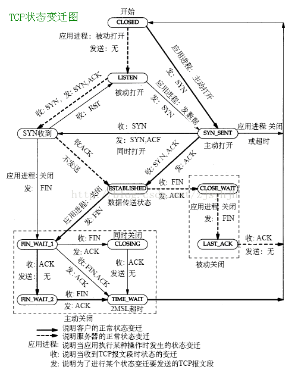

      1. CLOSED：表示初始状态。对服务端和C客户端双方都一样。  
      2. LISTEN：表示监听状态。**服务端调用了listen函数**，可以开始accept连接了。  
      3. SYN_SENT：表示客户端已经发送了SYN报文。当**客户端调用connect函数**发起连接时，首先发SYN给服务端，然后自己进入SYN_SENT状态，并等待服务端发送ACK+SYN。  
      4. SYN_RCVD：表示服务端收到客户端发送SYN报文。服务端收到这个报文后，进入SYN_RCVD状态，然后发送ACK+SYN给客户端。  
      5. ESTABLISHED：表示连接已经建立成功了。服务端发送完ACK+SYN后进入该状态，客户端收到ACK后也进入该状态。  
      6. FIN_WAIT_1：表示主动关闭连接。无论**哪方调用close函数**发送FIN报文都会进入这个这个状态。  
      7. FIN_WAIT_2：表示被动关闭方同意关闭连接。主动关闭连接方收到被动关闭方返回的ACK后，会进入该状态。  等待被动方发送FIN后进入TIME_WAIT。仍可接受数据？
      8. TIME_WAIT：表示收到对方的FIN报文并发送了ACK报文，就等2MSL后即可回到CLOSED状态了。如果FIN_WAIT_1状态下，收到对方同时带FIN标志和ACK标志的报文时，可以直接进入TIME_WAIT状态，而无须经过FIN_WAIT_2状态。  
      9. CLOSING：表示双方同时关闭连接。如果**双方几乎同时调用close函数**，那么会出现双方同时发送FIN报文的情况，此时就会出现CLOSING状态，表示双方都在关闭连接。  主动方的状态
      10. CLOSE_WAIT：表示被动关闭方等待关闭。当**收到对方调用close函数**发送的FIN报文时，回应对方ACK报文，此时进入CLOSE_WAIT状态。 仍可发送数据？ 
      11. LAST_ACK：表示被动关闭方发送FIN报文后，等待对方的ACK报文状态，当收到ACK后进入CLOSED状态。 

2. **socket网络编程有哪些系统调用，返回值意义？其中close是一次就能直接关闭的吗，半关闭状态是怎么产生的？**
   

   **close(sockfd)**：使用close中止一个连接，但它只是减少描述符的参考数，仅关闭本进程的socket id，只有当描述符的参考数为0时内核会真正通过发FIN来关闭TCP连接。所以在多进程/线程程序中，close只是确保了对于某个特定的进程或线程来说，该连接是关闭的。
   **shutdown()**函数来关闭该socket。该函数允许你**只停止在某个方向上的数据传输**，而一个方向上的数据传输继续进行。如你可以关闭某socket的写操作而允许继续在该socket上接受数据，直至读入所有数据。
   int shutdown(int sockfd,int how);shutdown可直接关闭描述符，不考虑描述符的参考数，可选择中止一个方向的连接。

3. **数据包处理全过程，对应的socket？**
4. **对路由协议的了解与介绍。内部网关协议IGP包括RIP，OSPF，和外部网关协议EGP和BGP.**
5. **路由协议所使用的算法。**
6. **TCP和UDP的区别，分别适用于什么场景**

    TCP 是面向连接的，UDP 是面向无连接的
    UDP程序结构较简单
    TCP 是面向字节流的，UDP 是基于数据报的
    TCP 保证数据顺序数据和正确性(报文头里面的序号)，UDP 不保证
    TCP拥有流量控制及拥塞控制的机制1）用户数据报协议UDP是一个简单的传输层协议。
应用进程往一个UDP套接字写入一个消息，该消息随后就被封装到一个UDP数据报中，该UDP数据报进而又被封装到一个IP数据报，然后发送到目的地。**UDP不保证UDP数据报会到达其最终目的地，不保证各个数据报的先后顺序跨网络后保持不变，也不保证每个数据报只到达一次。**
我们使用UDP进行网络编程所遇到的问题是它缺乏可靠性，比如说一个数据报达到了终点但校验和检测出现问题，或者一个数据报在传输的过程中就已经丢失，那么这个数据报就无法投递给UDP套接字了，也不会被源端自动重传。**如果说一定想要确保一个数据报到达其目的地，可以往应用程序中添加一大堆的特性：来自对端的确认、本端的超时与重传等。**
每个UDP数据报都有一个长度。如果一个数据报正确的到达其目的地，那么该数据报的长度将随数据一道传递给接收端应用进程。我们已经提到过TCP是一个字节流协议，没有任何记录边界，这一点不同于UDP。
我们也说**UDP提供无连接的服务**，因为UDP客户与服务器之间不必存在任何长期的关系。举例来说，**一个UDP客户可以创建一个套接字并发送一个数据报给一个给定的服务器，然后立即用同一个套接字发送另一个数据报给另一个服务器。同样地，一个UDP服务器可以用同一个UDP套接字从若干个不同的客户接收数据报，每个客户一个数据报**。
2）传输控制协议TCP 
由TCP向应用程序提供的服务不同于由UDP提供的服务。首先，**TCP提供客户与服务器之间的连接**。TCP客户先与某个给定服务器建立一个连接，再跨该连接与那个服务器交换数据，然后终止这个连接。其次，**TCP还提供了可靠性**。当TCP向另一端发送数据时，它要求对端返回一个确认。如果没有收到确认，TCP就**自动重传数据并等待更长时间**。在数次重传失败后，TCP才放弃，也就是说TCP提供的是数据的**可靠递送**或故障的**可靠通知**。
TCP含有用于动态估算客户和服务器之间的往返时间（round-trip time, RTT）算法，以便它知道等待一个确认需要多少时间。举例来说，RTT在一个局域网上大约是几毫秒，跨越一个广域网则可能是数秒钟。另外，因为RTT受网络流通各种变化因素的影响，TCP还持续估算一个给定连接的RTT。
TCP通过给其中每个字节关联一个序列号对所发送的数据进行排序。正因为TCP发送数据的每个字节都是有序列号的，在**保证数据顺序**的同时，也可以检测到重复的数据，比如说有个迷途数据，源端以为该数据丢失即重传了一份，后续迷途数据又到达了目的地，根据序列号，就可以检测出重复的数据，以免错误的发生。（**UDP本身不提供确认、序列号、RTT估算、超时和重传机制，需在应用层实现**）
TCP提供**流量控制**（flow control）。TCP总是告知对端在任何时刻它一次能够从对端接收多少字节的数据，这称为通告窗口（advertised window）。在任何时刻，该窗口指出接收缓冲区当前可用的空间量，从而确保发送端发送的数据不会使接收缓冲区溢出。该窗口时刻动态变化：当接收到来自发送端的数据时，窗口大小就减小，但是当接收端应用从缓冲区中读取数据时，窗口大小就增大。通告窗口大小减小到0是可能的：当TCP对应某个套接字的接收缓冲区已满，导致它必须等待应用从缓冲区中读取数据时，方能从对端再接收数据。
TCP连接是**全双工**的（full-duplex）。这意味着在一个给定的连接上应用可以在任何时刻在进出两个方向上既发送数据又接收数据。因此，TCP必须为每个数据流方向跟踪诸如序列号和通告窗口大小等状态信息。建立一个全双工连接之后，需要的话可以把它转换成一个单工连接。

7. **TCP和UDP相关的协议与端口号**
   端口号是16位非负整数（范围是0～65535）。这些数字是抽象的，在物理上没有指任何东西。相反，每个IP地址有65535个可用的端口号，每个传输协议可以使用这些端口号，它们被用于确定正确的接受数据的具体服务。对于客户机／服务器应用，一台服务器首先绑定到一个端口号，然后一个或多个客户机可以使用某种特定的传输协议与一台服务器上的端口号建立连接。
   标准的端口号是由Internet号码分配机构（IANA）分配。这组数据被划分为特定范围，包括熟知端口号（0～1023）、注册端口号（1024～49151）和动态／私有端口号（49152～65535）。
   **1）TCP的相关协议和端口号：**
   FTP：文件传输协议，使用20，21端口，使得主机间可以共享文件，下载文件，上传文件都要用到FTP服务。
   Telnet：远程终端协议，使用23端口，它是一种用于远程登录的端口，用户可以以自己的身份远程连接到计算机上，为用户提供了在本地计算机上完成远程主机工作的能力。
   SMTP：简单邮件传输协议，使用25端口，它帮助每台计算机在发送或中转信件时找到下一个目的地。
   HTTP：超文本传输协议，使用80端口，是我们浏览网页、看在线视频、听在线音乐等必须遵循的规则。
   DNS：域名系统，使用53端口，因特网上作为域名和IP地址相互映射的一个分布式数据库，能够使用户更方便的访问互联网，而不用去记住复杂的可以被机器直接读取的IP数串。
   HTTPS：超文本传输安全协议，使用端口443， 是以安全为目的的HTTP通道，简单讲是HTTP的安全版。
   SSH：安全壳协议，使用端口22，是建立在应用层和传输层基础上的安全协议。
   POP3：邮局协议版本3，使用110端口，主要用于支持使用客户端远程管理在服务器上的电子邮件。
   NTP：网络时间协议，使用123端口，它是用来同步网络各个计算机时间的协议。
   IMAP4：第四版因特网信息存取协议，使用143端口，IMAP4协议与POP3协议一样也是规定个人计算机如何访问互联网上的邮件服务器进行首发邮件的协议，IMAP4更为高级。
   **2）UDP的相关协议和端口号：**
   SNMP：简单网络管理协议，使用161端口，该协议能够支持网络管理系统，用以监测连接到网络上的设备是否有任何引起管理上关注的情况。
   TFTP： 简单文件传输协议，使用69端口，TCP／IP协议族中的一个用来在客户机和服务器之间进行简单文件传输的协议，提供不复杂、开销不大的文件传输服务。
   DNS：域名系统，使用53端口，因特网上作为域名和IP地址互相映射的一个分布式数据库，能够使用户更方便的访问互联网，而不用去记住能够悲及其直接读取的IP数串。
   BooTPS/DHCP：动态主机配置协议，使用哦67端口，主要有两个用途：给内部网络或网络服务供应商自动分配IP地址，给用户或者内部网络管理员作为对所有计算机中央管理的手段。

8. **TCP（UDP，IP，http）等首部的认识（http请求报文构成）**
   1）IP头部字段：IPv4头部字段和IPv6头部字段
   IPv4头部字段：
   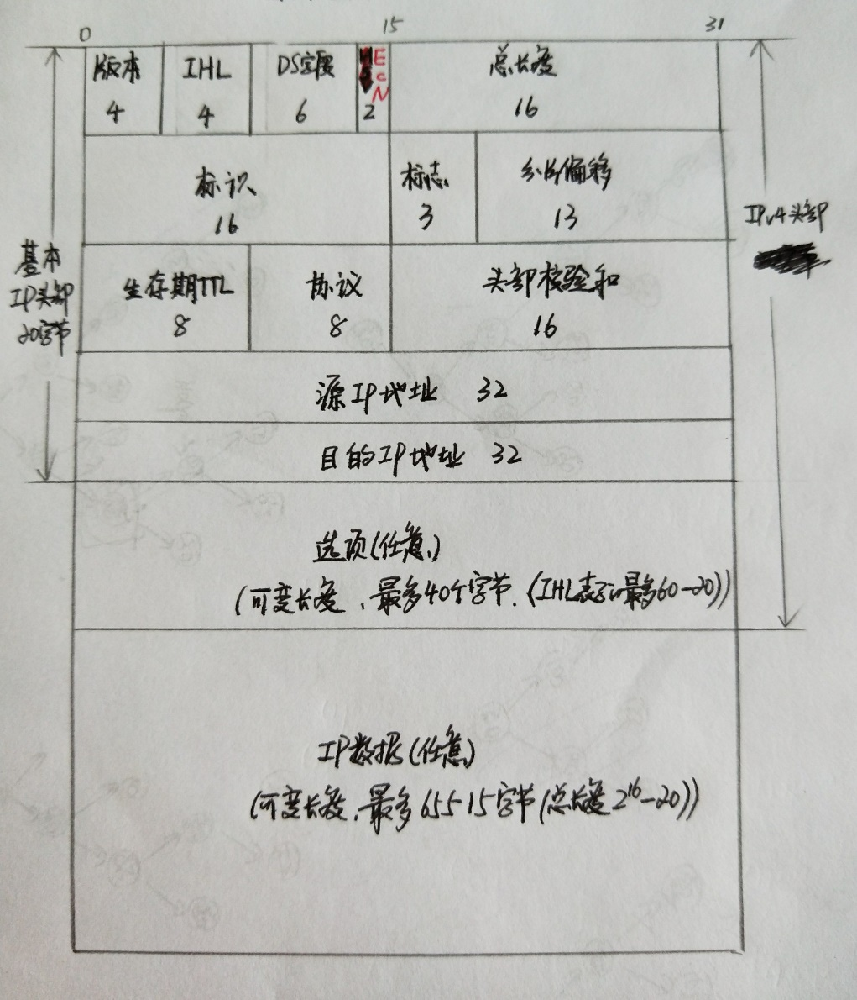
       第一个字段（只有4位）是版本字段。它包含IP数据报的版本号：IPv4为4，IPv6为6.
       Internet头部长度（IHL）字段保存IPv4头部中32位字的数量，包括任何选项。由于它是一个4位字段，所以IPv4头部被限制为最多15个32位字，即60个字节。这个字段的正常值是5。IPv6中不存在这个字段，因为IPv6头部固定长度位40个字节。
       前6位被称为区分服务字段（DS字段），后2位是显式拥塞通知（ECN）字段或称指示位，这些字段被用于数据报转发时的特殊处理。
       总长度字段是IPv4数据报的总长度（以字节为单位）。通过这个字段和IHL字段，我们可以知道数据报的数据部分从哪里开始，以及它的长度。由于它是一个16位的字段，所以IPv4数据报的最大长度是65535字节。
       标识字段帮助标识IPv4主机发送的数据报。为了避免将一个数据报分片和其它数据报分片混淆，发送主机通常在每次（从它的一个IP地址）发送数据报时都将一个内部计数器加1，并将该计数器值复制到IPv4标识字段。这个字段对于实现分片很重要。16位的标识字段后面接上3位的标志位和13位的分片偏移
       生存期（TTL）字段用语设置一个数据报可以经过的路由器数量的上限。占用8位，发送方将它初始化为某个值（建议为64，但128，255也不少见），每台路由器在转发数据报时，将该值减1。当这个字段减为0时，该数据报被丢弃，并使用一个ICMP消息通知发送方。这可以防止由于出现不想要的路由环路，而导致数据报在网络中无限循环。
      协议字段，占8位，IPv4头部中的协议字段包括一个数字，表示数据报有效载荷部分的数据类型。最常用的值为17（UDP），6（TCP）。现用于识别其中封装的协议是否为一种传输层协议。
       头部校验和，占16位，头部校验和字段仅计算IPv4头部。要注意，IPv4的头部检验和指对本身的头部进行检验，并不检查数据报中的内容，例如TCP或UDP数据的正确性，如果想要确保它们的正确性，就要在自己的头部中，即TCP头部和UDP头部中加上自己的校验和。
   IPv6头部：头部长度固定位40字节
       版本字段，占4位，同IPv4中的版本字段。
       DS字段，占6位，区分服务字段，接着ECN字段，显式拥塞通知，占2位。
       流标签 占20位
       负载长度，占16位，这里直接说的是负载数据的长度。
       下一个头部，占8位，下一个头部可以是TCP也可以是路由。
       跳数限制，占8位，与IPv4中生存期有一样的意义。
       源IP地址
       目的IP地址
   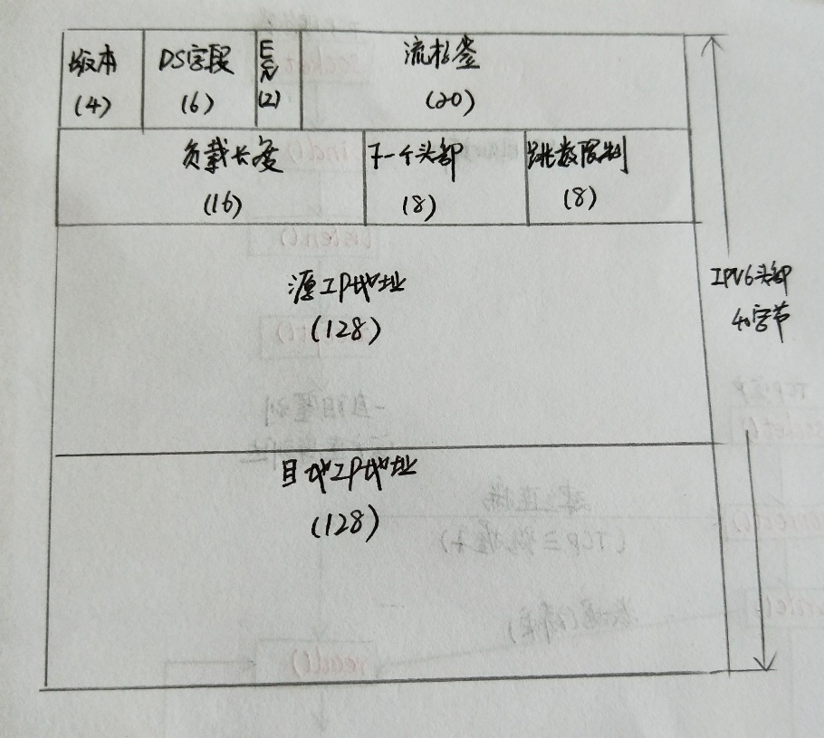
   UDP数据报和TCP数据报都可以在外层封装为IP数据报：
   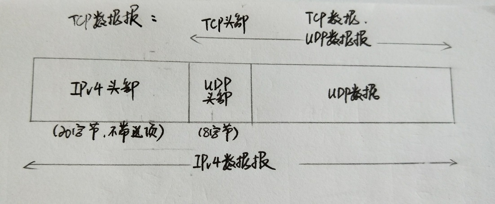
   2）UDP头部：
   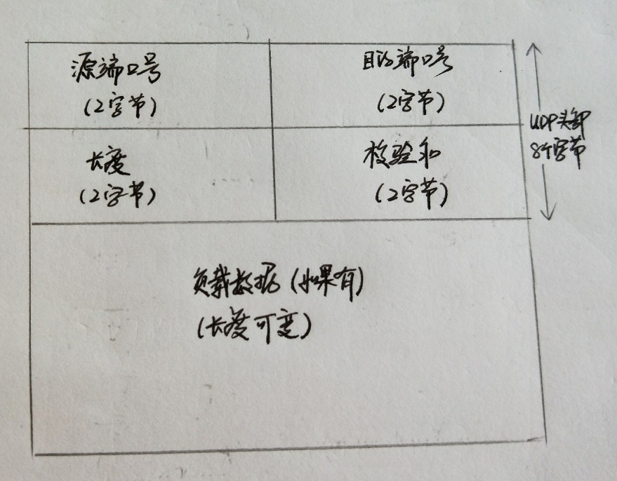

  * 源端口号
  * 目的端口号
在UDP中，端口号都是16位的正数，源端口号是可选的，如果数据报的发送方不需要对方回复，那么源端口号就可以置为0。使用目的端口号来帮助分离从IP层进入的数据，因为IPv4中的协议和IPv6中的下一个头部字段可以将IP层的数据分离到特定的传输协议，这也可以看出端口号在不同的协议中是独立的，即TCP端口号只能被TCP使用，UDP端口号只能被UDP使用，那么这样分离的一个结果是，两个完全不同的服务器可以使用相同的端口号和IP地址，只要它们使用不同的传输协议。
  * UDP长度字段，是UDP头部和UDP数据的总长度。占用16位，但实际上我们要知道UDP的长度字段是冗余的，IPv4的总长度－IPv4头部长度 ＝ UDP长度字段；IPv6负载长度 ＝ UDP长度字段。
  * 校验和：确保本身数据正确的校验和，占16位。
3）TCP头部：
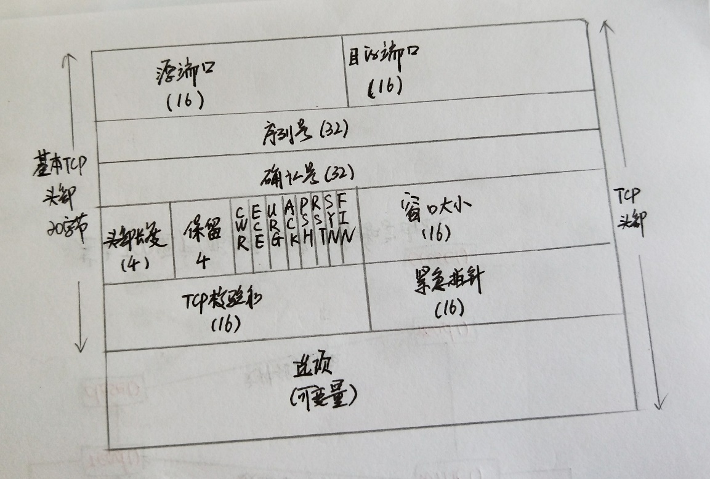
  * 源端口号和目的端口号：每个TCP头部包涵的源和目的端口号，分别占16位，这两个值号IP头部中的源、目的IP地址构成了唯一的连接标识。
  * 序列号和确认号：分别占32位，序列号字段其实就是SYN，确认号就是期望收到的ACK，即“SYN＋1”，确认号字段只有在打开ACK功能才会有数据。
  * 头部长度：占4位，因为TCP头部是具有选项的，所以也要有头部长度，类似于IPv4有IHL，同样头部长度都是以32位为单位，作为一个4位字段，TCP头部被限制最多只能有60个字节，和IPv4的头部一样。
  * 保留：占4位。
  * 定义了一个8位的标识区域：每个位标识一个量
    * CWR：拥塞窗口减（发送方降低它的发送速率）；
    * ECE：ECN回显（发送方接收到了一个更早的拥塞通告）；
    * URG：紧急（紧急指针字段有效）；
    * ACK：确认（确认号字段有效——连接建立以后一般都是启用状态）；
    * PSH：推送（接收方应尽快给应用程序传送这个数据——没被可靠地实现或用到）；
    * RST：重置连接（连接取消，经常是因为错误）；
    * SYN：用于初始化一个连接的同步序列号；
    * FIN：该报文段的发送方已经结束向对方发送数据；
  * 窗口大小：占16位，TCP的流量控制由每个端点使用窗口大小字段来通告一个窗口大小来完成。这是一个16位的字段，限制了窗口大小到65535字节，从而限制了TCP的吞吐量性能。窗口缩放选项可允许对这个值进行缩放，给高速和大延迟网络提供了更大的窗口和改进性能。
  * TCP校验和：TCP校验和字段覆盖了TCP的头部和数据以及头部中的一些字段。
  * 紧急指针：紧急指针字段只有在URG位字段被置位时才有效。这个“指针”是一个必须要加到报文段的序列号字段上的正偏移，以产生紧急数据的最后一个字节的序列号。TCP的紧急机制是一种让发送方给另一端提供特殊标志数据的方法。
  * 选项：最常见的选项字段就是“最大段大小”，称为MSS。连接的每个端点一般在它发送的第一个报文段上指定这个选项，MSS指定该选项的发送者在相反方向上希望接收到的报文段的最大值。

9. **网页解析的过程与实现方法,    在浏览器中输入URL后执行的全部过程（如[www.baidu.com](http://www.baidu.com)），    在浏览器中输入一个网站，发生的事情（客户端，服务端）**
   **1）用户输入网址，浏览器发起DNS查询请求：** 用户访问网页，DNS服务器（域名解析系统）会根据用户提供的域名查找对应的IP地址。域名解析服务器是基于UDPP协议实现的一个应用程序，通常监听53号端口来获取客户端的域名解析请求。DNS查找过程如下：
   	①查找浏览器缓存；
   	②浏览器做一个系统调用，查找系统缓存；
   	③将查询请求发给路由器，查找路由器缓存；
   	④在ISP（互联网服务提供商）的DNS缓存中进行查找；
   	⑤如果ISP DNS域名解析器中没有要查询的域名的记录，要向根域服务器发出请求，并开始递归迭代解析。
   例如我们要解析的是baidu.com。首先我们的域名解析器向根域服务器发出请求，根域服务器记录的是com域服务器的IP、cn域服务器的IP、org域服务器的IP等。我们要查找baidu.com，可以根据根域服务器返回的com域服务器的IP，给com域服务器发出请求，在com域服务器中我们得到baidu.com的IP。获取到需要的IP后，一步步向上返回，直到将这个IP返回给浏览器。

   **2）建立TCP连接：**浏览器通过DNS获取到的web服务器真正的IP地址后，便向web服务器发起tcp连接请求，通过TCP三次握手建立好连接之后，浏览器便可以将HTTP请求数据发送给服务器了。

   **3）浏览器向web服务器发送一个HTTP请求：**HTTP请求是一个基于TCP协议之上的应用层协议——超文本传输协议。一个HTTP事务由一条从客户端发往服务器的请求命令和一个从服务器发回客户端的响应结果组成。

   

   **4）发送响应数据给客户端：**web服务器通常通过监听80端口，来获取客户端的HTTP请求。与客户端建立好TCP连接后，web服务器开始接受客户端发来的数据，并通过HTTP解码，从接收到的网络数据中解析出请求的url信息以及其他诸如Accept-Encodng、Accep-Language等信息。web服务器根据HTTP请求头的信息，得到响应数据返回给客户端。一个典型的HTTP响应头数据报如下：

   

   至此，一个HTTP通信过程完成。web服务器会根据HTTP请求头中的Connection字段值来决定是否关闭TCP连接通道。当Connection字段为keep-alive时，web服务器不会立即关闭此连接，该连接则会被保持一段时间，在该时间内可以继续接收请求；如果Connection为close，则服务器主动关闭TCP连接，客户端被动关闭连接。

   **5）客户端浏览器解析HTML内容：**客户端浏览器首先解析响应中的状态行，查看表面请求是否成功的状态代码。然后解析每一个响应头，响应头告知以下为若干字节的HTML文档和文档字符集。客户端浏览器读取响应数据HTML，根据HTML的语法对其进行格式化，并在浏览器窗口中显示。

10. **网络层分片的原因与具体实现**
    1）网络层分片（IP分片）出现的**原因**：数据链路层具有最大传输单元MTU这个特性，它限制了数据帧的最大长度。通常要传输的IP报文大小超过最大传输单位MTU时就会产生IP分片的情况，IP分片多数是针对UDP数据报产生的，因为TCP数据报是可以自己进行分段的，而UDP则是写入多少就发送多少。

    2）IP分片的**具体实现**：分片和重组装的过程对传输层是透明的，其原因是当IP数据报进行分片之后，只有当它到达下一站，目的端的IP层时才会进行重新组装。分片后的数据报根据需要也可以再次进行分片。

    ​       IP分片和完整的IP报文差不多拥有相同的IP头，IP头部包含了分片和重组所需要的信息：

    

    ​	1标识：发送端发送的IP数据报被分片以后，每个数据报中的标识字段都是同一个值，该值在分片时被复制到每个片中，具有同一个标识的IP分片将会被重组。

    ​	2标志位：一共有3bit，第一个bit是R，保留未用；第二个bit是DF，“不分片”位，如果这一位被置1，IP层将不对数据进行分片；第三个bit是MF，“更多的片”，除了最后一片外，其它每个组成数据报的分片都要把该位置为1。

    ​	3分片偏移：占13位，该片偏移原始数据报开始处的位置，偏移的字节数应该是该数值乘以8。

    **3**）补充：尽管IP分片过程看起来是透明的，但是有一点让人不想使用它：即使只丢失一片数据也要重传整个数据报。因为IP层本身没有超时重传机制，而是由更高层的传输层的TCP来负责超时重传。当来自TCP报文段的的某一片丢失后，TCP在超时后重发整个TCP报文段，该报文段对应于一分IP数据报，没有办法只重传数据报中的一个IP分片。事实上，如果对数据报分片的是中间路由器，而不是起始端系统，那么起始端就无从知道数据报是如何被分片的，我们要尽量避免分片。

11. T**CP的三次握手与四次挥手的详细介绍（TCP连接建立与断开是热门**）
    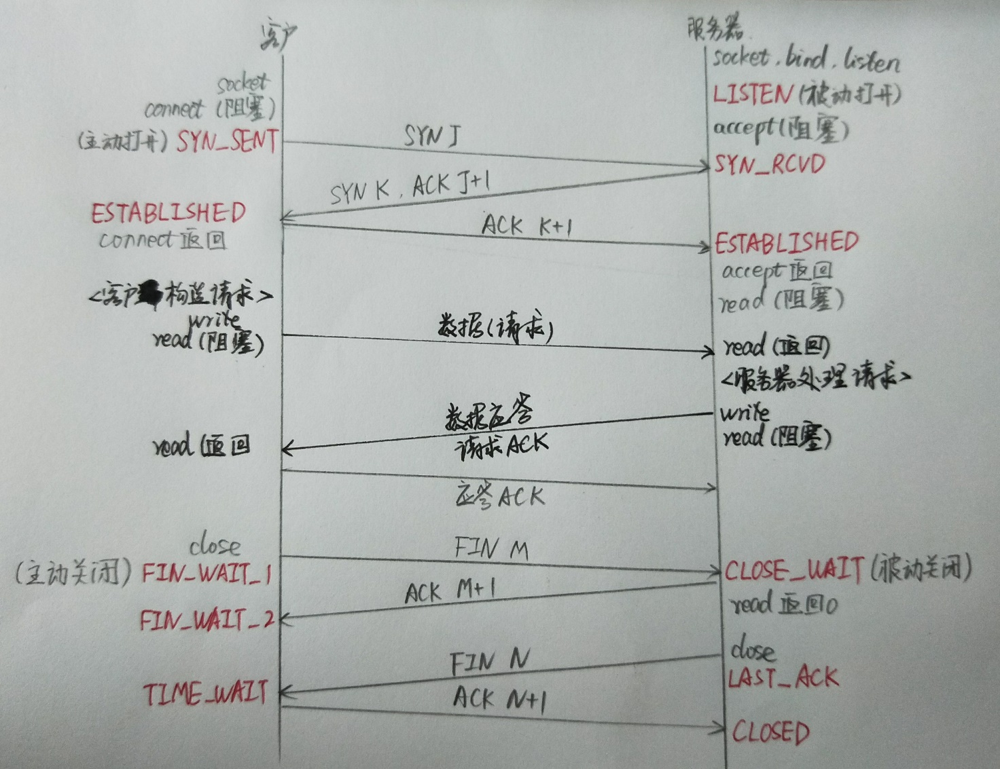
    **三次握手**

    ​	1，client想要向server发送数据，请求连接。这时client想服务器发送一个数据包，其中**同步位（SYN）被置为1**，表明client申请TCP连接，序号为j。 
    ​	2，当server接收到了来自client的数据包时，解析发现同步位为1，便知道client是想要简历TCP连接，于是将当前client的IP、端口之类的**加入未连接队列中**，并向client回复接受连接请求，想client发送数据包，其中**同步位为1，并附带确认位ACK=j+1**，表明server已经准备好分配资源了，并向client发起连接请求，请求client为建立TCP连接而分配资源。 
    ​	3，client向server回复一个ACK，并分配资源建立连接。server收到这个确认时也分配资源进行连接的建立,**将连接加入就绪队列，accept时获取**
    **四次挥手**
    ​	1**（我客户端已经没有话跟你说了）** 当client所要发送的数据发送完毕之后（这里是接收到了来自于server方的，对于clien发送的最后一个数据包的收到确认ACK包之后），向server请求关闭连接，因此client向server发送FIN数据包，表明client数据发送完了，申请断开。并且**进入等待结束连接状态FIN_WAIT-1 
    ​	2**（我服务器知道你没话说了，但是你等等我，我不确定是否没话跟你说了，等我的回复）**当server收到了来自client的FIN请求包之后，向client**回复一个确认报文ACK，同时进入关闭等待状态（CLOSE -WAIT）**，这时TCP连接的server便会向上层应用发送通知，表明client数据发送完毕，是否需要发送数据给client，这时TCP连接已经处于半关闭状态了，因为client已经没有数据要发送了。同时**client收到了来自server的确认报文之后，便会进入FIN-WAIT-2状态。** 

    ​	3， 从执行被动关闭一端到执行主动关闭一端流动数据是可能的。这称为**半关闭（half-close）**。

    ​	4，（**我服务器的上层应用也没话说了，咱们可以断开连接了**） TCP连接的server收到上层应用的指令表明没有数据要发送之后，会**向client发送一个FIN请求数据包，其中确认位ACK=1**，表明响应client的关闭连接请求，同时FIN=1表明server也准备好断开TCP连接了。 
    ​	5，（**好的，那么咱们断开连接吧**）client收到了来自server的FIN数据包之后，知道server已经准备好断开连接了，于是**向server发送一个确认数据包ACK**，告诉server，可以关闭资源断开连接了。同时**自身进入TIME-WAIT阶段，这个阶段将持续2MSL**（MSL：报文在网络链路中的最长生命时长），在等待2MSL之后，client将会关闭资源。 
    ​	6，server收到了来自于client的最后一个确认断开连接数据包之后便会直接进入TCP关闭状态，进行资源的回收。

    ***补充1***：当套接字被关闭时，其所在端TCP各自发送了一个FIN。我么在图中指出，这是由应用进程调用close而发生的，不过需要认识到，当一个Unix进程无论自愿地（调用exit或从main函数返回）还是非自愿地（收到一个终止本进程的信号）**终止时，所有打开的描述符都被关闭**，这也导致仍然打开的任何TCP连接上也发出一个FIN。
    ***补充2***：类似**SYN，FIN也占据1个字节的序列号（seq）空间**。因此，每个FIN的ACK确认号就是这个FIN的序列号加1.

12. **TCP握手以及每一次握手客户端和服务器端处于哪个状态（11种状态），对应socket？**

13. **三次握手中通过mss选项确定段的大小**

14. **为什么使用三次握手，两次握手可不可以，四次？**
    1）首先说一下为什么不是两次，**采用三次握手是为了防止失效的连接请求报文段突然又传送到服务器时产生的资源浪费**。失效的连接请求报文段是指：客户发出的SYN=1**连接请求**没有收到服务器的确认，于是经过一段时间后，客户又**重新向服务器发送连接请求**，且建立成功，顺序完成数据传输。然而这时要考虑一种情况，**客户第一次发送的连接请求并没有丢失**，而是因为网络节点导致**延迟到达服务器**，服务器以为是客户**又发起的新连接请求**，于是服务器同意连接，并向客户发回确认，如**果采用两次握手，这时这个伪新连接就已经建立了**，但客户并不会理会这个服务器发来的确认，服务器就一直等待客户发送数据，导致服务器的资源浪费。而采用三次握手，就可以保证在客户没有发来确认前不建立连接，规避掉这种情况可能造成的资源浪费。
    2）下面来说，为什么不是四次或者五次握手呢，**实际上对于三次握手来说，我们只能确保三次握手之后，客户和服务器之间的通信情况**，即可以建立连接，传输数据，对于其它的一些情况，我们是不能保证的，我们不能保证第二次握手，客户一定能收到服务器的ACK和SYN，也不能确定第三次握手服务器一定能收到客户的ACK，但是完全可靠的通信协议是根本不存在的，我们的任何通信协议都是在接受这样的现实情况之上进行的，所以从这个角度理解，无论是四次还是五次或是更多次都是徒劳的。

15. **第三次握手失败了怎么办？**
    当client与server的第三次握手失败了之后，即client发送至server的确认建立连接报文段未能到达server，server在等待client回复ACK的过程中超时了，那么server会向client发送一个RTS报文段并进入关闭状态，即：并**不等待client第三次握手的ACK包重传，直接关闭连接请求，这主要是为了防止泛洪攻击**，即坏人伪造许多IP向server发送连接请求，从而将server的未连接队列塞满，浪费server的资源。

16. **syn攻击**
    黑客仿造IP大量的向server发送TCP连接请求报文包，从而将server的半连接队列（上文所说的未连接队列，即server收到连接请求SYN之后将client加入半连接队列中）占满，从而使得server拒绝其他正常的连接请求。即**拒绝服务攻击**

17. **怎么防范这种攻击？**
    1，缩短服务器接收客户端SYN报文之后的等待连接时间，即SYN timeout时间，也就是server接收到SYN报文段，到最后放弃此连接请求的超时时间，将SYN timeout设置的更低，便可以成倍的减少server的负荷，但是过低的SYN timeout可能会影响正常的TCP连接的建立，一旦网络不通畅便可能导致client连接请求失败
    2，SYN cookie + SYN proxy 无缝集成（较好的解决方案）
    SYN cookie：当server接收到client的SYN之后，不立即分配资源，而是根据client发送过来的SYN包计算出一个cookie值，这个cookie值用来存储server返回给client的SYN+ACK数据包中的初始序列号，当client返回第三次握手的ACK包之后进行校验，如果校验成功则server分配资源，建立连接。
    SYN proxy代理，作为server与client连接的代理，代替server与client建立三次握手的连接，同时SYN proxy与client建立好了三次握手连接之后，确保是正常的TCP连接，而不是TCP泛洪攻击，那么SYN proxy就与server建立三次握手连接，作为代理（网关？）来连通client与server。（类似VPN了解一下。）

18. **为什么TCP建立连接是三次握手，终止连接却要四次挥手**
    因为当服务器收到客户的SYN连接请求报文之后，可以直接发送SYN＋ACK报文。其中，**ACK报文是用来应答的，SYN报文是用来同步的**。但是关闭连接时，当**服务器收到FIN报文时，服务器执行被动关闭**，这个FIN由TCP确认，也作为一个文件结束符传递给接收端应用进程，放在已排队等候接收端应用进程处理的其它数据之后，也就是说，**服务器在接收到FIN之后，可能不会立即关闭SOCKET，所以只能先回复一个ACK报文，通知客户“你发的FIN报文我收到了”**。只有等接收端应用进程处理完其它数据之后，服务器才会发送FIN报文，因此关闭连接时服务器发来的ACK 和FIN可能不能一起发送，所以需要四次挥手。
    **前两次挥手是为了断开client至server的连接，后两次挥手是为了断开server至client的连接**，如果没有四次挥手，会出现如下状况：
        server发送FIN数据包并携带ACK至client之后直接断开连接，**如果client没有收到这个FIN数据包，那么client会一直处于等待关闭状态**，这是为了确保TCP协议是面向连接安全有保证锝。
        上面解释了为什么不是三次挥手，同理，两次挥手也是不安全的。不能保证server与client都能正确关闭连接释放资源，而不会造成资源浪费。

19. **挥手的6个状态？作用？fin_wait1 、fin_wait2半关闭状态、time_wait2msl时间、close_wait、last_ack、closed**

20. **TIME_WAIT的意义（为什么2MSL）,存在大量怎么解决, 哪一方会进入**
    **1）可靠的实现TCP全双工连接的终止：**
    TIME_WAIT存在是因为，虽然服务器和客户都已经同意关闭连接，而且挥手的四个报文也都发送完毕且被接收，按理客户是可以直接回到CLOSED状态，但是因为我们必须要假想网络是不可靠的，我们无法**保证客户最后发送的ACK报文一定会被服务器收到**，也就是说处于LAST_ACK状态的服务器很有可能因为超时未收到客户的ACK报文，而重新发送自己的FIN报文，所以这个TIME_WAIT状态的作用就是用来重发可能丢失的ACK报文。也就是说TIME_WAIT可以用来维护状态信息，以允许它重新发送最终的那个ACK。要是客户不维护状态信息，直接CLOSED，当接收到服务器的FIN时，客户将响应以一个RST，该分节将被服务器解释成为一个错误。
    **2）允许老的重复分节在网络中消逝： （TIME_WAIT等于2MSL的原因）**
    除了在关闭连接时保证有效的状态保留之外，TIME_WAIT还有一个作用，就是可以**允许旧的重复分节在网络中消逝。**
    MSL是任何IP数据报能够在因特网中存活的最长时间。分组在网络中“迷途”通常是路由异常的结果。某个路由器崩溃或某两个路由器之间的某个链路断开时，路由协议需要花数秒钟到数分钟的时间才能稳定并找出另一条通路。在这段时间内有可能发生路由循环（路由器A把分组发给路由器B，而B再把它们发送回A），我们关心的分组可能就此陷入这样的循环。在它迷途期间，**发送端TCP超时并重传该分组**，通过某条候选路径到达最终目的地。然而不久后（自迷途的分组开始其旅程起最多MSL秒之内）路由循环修复，早先迷失在这个循环中的分组最终也被送到目的地。这个**原来的分组成为迷途的重复分组**或漫游的重复分组。
    在关闭一个TCP连接后，马上又重新建立起一个相同的IP地址和端口之间的TCP连接，后一个连接被称为前一个连接的化身，那么有可能出现这种情况，前一个连接的迷途重复分组在前一个连接终止后出现，从而被误解成从属于新的化身。
    为了避免这个情况，TCP不允许处于TIME_WAIT状态的连接启动一个新的化身，因为TIME_WAIT状态持续2MSL，就可以保证当成功建立一个TCP连接的时候，来自连接先前化身的重复分组已经在网络中消逝。
    **3）影响**
         在**高并发短连接**的TCP服务器上，当服务器处理完请求后立刻主动正常关闭连接。这个场景下会出现大量socket处于TIME_WAIT状态。如果客户端的并发量持续很高，此时部分客户端就会显示连接不上。
    **主动正常关闭TCP连接，都会出现TIMEWAIT。**有两个方面需要注意：
    高并发可以让服务器在短时间范围内同时占用大量端口，而端口有个0\~65535的范围，并不是很多，刨除系统和其他服务要用的，剩下的就更少了。
    在这个场景中，短连接表示“**业务处理+传输数据的时间 远远小于 TIMEWAIT超时的时间**”的连接。
    这里有个相对长短的概念，比如取一个web页面，**1秒钟的http短连接处理完业务，在关闭连接之后，这个业务用过的端口会停留在TIMEWAIT状态几分钟，而这几分钟，其他HTTP请求来临的时候是无法占用此端口的(占着茅坑不拉翔)**。单用这个业务计算服务器的利用率会发现，服务器干正经事的时间和端口（资源）被挂着无法被使用的时间的比例是 1：几百，服务器资源严重浪费。（说个题外话，从这个意义出发来考虑服务器性能调优的话，**长连接业务的服务就不需要考虑TIMEWAIT状态**。同时，假如你对服务器业务场景非常熟悉，你会发现，在实际业务场景中，一般长连接对应的业务的并发量并不会很高。
    综合这两个方面，持续的到达一定量的高并发短连接，会使服务器因端口资源不足而拒绝为一部分客户服务。同时，**这些端口都是服务器临时分配，无法用SO_REUSEADDR选项解决这个问题。**

    ```cpp
     //编辑内核文件/etc/sysctl.conf，加入以下内容：  
     net.ipv4.tcp_syncookies = 1 //表示开启SYN Cookies。当出现SYN等待队列溢出时，启用cookies来处理，可防范少量SYN攻击，默认为0，表示关闭；  
     net.ipv4.tcp_tw_reuse = 1 //表示开启重用。允许将TIME-WAIT sockets重新用于新的TCP连接，默认为0，表示关闭；  
     net.ipv4.tcp_tw_recycle = 1 //表示开启TCP连接中TIME-WAIT sockets的快速回收，默认为0，表示关闭。  
     net.ipv4.tcp_fin_timeout = 30 //修改系默认的 TIMEOUT 时间  
     //然后执行 /sbin/sysctl -p 让参数生效.  
     
     //不理想就继续修改  
     net.ipv4.tcp_keepalive_time = 1200   #表示当keepalive起用的时候，TCP发送keepalive消息的频度。缺省是2小时，改为20分钟。  
     net.ipv4.ip_local_port_range = 1024 65000   
     #表示用于向外连接的端口范围。缺省情况下很小：32768到61000，改为1024到65000。  
     net.ipv4.tcp_max_syn_backlog = 8192   #表示SYN队列的长度，默认为1024，加大队列长度为8192，可以容纳更多等待连接的网络连接数。  
     net.ipv4.tcp_max_tw_buckets = 5000   #表示系统同时保持TIME_WAIT套接字的最大数量，如果超过这个数字，TIME_WAIT套接字将立刻被清除并打印警告信息。
    ```

    

21. **close_wait状态大量存在的原因 ？解决办法？1.调用shutdown进行半关闭 2.程序忙于其他事情，没时间发fin包？**
    **被动关闭的一方收到FIN包后，协议层回复ACK**；然后**被动关闭的一方，进入CLOSE_WAIT状态，**主动关闭的一方等待对方关闭，则进入FIN_WAIT_2状态；此时，主动关闭的一方 **等待** 被动关闭一方的应用程序，调用close操作。
    出现大量close_wait的现象，**主要原因是某种情况下对方关闭了socket链接，但是我方忙与读或者写，没有关闭连接。**代码需要判断socket，一旦读到0，断开连接，read返回负，检查一下errno，如果不是AGAIN，就断开连接。
    **可用心跳包解决**。
    其中的close不一定能够一次就直接关闭，只有在处理完已排队的发送数据之后，才能够真正的执行关闭。半关闭的状态就是这个时候产生的，一个客户发来了一个FIN请求关闭，服务器响应这个FIN，回给客户一个ACK，服务器将这个FIN也作为一个文件结束符放进等待接收端进程处理的队列中，当应用进程处理完队列中剩余的数据后，才会读到这个文件结束符，执行真正的关闭动作，并给客户返回一个FIN，客户收到FIN之后返回给服务器一个ACK，进入TIME_WAIT状态，等待2MSL后，关闭自身，结束半关闭状态。

    ​	1.代码需要判断socket，一旦read返回0，断开连接，read返回负，检查一下errno，如果不是AGAIN，也断开连接。(注:在UNP 7.5节的图7.6中，可以看到使用select能够检测出对方发送了FIN，再根据这条规则就可以处理CLOSE_WAIT的连接)
    ​	2.给每一个socket设置一个时间戳last_update，每接收或者是发送成功数据，就用当前时间更新这个时间戳。定期检查所有的时间戳，如果时间戳与当前时间差值超过一定的阈值，就关闭这个socket。
    ​	3.使用一个Heart-Beat线程，定期向socket发送指定格式的心跳数据包，如果接收到对方的RST报文，说明对方已经关闭了socket，那么我们也关闭这个socket。
    ​	4.设置SO_KEEPALIVE选项，并修改内核参数

22. **netstat命令查看tcp连接前后状态**

23. **超时重传机制（不太高频）**
    由于下层网络层（IP）可能出现丢失、重复或失序包的情况，TCP协议提供可靠数据传输服务。为保证数据传输的正确性，TCP需要尽可能的处理这些情况，TCP需要有能力确认是否出现丢包，当数据段或确认信息丢失时，TCP启动重传机制，重传尚未确认的数据。
    TCP有两套独立机制来完成重传：
    1）**超时重传机制**：
    TCP发送端设置一个重传计时器（RTO）。在设定计时器前，需记录被计时的报文段序列号，若及时收到了该报文段的ACK，那么及时期被取消。之后发送端发送一个新的数据包时，需设定一个新的计时器，并记录新的序列号。因此每一个TCP连接的发送端不断的设定和取消一个重传计时器；如果没有数据丢失，就不会出现计时器超时。若在连接设定的RTO（Retransmision timeout）内，TCP没有收到被计时的报文段的ACK，将会触发超时重传。TCP将超时重传视为相当重要的一件事，这种情况发生时，它通过降低当前数据发送率来对此进行快速响应。超时重传中要注意的是：○1这些被发送的报文段被放在一个窗口内，等待被确认，没有确认就不会从窗口中移走，计时器在RTO到时前，每个片段的位置不变。○2只有等到ACK收到时，变成发送并ACK的片段，才会被窗口移走。○3如果定时器到期还没有收到对应ACK，就重传这个TCP报文段。
    2）**快速重传机制**：即当接收端收到比期望序号大的报文段时，便会重复发送最近一次确认的报文段的确认信号，我们称之为**冗余ACK**（duplicate ACK）。如果在超时重传定时器溢出之前，接收到**连续的三个重复冗余ACK**（其实是收到4个同样的ACK，第一个是正常的，后三个才是冗余的），发送端便知晓哪个报文段在传输过程中丢失了，于是重发该报文段，不需要等待超时重传定时器溢出，大大提高了效率。**（此时拥塞控制进行快启动）**

24. **TCP怎么保证可靠性（面向字节流，超时重传，应答机制，滑动窗口，拥塞控制，校验等）？发送端是如何确认需要重传哪些包的**
    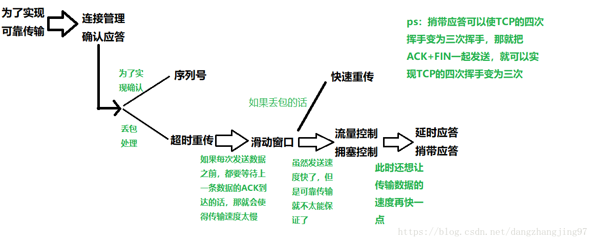
    1）**面向字节流**：TCP必须把一个发送应用程序的字节流转换成一组IP可以携带的分组，这被称为组包（packetization）。这些分组包含序列号，该序列号在TCP中实际代表了每个分组的第一个字节在整个字节流中的数据偏移，而不是简单的分组号。这允许分组在传递中是大小可变的，并允许它们组合，组合的过程称为重新组包（repacketization）。应用程序数据被打散成TCP认为的最佳大小的块来发送，一般使得每个报文段按照不会被分片的IP层数据报的大小来划分。这与UDP不同，使用UDP时，应用程序每次写入就会产生一个UDP数据报，写入多少数据，再加上UDP的头部，就形成了一个UDP数据报，不会自己进行分片，而增加了传送到IP层被分片的可能性，也就引入了产生错误的可能性。
    2）**校验**：TCP维持了一个强制的校验和，该校验涉及的内容较多，包括TCP头部、任何相关应用程序数据和IP头部的所有字段。它用于检测传送中引入的比特差错，如果一个带有无效校验和的报文到达，那么TCP会丢弃它，而且不为丢弃的报文发任何确认。然而，TCP接收端可能会对一个以前的（已经确认的）报文段进行确认，以帮助发送方计算它的拥塞控制。TCP校验和使用的数学函数与其它互联网协议（UDP、ICMP等）一样。对于大数据的传送，对这个校验和是否不够强壮的担心是存在的，所以仔细的应用程序应该应用自己的差错保护方法，或者使用一种中间层来达到同样的效果。
    3）**重传**：超时+快速（3冗余）
    4）**应答机制**：当TCP接收到对方的数据时，它会发送一个确认。这个确认可能不会立即发送，而一般会延迟片刻。TCP使用的ACK是积累的，从某种意义上讲，一个指示字节号N的ACK暗示着所有直到N的字节（不包括N）已经成功被接收了。这样对于ACK的丢失带来了一定的鲁棒性，如果一个ACK丢失，很有可能根据后面的ACK就足矣确认前面的报文段了，
    5）滑动窗口
    6）拥塞控制
    7）流量控制

25. **如何实现可靠upd**

    最重要的是得解决可靠性问题，那可靠传输如何保证？

   * **超时重传**
* **确认机制**
  只要具备这两个机制，我们就能实现**最基本、最简单的可靠传输**。要想支持这两点，那么你所发送的**所有报文都需要进行编号**。**接收方按照编号的顺序，重组报文**，最终应用层就可以读取到有序的数据。
  那么问题来了，接收方如何知道哪一包是第一包的报文呢？**不妨约定第一包的编号为 0**，如此我们就可以快乐的使用UDP + 确认机制 + 超时重传来保证可靠的数据传输了。
  协商第一包数据编号。这个第一包编号，称为 ISN (Initial Sequence Number，初始序号)，一定要记住这个名词，很重要，默念几遍。刚刚我们约定的策略是，**第一包数据是编号是 0，那黑客就可以利用这个漏洞，伪造 TCP 报文，篡改数据**，有了 ISN 后，双方就可以通过 ISN 来协议第一包数据编号了。通常实现上，ISN 的初始值是一个随机数（看你怎么猜！）。
  协商 MSS 以及确认双方数据接收能力。
  通俗的说，**三次握手的目的是要建立一个信任关系**，探测对方的老底，确认对方的能力，同时防止被黑客攻击。

26. **流量控制的介绍，采用滑动窗口会有什么问题（死锁可能，糊涂窗口综合征）**
    TCP中**使用滑动窗口来实现流量控制**，对于滑动窗口来说，就是TCP连接的每一端都是通过一组窗口结构来维护发送数据的。每个TCP活动连接的两端都维护了一个发送窗口结构和一个接收窗口结构。
    发送方维护一个接受窗口。当前接收窗口大小是**发送回发送端的 ACK **中通告的“窗口”字段值，等于最大接收窗口大小与已接收和确认但尚未被应用程序检索的数据量之间的差值。
    **1）发送端窗口：**
    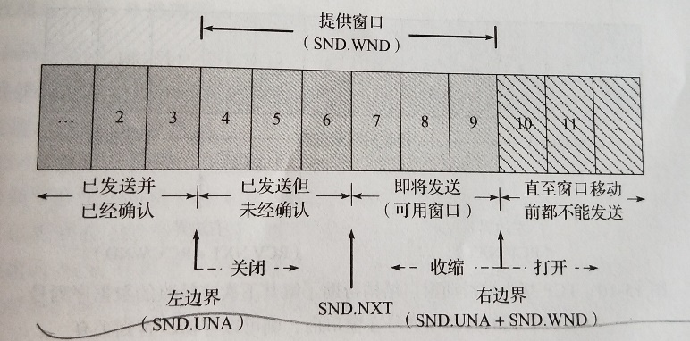
    提供窗口：**由接收端通告的窗口**，即**发送回发送端的 ACK的**TCP头部中的窗口大小所提供的信息。在提供窗口中被分成了两个部分，一部分是已发送但未经确认的部分，另一部分是即将发送的部分，也称为可用窗口，在提供窗口的左侧是已经发送并经过确认的数据。
    在提供窗口右侧是直到窗口移动前都不能发送的数据。提供窗口有两个边界，左边界和右边界，左边界可用向右移，当已发送数据得到ACK时，窗口减小，这个运动称为关闭；右边界也可以右移，使得可发送数据量增大。当已确认数据得到处理，接收端缓存变大，窗口也随之变大，这个运动称为打开。右边界还可以左移，这个运动称为收缩。但左边界不能左移，因为它控制的是已确认的ACK号，具有累积性，不能返回。提供窗口中内部也有一个分界线，将已发送但未确认的数据和可用窗口的数据进行分界，当有数据发送时，这个分界线会移动。
    每个TCP报文段都包含ACK号和窗口通告信息，TCP发送端可以据此调节窗口结构。当得到的ACK号增大而窗口大小保持不变时，我们就说窗口向前“滑动”。若随着ACK号增大而窗口大小减小，则左右边界距离减小。当左右边界相等时，称之为零窗口。此时发送端不能再发送数据。这种情况下，TCP发送端开始探测对方窗口，伺机增大提供窗口。
    **2）接收端窗口：**
    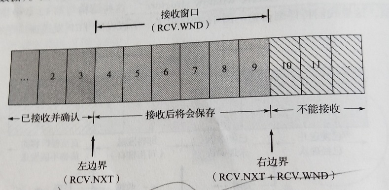
    接收端也维护一个窗口结构，但比发送端窗口简单。该窗口也有一个接收窗口，接收窗口有左右边界，左边界左侧是已接收并确认的数据，右边界标识出能接收的最大序列号，右边界右侧是不能接收的数据，这样**接收窗口就可以做到避免存储重复的已接收和确认数据，以及避免存储不应接收的数据**。在接收窗口中接收并保存发送端发来的数据。同样，只有当到达数据序列号等于左边界时，窗口才能向前滑动。对选择确认TCP来说，窗口内的其它报文段也可以被确认，但只有在接收到等于左边界的序列号数据时，窗口才能向前移动。
    **3）滑动窗口和流量控制：**
    TCP是**通过接收端的通告窗口来实现流量控制**的。通告窗口指示了接收端可接收的数据量。**当窗口值变为0时，可以有效阻止发送端继续发送，直到窗口大小恢复为非零值。**当接收端重新获得可用空间时，会给发送端传输一个窗口更新，告知其可继续发送数据。以此实现流量控制。
    窗口是处于传输层，与应用层无关，故无论接收方应用层是否read，都维护，但其rwnd会快速到0.
    **4）滑动窗口中可能存在的死锁：**
    滑动窗口中可能存在一种死锁情况，就是发送端的接收窗口在被设置为零窗口后，接收端重新获得空间，想要让发送端更新窗口大小为非零值，所以发送了一个窗口更新，但当这个包含窗口更新的ACK丢失时，通信双方就会一直处于等待状态：接收方等待接收数据，以为对方已经将窗口设置为非零值，发送方则等待接收方发来窗口更新的通知并没有准备发送数据，也就造成了死锁。
    为了防止上述的死锁的发生，发送端会采用一个持续计时器间歇性的查询接收端，看其窗口是否已经增长。持续计时器会触发窗口探测的传输，强制要求接收端返回包含了窗口大小字段的ACK。窗口探测包含一个字节大的数据，采用TCP可靠传输（丢失重传），可以避免由窗口丢失导致的死锁。但是这种探测与TCP的重传机制不同，在重传机制中，超过一定次数和时间的重传会被终止，但是通常TCP不会停止发送窗口探测，这种情况可能会造成某种程度的资源耗尽。
    **5）糊涂窗口综合征**
    基于窗口的流量控制机制，尤其是不使用大小固定的报文段的情况（如TCP），可能会出现糊涂窗口综合征（Silly Window Syndrome，SWS）的缺陷。当出现该问题时，交换数据段大小不是全长的而是一些较小的数据段。由于每个报文段中有用数据相对于头部信息的比例较小，因此耗费的资源也更多，相应的传输效率也更低。
    TCP连接的两端都可能导致SWS的出现：接收端没有等到窗口变的更大就发出通告窗口，导致通告的接收端窗口较小，会造成SWS；或者发送端没有等待其它数据组合成一个更大的报文段就发送数据，所以发送的数据段较小，造成了SWS这种问题的浪费资源。
    要避免糊涂窗口综合征，必须在发送端或接收端实现相关规则。TCP的某一端无法预知另一端的情况，所以需要遵循以下规则：
    接收端要遵循：不应该通告小的窗口值。在窗口可增加到一个全长的报文段（即接收端MSS）或者接收端缓存空间的一半（取两者中较小者）之前，不能通告比当前窗口（可能为0）更大的窗口值。可能有两种情况会遇到该规则：当应用程序处理接收到的数据后使得可用缓存增大，以及TCP接收端需要强制返回对窗口探测的响应。
    发送端遵循：不应发送小的报文段，而且需要由Nagle算法控制何时发送。为避免SWS问题，只有至少满足以下条件之一时才能传输报文段：
    a.全长（发送MSS字节）的报文可以发送；
    b.数据段长度&gt;=接收端通告过的最大窗口值的一半的，可以发送；
    c.满足以下任一条件的都可以发送：(i)某一ACK不是目前期盼的（即没有未经确认的在传数据）；(j)该连接禁用Nagle算法。
    条件a最直接的避免了高耗费的报文段传输问题。条件b针对通告窗口值较小，可能要小于传输的报文的情况。条件c防止TCP在数据需要被确认以及Nagle算法启用的情况下发送小报文段。若发送端应用在执行某些较小的写操作（如小于报文段大小），条件c可以有效避免SWS。

27. **tcp滑动窗口协议**
    滑动窗口协议，属于TCP协议的一种应用，用于网络数据传输时的流量控制，以避免拥塞的发生。该协议允许发送方在停止并等待确认前发送多个数据分组，就是有个提供窗口。由于发送方不必每发一个分组就停下来等待确认，因此该协议可以加速数据的传输，提高网络吞吐量。
    ＋ 26 中的1） 2） 3） 4） 5）

28. **拥塞控制和流量控制的区别**
    **流量控制是端到端的控制**，例如A通过网络给B发送数据，A发送的太快导致B没办法接收（B缓冲窗口过小或者处理过慢），这时候的控制就是流量控制，**原理是通过滑动窗口大小改变来实现的流量控制。**
    拥塞控制是A与B之间的**网络发生堵塞导致传输过慢或者丢包**，来不及传输。防止过多的数据注入到网络中，这样可以使网络中的路由器或链路不至于过载。**拥塞控制是一个全局性的过程**，涉及到所有的主机，路由器以及与降低网络性能有关的所有因素。
    数据包分为：交互数据流和块数据流 交互数据流：nagle算法、延时确认 块数据流：滑动窗口、窗口大小 
    TCP拥塞控制，算法名字？ 
    慢启动、拥塞避免、快速重传、快速恢复。
      1）慢启动和拥塞避免：
      **慢启动：**在每收到一个**新的报文段的确认**后，把拥塞窗口增加至多一个MSS的数值。
      **拥塞避免：**每经过一个**往返时间RTT**就把发送方的拥塞窗口cwnd加1，而不是加倍
    只要判断网络**出现拥塞（超时）**，就要把慢启动开始门限（**ssthresh）设置为发送窗口的一半**（&gt;=2），**cwnd设置为1**，然后再使用慢启动算法。若**收到三个重复的确认ACK**时，则**进入快速重传与快速恢复**。
      i.当**cwnd &lt; ssthresh**时，使用上述**慢启动**算法；
      ii.当**cwnd &gt;ssthresh**时，停止使用慢启动算法，改用**拥塞避免**算法；
    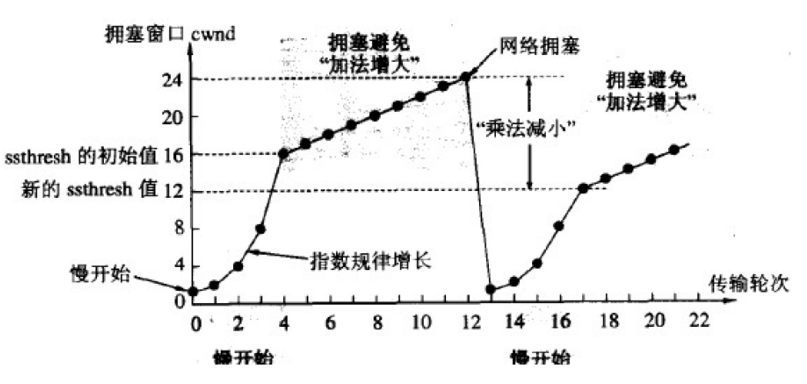
      快速重传与快速恢复：
    
    2）
    **快速重传**就是当发送端**收到三个重复的确认ACK**时，断定分组丢失，立即重传丢失的报文段，而不需要等待重传计时器超时。
    **快速恢复**：
    当收到3个重复ACK时，把**ssthresh设置为cwnd的一半**，把**cwnd设置为ssthresh的值加3**，然后**重传丢失的报文段**。
    ***注：***加3的原因是因为收到3个重复的ACK，表明有3个“老”的数据包离开了网络。（既然发送方收到三个重复的确认，就表明有三个分组已经离开了网络。这三个分组不再消耗网络 的资源而是停留在接收方的缓存中。可见现在**网络中并不是堆积了分组而是减少了三个分组**。因此可以适当把拥塞窗口扩大了些。）
    每收到**重复**的ACK，则cwnd加1；
    收到**非重复**ACK时，置cwnd＝ssthresh，**转入拥塞避免阶段**（说明从重复ACK时的数据都已收到，该恢复过程已经结束，可以回到恢复之前的状态了，也即再次进入拥塞避免状态。）；
    如果**发生超时**重传，则置ssthresh为当前cwnd的一半，cwnd＝1，重新**进入慢启动**阶段。

29. **http协议与TCP联系**

30. **http/1.0和http/1.1的区别**

31. **http的请求方法有哪些？get和post的区别。**

32. **http的状态码**

33. **http和https的区别，由http升级为https需要做哪些操作**
    HTTPS是以安全为目标的HTTP通道，即在HTTP之外加上了SSL构建的可以进行加密传输、身份认证的网络协议。使用HTTP则是直接在客户端与服务器之间建立TCP连接，默认使用80端口，使用明文在网络中传输通信，通信结束后，断开TCP连接。但HTTPS则是具有安全性的ssl加密传输协议，起初需要建立SSL安全连接，默认使用443端口，然后在网络中传输的内容也是经过加密的。下面来详细讲解一下**HTTPS的具体实现过程**：

    **1）客户端发起HTTPS请求：**用户在浏览器中输入一个https网址，然后连接到服务器的443端口。

    **2）服务器端配置**：采用HTTPS协议的服务器必需要有一套数字证书，可以自己生成，也可以向组织申请，区别就是自己生成的证书会给客户端提示，证书可能不安全，需要客户端验证通过才能继续访问；而使用受信任的公司申请的证书则不会弹出提示页面。这个证书就携带着一对公钥和私钥。

    **3）服务器传送证书给客户端：**证书中包含很多信息，如证书的颁发机构，过期时间等。

    **4）客户端解析证书：**这部分工作是由客户端的TLS来完成的，首先会验证公钥是否有效，比如颁发机构的数字签名是否一致，有效期是否过期等。如果发现异常，则会弹出一个警告框。在确认发来的证书无误后，即确保公钥无误后，客户端生成一个随机值，然后用证书中的公钥对这个随机值进行加密，准备将结果传送给服务器。

    **5）传送用于加密的信息：**向服务器传送上一步中经过公钥加密的随机值，以后客户端和服务器之间需要使用这个随机值对传送的数据进行对称加密后传输。

    **6）服务器解密用于加密的信息：**服务器使用自己的私钥对用公钥加密的随机值进行解密，获取随机值，这样客户端和服务器都有一个共同的密钥用于加密数据，且该密钥没有明文在网络中传送过。

    **7）开始在SSL连接上进行数据传输：**服务器用随机值密钥对信息进行加密，传输给客户端，客户端使用随机值密钥对信息进行解密，获取信息。

    ​       总的来说，HTTPS协议需要服务器端有证书，两个协议使用的端口号不同80和443，另外HTTP的连接很简单，是无状态的，而HTTPS协议是由SSL＋HTTP协议构建的可进行加密传输、身份认证的网络协议，比HTTP更安全。

    ​       那么由**HTTP升级为HTTPS又要做什么呢？**

    ​       ①首先服务器要支持HTTPS，自己生成证书或者向组织机构申请证书，安装证书；
    ​       ②需要对页面中的所有链接，例如js，css，图片等链接都要进行修改。在修改过程中需要注意备份。

    ​       虽然HTTPS比HTTP要安全一些，但正因为加入了SSL连接的建立，HTTPS在初始会比HTTP耗时更多，HTTP的TCP建立只需要3个包，而SSL的建立就需要9个包，这样一共需要12个包，所以说，HTTPS虽然安全但也是损失一部分效率换来的，两个各有适用情况。

    

34. **URL包括哪三个部分？**HTTP URL的格式如下：

    ​		http://host\[:port]\[abs_path]

    http：表示要通过HTTP协议来定位网络资源；

    **host**：表示合法的Internet主机域名或IP地址；

    **port**：指定一个端口号，为空则使用缺省端口80；

    **abs_path**：制定请求资源的URI，如果URL中没有给出abs_path，那么当它作为请求URI时，必须以 ‘／’的形式给出，通常浏览器可以自动补充。

    例如： 浏览器网址栏输入www.guet.edu.cn 

    ​              浏览器自动转换成http://www.guet.edu.cn/

    ​              经过DNS解析，变成http:192.168.0.116:8080/index.jsp

35. **一个机器能够使用的端口号上限是多少，为什么？可以改变吗？那如果想要用的端口超过这个限制怎么办？**

36. **对称密码和非对称密码体系**

37. **数字证书的了解（高频）**
    数字证书主要的作用是确保公钥不被冒充。数字证书是经过权威机构（CA）认证的公钥，通过查看数字证书可以知道该证书是由哪家权威机构签发的，证书使用人的信息，使用人的公钥，具有以下特点：由专门的机构签发的数据证书才有效；签发数据证书是收费的；数据证书不会被冒充，安全可信；数字证书有使用期限，过了使用期限，证书变为不可用。CA也可以在试用期内，对证书进行废操作。CA的公钥已经集成到操作系统中了，如图
    
    1）举例说明某个版本下的数字证书需要包括：版本号、序列号、证书算法标识、颁发者名称、有效期、使用者名称、使用者公钥信息、颁发者唯一标识符、使用者唯一标识符，扩充信息、证书颁发机构的数字签名。
    2）生成一个数字证书的过程为：
        持有人将公钥以及身份信息发送给权威机构；
        权威机构负责对持有人的身份进行验证，确保公钥和持有人的信息准确无误；
        权威机构使用自己的私钥对持有人公钥进行数据签名，生成数字证书；
        为了确保证书不被篡改，权威机构对数字证书进行hash计算，生成摘要，使用自己的私钥对摘要进行数字签名，然后放到数字证书中。
      对持有人收费。
    3）上面多次提到数字签名，下面来说一下什么是数字签名：
    数字签名这个概念我们通过两个人之间发送信件来讲，假设A要给B发送一个信件，那么B如何确定收到的信件就是A发来的，而没有经过篡改呢，就是通过A把数字签名加到信件中实现的。过程就，
        A将信件通过hash计算，得到一个消息摘要，这个摘要要保证，不能通过消息摘要计算出信件的内容，且消息摘要不会重复。如果信件遭受过改动，再次计算hash得到的消息摘要是不会和改动前的消息摘要一致的。
        A将使用自己的私钥对消息摘要进行加密，加密后得到的结果，我们就可以称之为“数字签名”，A将信件连同数字签名一同发给B。
        B收到信件时，使用A的公钥将数字签名解密，如果解密顺利，说明确认是A签发的数字签名，不是别人签发的数字签名。下面检查是否经过篡改，B使用hash计算信件内容，新的到的消息摘要和解密数字签名的到的消息摘要进行对比，如果一样，则说明没有经过篡改。
    这就是数字签名的使用过程，可以保证某个数据是需要方发出的，且在传输过程中没有经过篡改，内容是可信的。

38. **客户端为什么信任第三方证书**

39. **RSA加密算法，MD5原理（MD5不算加密算法）**
    **1）MD5加密**（单向散列算法）的全称是Messgae-Digest Alogrithm 5(信息－摘要算法)。

    MD5的功能：

    ​	①输入任意长度的信息，经过处理，输出为128位的信息（数字指纹）；

    ​	②不同的输入得到不同的结果（唯一性）；

    ​	③根据128位的输出结果不可能反推输入的信息（不可逆），也就是只能加密，不能解密。

    MD5的用途：

    ​	①防止被篡改：例如，发送一电子文档，发送前，现保留MD5的输出结果a，然后在对方收到电子文档时，新生成一个MD5的结果b，比对a和b，如果ab一样就代表中途未被篡改。再如，网站提供文件下载功能，为了防止不法分子在安装程序中添加木马，可以在网站上公布由安装文件得到的MD5输出结果。

    ​	②防止直接看到明文，现在由很多网站在数据库中存储用户的密码时都是存储用户密码的MD5值。这样就算不法分子得到数据哭的用户密码的MD5值，也无法知道用户的密码（但这样也存在安全隐患）。比如在UNIX系统中用户的密码就是MD5经过加密后存储在文件系统中的。当用户登录时，系统把用户输入的密码计算成MD5值，然后再和保存在文件中的MD5值进行比较，进而确定输入的密码是否正确。通过这样的步骤，系统并不知道用户密码的明文情况下，就可以确定用户登录系统的合法性。这不但可以避免用户的密码被具有系统管理员权限的用户知道，而且还在一定程度上责怪来密码被破解的难度。

    ​	③防止抵赖（数字签名），这个需要一个第三方认证机构。例如A写了一个文件，认证机构对词文件用MD5算法产生摘要信息并做好记录。若以后A说不承认文件是自己写的，权威机构只需要对此文件重新生成摘要信息，然后进行比对，如果相同，则A无法抵赖。

    **2）RSA加密**

    ①RSA是第一个比较完善的公开密钥算法，它既能用于加密，也能用于数字签名。

    ②RSA加密是可逆的，一个字符串可以经过RSA加密后，经加密后的字符串传到对端如服务器上，再进行解密即可。前提是服务器知道解密的私钥，当然这个私钥最好不要再网络传输。

    ③RSA的安全基于大数分解的难度。其公钥和私钥是一对大数（100到200位十进制数或更大）的函数。从一个公钥和密文恢复出明文的难度，等价于分解两个大素数之积（这是公认的数学难题）。

    

    ​       在RSA密码中，公钥是被公开的，即n和e的数值可以被第三方窃听者得到。破解RSA密码的问题就是从已知的e和n的数值，想办法求出d的数值，这样就可以得到私钥来破解密文。从上面 

    可以看出，密码破解的实际问题是需要知道p－1和q－1的值，即知道p和q的值，就可以求解出d，根据已知的n，即两个大数的乘积去拆解分析出两个数的具体值。

    然而，虽然RSA的安全性依赖于大数的因子分解，但并没有从理论上证明破译RSA的难度与大数分解难度等价。即RSA的重大缺陷是无法从理论上有把握它的保密性能如何。此外，**RSA的缺点**还有：

    ​	①产生密钥很麻烦，受到素数产生技术的限制，因而难以做到一次一密。

    ​	②分组长度太大，为保障安全性，n至少也要有600bits以上，使运算代价很高，尤其速度比较慢，较对称加密算法慢几个数量级；且随着大数分解技术的发展，这个长度还在增加，不利于数据格式化的标准化。因此，使用RSA只能加密少量数据，大量的数据加密还要靠对称密码算法。

40. **单条记录高并发访问的优化**

41. **介绍一下ping的过程，分别用到了哪些协议**
    
    首先假设A ping B
    **1.**ping通知系统建立一个固定格式的ICMP请求数据包。
    **2.**ICMP协议打包这个数据包和B的IP地址**转交给IP协议层，**ICMP数据包内包含多个字段。最重要的是两个，第一个是**类型字段**，对于请求数据包而言该字段为8；另一个是**顺序号**，主要用于区分连续ping的时候发出的多个数据包。
    **3.**IP层协议将机器B的**IP地址为目的地址，本机的IP地址为源地址，协议字段(0x01**, ICMP的协议号)，加上一些头部必要的控制信息，构建一个IP数据包
    **4.**获取B的MAC地址，做这个操作**首先机器A会判断B是否在同一网段内**，若IP层协议通过B的IP地址和自己的子网掩码，发现它跟自己属于同一网络，就直接在本网络查找这台机器的MAC，否则则通过路由器进行类似查找。
    （具体的判断方法是将目标IP和子网掩码一起找出目标网络，看是否等于本地网络；例：目标IP(192.168.20.2), 子网掩码 255.255.255.0，因此目标网络为 192.168.20.0，不属于本地网络(192.168.1.0)）
    **接下来是ARP协议根据IP地址查找MAC地址的过程**:
    若两台机器之前有过通信，在机器A的ARP缓存表里应该存有B的IP与其MAC地址的映射关系。若没有，则通过发送ARP**请求广播(MAC广播地址为：FF-FF-FF-FF-FF-FF)**，得到回应的B机器MAC地址，并交给数据链路层
    **5**.数据链路层构建一个数据帧，目的地址是IP层传过来的MAC地址，源地址是本机的MAC地址，再附加一些必要的控制信息，依据以太网的介质访问规则将他们传送出去
    **6.**机器B收到这个数据帧后，**先检查目的地址，和本机MAC地址对比**：
    若符合，则接受。接收后检查该数据帧。**将IP数据包从帧中提取出来**，交给本机的的IP地址协议层协议，检查其目的IP，IP协议层检查之后，将有用的信息提取给ICMP协议，后者处理，马上构建一个ICMP应答包，发送给A，其过程和主机A发送ICMP请求包到B的过程类似，但不用ARP广播收取A的信息，因为请求包中已经有足够的信息用于B回应A。**应答数据包的类型字段为0，顺序号为接收到的请求数据包中的顺序号。**
    若不符合，丢弃。
    可以知道PING的过程即一段发送报文和接受确认报文的过程，在来回直接可以计算时延。其过程简单，但其中还包括了一步**ARP协议**请求，广播请求，单播回应的过程。其他都是正常**IP**数据包的发送和接受

42. **TCP/IP的分片粘包过程，如何解决粘包**（star
    **TCP粘包**： TCP粘包是指发送方发送的若干包数据到接收方接收时粘成一包，从接收缓冲区看，后一包数据的头紧接着前一包数据的尾。socket读取时，读到了实际意义上的两个或多个数据包的内容，同时将其作为一个数据包进行处理。
    **TCP拆包：**socket读取时，没有完整地读取一个数据包，只读取一部分。
    *（1）发送方原因*
      我们知道，TCP默认会使用**Nagle算法**。而Nagle算法主要做两件事：
      1）只有上一个分组得到确认，才会发送下一个分组；
      2）收集多个小分组，在**一个确认到来时**合并一起发送。
      所以，正是Nagle算法造成了发送方有可能造成粘包现象。其**目的是为了减少网络中 TCP 报文段的数量。**
    *（2）接收方原因*
      TCP接收到分组时，并不会立刻送至应用层处理，或者说，应用层并不一定会立即处理；实际上，TCP**将收到的分组保存至接收缓存里**，然后应用程序主动从缓存里读收到的分组。这样一来，如果TCP接收分组的速度大于应用程序读分组的速度，**多个包就会被存至缓存**，应用程序读时，就会读到多个首尾相接粘到一起的包。
    *（3）处理粘包现象*
      发送方：对于发送方造成的粘包现象，我们可以通过关闭Nagle算法来解决，使用TCP_NODELAY选项来关闭Nagle算法。
      接收方：遗憾的是TCP并没有处理接收方粘包现象的机制，我们只能在应用层进行处理：
      **发送定长包**：数据段定长处理，位数不足的空位补齐。
      **消息头+消息体**：消息头中一般会包含消息体的长度，消息类型等信息，消息体为实际数据体。接收对等方先接收包体长度，依据包体长度来接收包体。
      **特殊字符（如： \\r\\n）：**作为消息数据的结尾，以实现消息数据的分段。但问题在于如果数据正文中也含有\\r\\n，则会误判为消息的边界。

43. **有没有抓过TCP包，描述一下**

44. **一个ip配置多个域名，靠什么识别？**

45. **服务器攻击（DDos攻击）**

46. **延时确认机制（200ms）、nagle算法 、快速重传**

47. **保活 心跳** 
    (1) Keep Alive机制开启后，TCP层将在定时时间到后发送相应的KeepAlive探针以确定连接可用性。默认时间为7200s(两小时)，失败后重试10次，每次超时时间75s。显然默认值无法满足移动网络下的需求；
    (2) 即便修改了(1)中的默认值，也不能很好的满足业务需求。**TCP的KeepAlive用于检测连接的死活而不能检测通讯双方的存活状态。**比如某台服务器因为某些原因导致负载超高，无法响应任何业务请求，但是使用TCP探针则仍旧能够确定连接状态，这就是**典型的连接活着但业务提供方已死的状态**，对客户端而言，这时的最好选择就是断线后重新连接其他服务器，而不是一直认为当前服务器是可用状态，一直向当前服务器发送些必然会失败的请求。
    (3) **socks代理会让Keep Alive失效**。socks协议只管转发TCP层具体的数据包，而不会转发TCP协议内的实现细节的包。所以，一个应用如果使用了socks代理，那么TCP的KeepAlive机制就失效了。
    (4) 部分复杂情况下Keep Alive会失效，如路由器挂掉，网线直接被拔除等；
    因此，KeepAlive并不适用于检测双方存活的场景，这种场景还得依赖于应用层的心跳。应用层心跳也具备着更大的灵活性，可以控制检测时机，间隔和处理流程，甚至可以在心跳包上附带额外信息。
    心跳过于频繁会带来耗电和耗流量的弊病，心跳频率过低则会影响连接检测的实时性。

48. **TCP协议和IP协议有什么关系**

49. **tcp长连接短连接，http长连接短连接**
    **HTTP的长连接和短连接本质上是TCP长连接和短连接**。HTTP属于应用层协议，在传输层使用TCP协议，在网络层使用IP协议。IP协议主要解决网络路由和寻址问题，TCP协议主要解决如何在IP层之上可靠的传递数据包，使在网络上的另一端收到发端发出的所有包，并且顺序与发出顺序一致。TCP有可靠，面向连接的特点。
    **在HTTP/1.0中，默认使用的是短连接**。也就是说，浏览器和服务器每进行一次HTTP操作，就建立一次连接，但任务结束就中断连接。如果客户端浏览器访问的某个HTML或其他类型的 Web页中包含有其他的Web资源，如JavaScript文件、图像文件、CSS文件等；当浏览器每遇到这样一个Web资源，就会建立一个HTTP会话。
    但从 **HTTP/1.1起，默认使用长连接**，用以保持连接特性。使用长连接的HTTP协议，会在响应头有加入这行代码：Connection:keep-alive
    在使用长连接的情况下，当一个网页打开完成后，客户端和服务器之间用于传输HTTP数据的 TCP连接不会关闭，如果客户端再次访问这个服务器上的网页，会继续使用这一条已经建立的连接。Keep-Alive不会永久保持连接，它有一个保持时间，可以在不同的服务器软件（如Apache）中设定这个时间。实现长连接要客户端和服务端都支持长连接。
    **1） TCP短连接**
    　　我们模拟一下TCP短连接的情况，client向server发起连接请求，server接到请求，然后双方建立连接。client向server 发送消息，server回应client，然后一次读写就完成了，这时候双方任何一个都可以发起close操作，不过一般都是client先发起 close操作。为什么呢，一般的server不会回复完client后立即关闭连接的，当然不排除有特殊的情况。从上面的描述看，短连接一般只会在 client/server间传递一次读写操作。
    短连接优点：管理起来简单，存在的连接都是有用的连接，不需要额外的控制手段
    **2） TCP长连接**
    　　接下来我们再模拟一下长连接的情况，client向server发起连接，server接受client连接，双方建立连接。Client与server完成一次读写之后，它们之间的连接并不会主动关闭，后续的读写操作会继续使用这个连接。
    首先说一下TCP/IP详解上讲到的TCP保活功能，保活功能主要为服务器应用提供，服务器应用希望知道客户主机是否崩溃，从而可以代表客户使用资源。如果客户已经消失，使得服务器上保留一个半开放的连接，而服务器又在等待来自客户端的数据，则服务器将应远等待客户端的数据，保活功能就是试图在服务 器端检测到这种半开放的连接。
    如果一个给定的连接在两小时内没有任何的动作，则服务器就向客户发一个探测报文段，客户主机必须处于以下4个状态之一：

    ​	1）客户主机依然正常运行，并从服务器可达。客户的TCP响应正常，而服务器也知道对方是正常的，服务器在两小时后将保活定时器复位。

    ​	2）客户主机已经崩溃，并且关闭或者正在重新启动。在任何一种情况下，客户的TCP都没有响应。服务端将不能收到对探测的响应，并在75秒后超时。服务器总共发送10个这样的探测 ，每个间隔75秒。如果服务器没有收到一个响应，它就认为客户主机已经关闭并终止连接。

    ​	3）客户主机崩溃并已经重新启动。服务器将收到一个对其保活探测的响应，这个响应是一个复位，使得服务器终止这个连接。

    ​	4）客户机正常运行，但是服务器不可达，这种情况与2类似，TCP能发现的就是没有收到探查的响应。

    **3） 长连接短连接操作过程**
    **短连接**的操作步骤是：
    建立连接——数据传输——关闭连接...建立连接——数据传输——关闭连接
    **长连接**的操作步骤是：
    建立连接——数据传输...（保持连接）...数据传输——关闭连接

    **4）长连接和短连接的优点和缺点**
    　　由上可以看出，**长连接**可以**省去较多的TCP建立和关闭的操作，减少浪费，节约时间**。对于频繁请求资源的客户来说，较适用长连接。不过这里**存在一个问题**，**存活功能的探测周期太长**，还有就是它只是探测TCP连接的存活，属于比较斯文的做法，遇到恶意的连接时，保活功能就不够使了。在长连接的应用场景下，client端一般不会主动关闭它们之间的连接，**Client与server之间的连接如果一直不关闭的话，会存在一个问题，随着客户端连接越来越多，server早晚有扛不住的时候**，这时候server端需要采取一些策略，如关闭一些长时间没有读写事件发生的连接，这样可 以避免一些恶意连接导致server端服务受损；如果条件再允许就可以以客户端机器为颗粒度，限制每个客户端的最大长连接数，这样可以完全避免某个蛋疼的客户端连累后端服务。
    **短连接**对于服务器来说管理较为简单，存在的连接都是有用的连接，不需要额外的控制手段。但如果客户**请求频繁**，将在**TCP的建立和关闭操作上浪费时间和带宽**。
    长连接和短连接的产生在于client和server采取的关闭策略，具体的应用场景采用具体的策略，没有十全十美的选择，只有合适的选择。
    **5） 什么时候用长连接，短连接？**  　　**长连接**多用于操作频繁，点对点的通讯，而且连接数不能太多情况，。每个TCP连接都需要三步握手，这需要时间，如果每个操作都是先连接，再操作的话那么处理速度会降低很多，所以每个操作完后都不断开，次处理时直接发送数据包就OK了，不用建立TCP连接。例如：数据库的连接用长连接， 如果用短连接频繁的通信会造成socket错误，而且频繁的socket 创建也是对资源的浪费。   　　而像WEB网站的http服务一般都用**短链接**，因为长连接对于服务端来说会耗费一定的资源，而像WEB网站这么频繁的成千上万甚至上亿客户端的连接用短连接会更省一些资源，如果用长连接，而且同时有成千上万的用户，如果每个用户都占用一个连接的话，那可想而知吧。所以并发量大，但每个用户无需频繁操作情况下需用短连好。

50. **web服务器的架构和实现**

51. **get post幂等性**
    HTTP方法的幂等性是指一次和多次请求某一个资源应该具有同样的副作用。
    HTTP GET方法用于获取资源，比如：GET http://www.bank.com/account/123456，不会改变资源的状态，不论调用一次还是N次都没有副作用。不应有副作用，所以是幂等的。
    HTTP DELETE方法用于删除资源，有副作用，但它应该满足幂等性。比如：DELETE http://www.forum.com/article/4231，调用一次和N次对系统产生的副作用是相同的，即删掉id为4231的帖子；因此，调用者可以多次调用或刷新页面而不必担心引起错误。
    POST所对应的URI并非创建的资源本身，而是资源的接收者。比如：POST http://www.forum.com/articles的语义是在http://www.forum.com/articles下创建一篇帖子，HTTP响应中应包含帖子的创建状态以及帖子的URI。两次相同的POST请求会在服务器端创建两份资源，它们具有不同的URI；所以，POST方法不具备幂等性。
    PUT所对应的URI是要创建或更新的资源本身。比如：PUT http://www.forum/articles/4231的语义是创建或更新ID为4231的帖子。对同一URI进行多次PUT的副作用和一次PUT是相同的；因此，PUT方法具有幂等性。

52. **同一个IP同一个端口可以同时建立tcp和udp的连接吗**
      答：可以，同一个端口虽然udp和tcp的端口数字是一样的，但实质他们是不同的端口，所以是没有影响的，从底层实质分析，对于每一个连接内核维护了一个五元组，包含了源ip，目的ip、源端口目的端口、以及传输协议，在这里尽管前4项都一样，但是传输协议是不一样的，所以内核会认为是2个不同的连接，在ip层就会进行开始分流，tcp的走tcp，udp走udp。

53. **DNS怎么回事，如何查找对应的IP地址。DNS用什么协议。广播是怎么回事？**

54. **Cookie与session**


# 3数据库（MySQL）
  1. 关系型和非关系型数据库的区别（各自优点）
  2. 常用SQL语句（DDL,DML,DCL,TCL）
  3. 数据库中join的类型与区别（inner join, outer join, cross join, natural join, self join），注意适用场景和sql语句的编写
  4. 数据库的索引类型
  5. 聚集索引和非聚集索引的区别（叶节点存储内容）
  6. 唯一性索引和主码索引的区别
  7. 索引的优缺点，什么时候使用索引，什么时候不能使用索引（重点）
  8. 索引的底层实现（B+树，为何不采用红黑树，B树）
  9. B树和B+树具体实现
  10. 索引最左前缀问题
  11. Mysql的优化（高频，索引优化，性能优化）
  12. 数据库引擎介绍，innodb和myisam的特点与区别
  13. 数据库中事务的ACID（四大特性都要能够举例说明，理解透彻，比如原子性和一致性的关联，隔离性不好会出现的问题）
  14. 数据库隔离性设置不同会出现的问题（脏读、不可重复读、丢失修改、幻读）
  15. 数据库的隔离级别，mysql和Oracle的隔离级别分别是什么
  16. 数据库连接池的作用
  17. Mysql的表空间方式，各自特点
  18. 分布式事务
  19. 数据库的范式
  20. 数据的锁的种类，加锁的方式
  21. 视图的作用与使用方法（如何删除等）
  22. 分库分表，主从复制，读写分离。（我不会，也没碰到过）
  23. 项目中哪里用到了数据库，怎么用的


# 4Linux基础与服务器相关
  1. **Linux的I/O模型介绍以及同步异步阻塞非阻塞的区别（超级重要）**
IO有**内存IO，网络IO和磁盘IO**三种，通常我们说的IO指的是后两者。
Linux的IO模型可以根据**同步异步、阻塞非阻塞**，以及加入的信号驱动，一共有5种。
**阻塞和非阻塞**，是函数/方法的实现方式，即在**数据就绪之前是立刻返回还是等待**，即发起IO请求是否会被阻塞。
同步和异步是指消息通信机制，以文件IO为例,一个IO读过程是文件数据从磁盘→内核缓冲区→用户内存的过程。**同步与异步**的区别主要在于数据从内核缓冲区→用户内存这个过程需不需要用户进程等待，即实际的**IO读写是否阻塞请求进程**。(网络IO把磁盘换做网卡即可)。
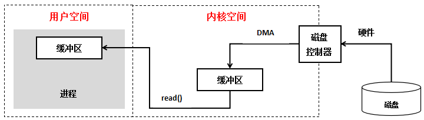
**1）同步阻塞（Blocking IO，BIO）：**
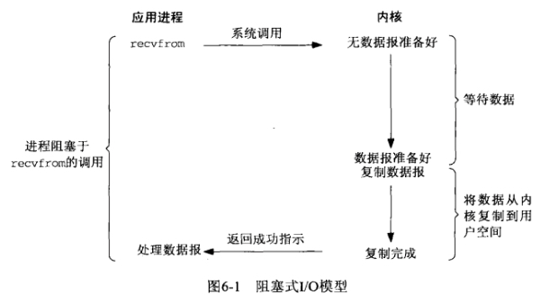
当用户进程进行系统调用时，内核就开始了I/O的第一个阶段，准备数据到缓冲区，当数据准备完成后，则将数据从内核缓冲区拷贝到用户进程的内存中，这时用户进程才解除阻塞的状态重新运行。这种模型可以**及时返回数据，无延迟，但是性能较低**。
**2）同步非阻塞（Nonblocking IO，NIO）：**
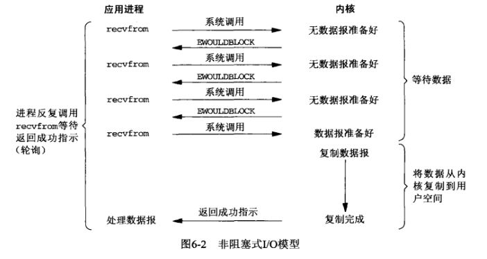同步非阻塞中，进程在不**停的询问**内核是否准备好数据，如果没有准备好，就返回处理其他事情，而只有在询问到内核已经准备好数据后，进程才进入阻塞状态，完成数据从内核拷贝到用户进程内存中的过程。这里，在IO的准备数据阶段，进程是非阻塞的，可以在等待IO准备数据时处理其他事件，但是在拷贝数据的整个过程中，进程仍然是阻塞的，且需要不断地询问数据是否准备好了，会增加延迟。
这种方式在编程中对socket设置**O_NONBLOCK**即可。但此方式**仅仅针对网络IO有效，对磁盘IO并没有作用**。因为我们所说的网络IO的阻塞是因为网路IO有无限阻塞的可能，而本地文件除非是被锁住，否则是不可能无限阻塞的，因此只有锁这种情况下，O_NONBLOCK才会有作用。而且，磁盘IO时要么数据在内核缓冲区中直接可以返回，要么需要调用物理设备去读取，这时候进程的其他工作都需要等待。因此，**后续的IO复用和信号驱动IO对文件IO也是没有意义的。**
**3）多路复用IO：**
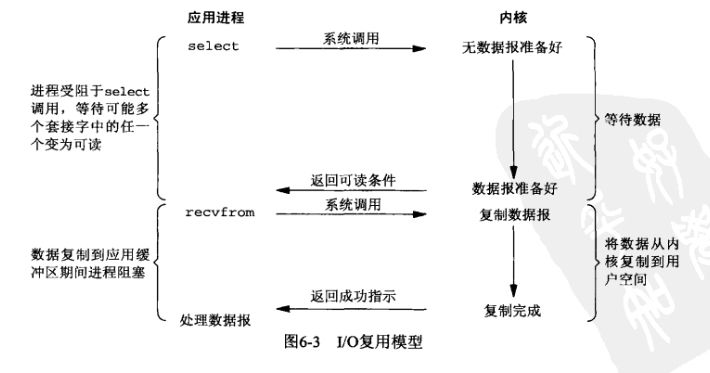
IO复用也称多路**IO就绪通知**，这是一种进程预先告知内核的能力，让内核发现进程指定的一个或多个IO条件就绪了，就通知进程。IO复用的实现方式目前主要有**select，poll和epoll**。
select和poll的原理基本相同：注册待监听的fd；每次调用都去检查这些fd的状态，当有一个或多个fd就绪的时候返回；返回结果中包含已就绪和未就绪的fd。
相比select，poll解决了单个进程能够打开的文件描述符数量有限制这个问题：select受限于FD_SIZE的限制，如果修改则需要修改这个宏重新编译内核；而poll通过一个pollfd数组向内核传递需要关注的事件，避开了文件描述符数量的限制。此外，select和poll共同具有的一个很大的缺点是包含**大量fd的数组被整体复制于用户态和内核态地址空间之上**，开销会随着fd线性增长。
select和poll**每次轮询都会遍历所有的fd来的到结果**，那么在fd的数量很大时，select和poll的效率就不好了，这时epoll出现，epoll基于**事件驱动**的方式，避免了每次都要把所有fd扫描一遍的问题，epoll_wait只返回就绪的fd，epoll使用nmap内存映射技术避免了内存复制的开销，epoll的fd数量上限是操作系统的最大文件句柄数目，这个数目一般和内存有关，通常远大于1024。
此外，对于IO复用还有一个水平触发和边缘触发的概念：

    * 水平触发：当就绪的fd未被用户进程处理后，下一查询依旧会返回，这是select和poll的触发方式；
    * 边缘触发：无论就绪的fd是否被处理，不再返回。须有下次就绪才再次出发。epoll默认使用水平触发，通过相应选项可以使用边缘触发。

**4）信号驱动：**
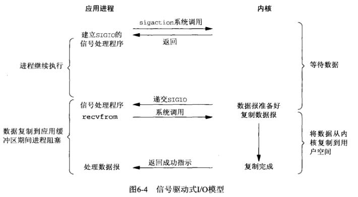
流程：开启套接字信号驱动IO功能；系统调用sigaction执行信号处理函数（非阻塞，立刻返回）；数据就绪，生成sigio信号，通过信号回调通知应用来读取数据。
**回调机制 实现、开发难度大**


**5）异步非阻塞：**
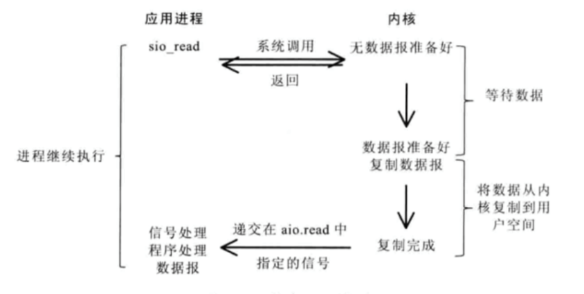
对比信号驱动IO，异步非阻塞IO的主要区别在于，信号驱动由内核告诉进程可以开始一个IO操作，数据还在内核缓冲区中，而异步非阻塞中内核将数据放到指定的缓冲区，通知应用程序来取。
**小结：**
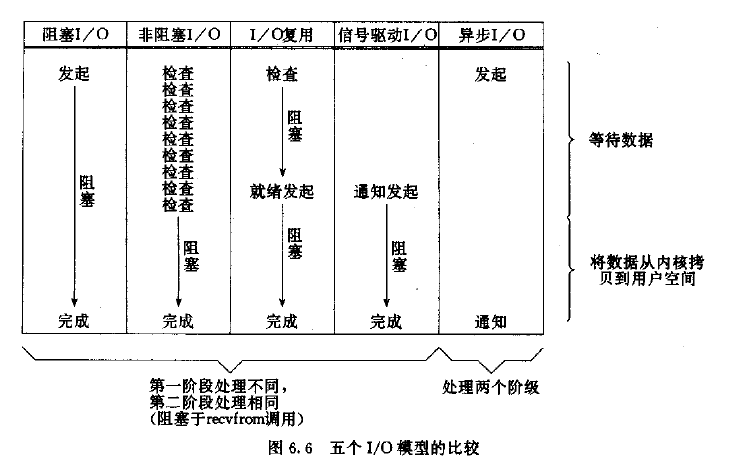

  2. **文件系统的理解（EXT4，XFS，BTRFS）**
EXT4：使用广泛

    XFS：XFS 文件系统是扩展文件系统的一个扩展，XFS 文件系统有一些缺陷，例如它不能压缩，删除大量文件时性能低下。
    btrfs：有很多好用的功能，例如写复制、扩展校验、快照、清洗、自修复数据、冗余删除以及其它保证数据完整性的功能。
  3. **文件处理grep,awk,sed这三个命令必知必会**

grep  <http://www.zsythink.net/archives/1733/>

sed   <https://coolshell.cn/articles/9104.html>

awk   <https://coolshell.cn/articles/9070.html>


4. **IO复用的三种方法（select,poll,epoll）深入理解，包括三者区别，内部原理实现？**
   [https://blog.csdn.net/baiye_xing/article/details/74353066](https://blog.csdn.net/baiye_xing/article/details/74353066)

5. **Epoll的ET模式和LT模式（ET的非阻塞），EPOLLONESHOT**
   epoll把epoll实例创建、events增删改还有events轮询都分开了，这样的话epoll实例就可以被同一个进程中的所有线程共享。epoll跟poll一样，使用链表节点记录监听events，但是它有三个链表型结构（就绪链表、辅助链表、红黑树），首先想**要监听的events的节点被放到红黑树里**，这样可以加快events节点的访问。**events就绪之后会被挂载到就绪链表里去**。ep_send_events_proc中，当epoll_wait**从内核空间向用户空间写出就绪events的时候，会遍历就绪链表并获取发生的关心的events**，没有关心的events发生则无视（**所以LT中处理完成的事件不会使得epoll_wait返回**）。同时这个时候可能还会发生新的就绪events，这个时候已就绪的events不再添加到就绪链表里去，而是使用辅助链表**eventpoll.ovflist**... 
   在epoll_wait调用中，epoll会**遍历就绪队列**里的每一个events节点，然后通过**文件的poll方法**再次获取事件的**最新状态revents**，然后把**该events节点从就绪链表中删除**。当revents中包含我们关心的事件events的话，**LT模式还会把该节点重新加入到就绪队列里**，而ET模式也就是edge边界模式不会。这么做有什么影响呢，emmm...让我举个例子，假设我们监听一个管道可读，当事件就绪之后，我们只读了部分内容，还有部分内容没有读。**当我们再次epoll_wait的时候，对LT模式来说，就绪队列里还有这个事件的节点，再次获取状态，对！还是可读的，所以还是不从就绪队列里删除，然后返回这个这个事件**；对ET模式来说，就绪队列里没有这个事件的节点了，所以也就不会再对它进行通知了。那LT模式中的这个事件节点什么时候被删除呢，**假设第一次epoll_wait的时候，我们把管道里的内容全部读完了，下次epoll_wait遍历到这个节点然后重新获取它的状态的时候，它已经不再就绪了，因为管道空了**，**这个时候LT模式就不会再把这个节点重新添加到就绪队列里了**。
   即如果是LT模式，那么每次向用户交付events之后，再次把该epitem挂载到eventpoll中的就绪队列上，下一次epoll_wait()时不休眠直接进入到ep_send_events_proc()中来，通过获取资源文件的最新状态然后与我们关心的events比较：

   1. 如果资源状态还是满足我们关心的events（可能是资源又就绪了，也有可能是上次就绪的资源未消费完），那么还是把它再次交付；
   2. 如果不再满足我们关心的events（上一次的就绪资源已经消费完并且还没有再次就绪），那么将它从就绪队列上卸载之后（下一轮的ep_send_events_proc中，当epoll_wait**从内核空间向用户空间写出就绪events的时候，会遍历就绪链表并获取发生的关心的events**，没有关心的events发生则无视）可就不再重新挂载了...

   **ET不一定会效率高**，比如在read一个管道时，需要用while包裹起来保证一次全部读完直到EAGAIN，这样导致在**一次能read完的情况下多read一次**。

6. 查询进程占用CPU的命令（注意要了解到used，buf，cache代表意义）

7. linux的其他常见命令（kill，find，cp等等）

    ls -al 显示当前目录下的所有文件目录信息，包括隐藏的 
    mkdir 创建文件夹 
    cat 查看文件内容 
    cp 拷贝 
    rm -rf 删除文件下所有文件 
    find 查找文件 
    grep 正则匹配 
    pwd 显示当前文件路径 
    ln 创建文件连接 -s 软连接 
    chmod 修改文件权限 
    netstat -a |grep 查看网络状态 
    linux下进程管理的相关命令:
    ps -e 查看所有的进程信息 ，ps -axj | more 查看所有用户的作业。
    1.ps：表示对进程监测和控制。 
    
    2.参数a:表示不仅列出当前用户的进程，也列出所有其他用户的进程。 
    3.参数x:表示不仅列出控制终端的进程，也列出所有无控制终端的进程。 
    4.参数j:表示列出与作业控制相关的信息。
    kill -9 pid 强行杀死进程 
    top -p pid 查看进程信息 

8. **linux下如何查看内存、磁盘情况** 
     top 
     df 
     free
   查看端口被哪个进程占用？  lsof -i:端口号
   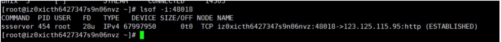
   查看进程打开了哪些文件？  lsof -p pid
   查看cpu核的个数主频？   cat /proc/cpuinfo
   查看进程下的线程？  top -H -p pid
   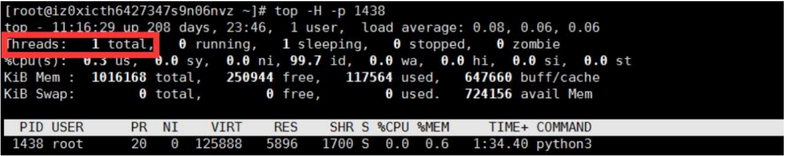
   查看所有端口的占用情况？    netstat
   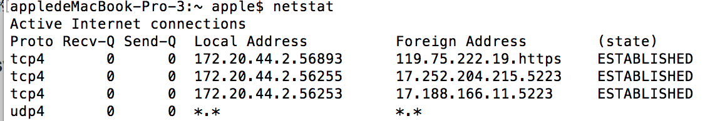
   如何查看一个服务器是否正常运作？    ps aux
   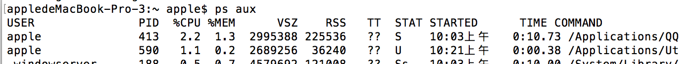
   创建用户命令？   adduser 用户名
   查看运行堆栈命令？   gstack pid
   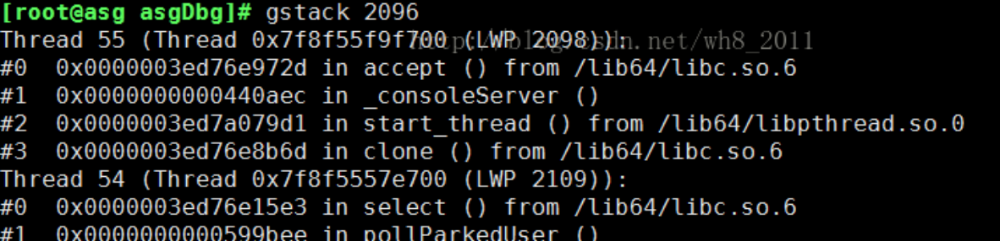
   查看占用CPU最高的进程？
   
   查看占用内存最高的进程
   
   kill -trem &lt;pid&gt;
   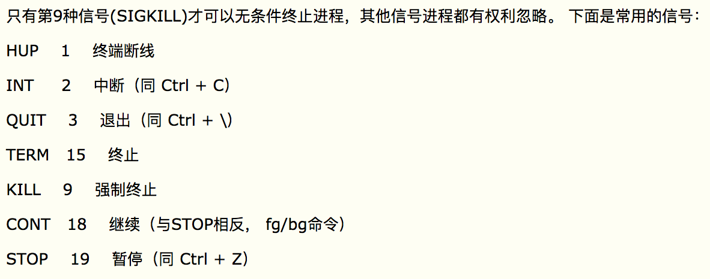
   find
   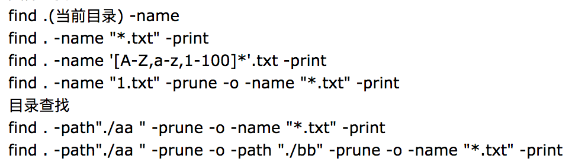
   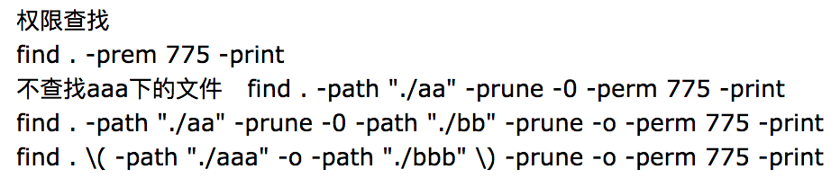
   cp
   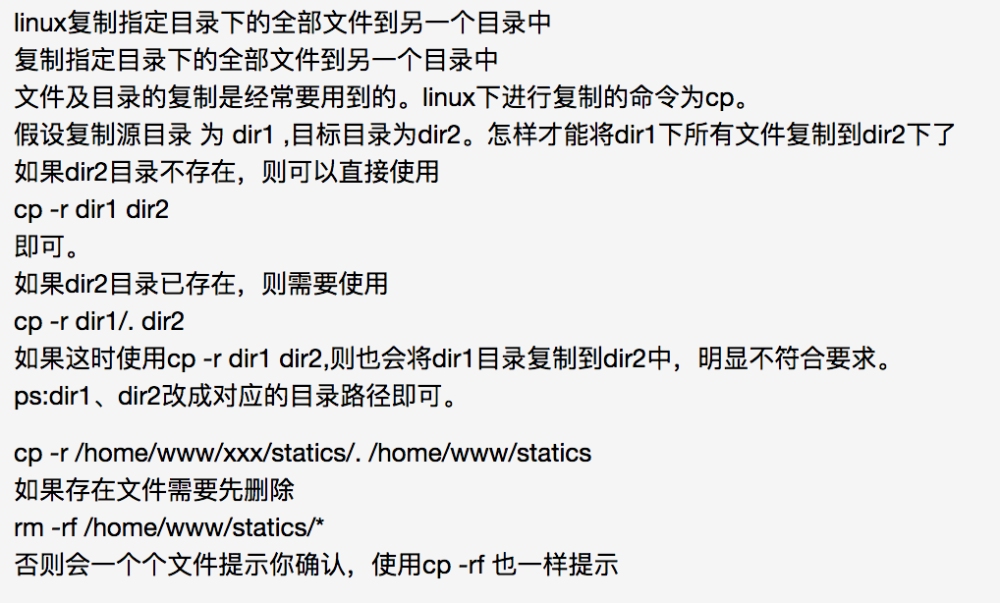

9. **shell脚本用法**

10. **硬连接和软连接的区别**

    硬链接是以文件副本引用的形式存在的，他跟源文件拥有**同一个inode节点**； 
    ln test.txt hard_link
软连接是以路径的形式存在的，他的inode节点所对应的数据块存储的是**源文件的路径**。
 ln -s test.txt soft_link
他们的区别的是：软连接可以**跨文件系统**创建，而且可以**对目录**进行创建，硬链接都不行，所以，相对来说，软连接更加灵活，**删除软连接不会产生任何影响**，但是如果源文件被删除了，那么所有的软连接就失效了，很像windows下的快捷方式。
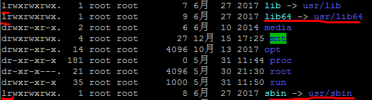
**详解版本：**

硬链接说白了是一个指针，指向指定的文件索引节点inode，系统并不为它重新分配inode。inode中有一个计数，硬链接同时会使这个计数加一，当计数为0时才真正删除文件。

**当我们查找一个文件，比如** /root/test **时，要经过以下步骤：**

``` 
1. 首先找到根目录的 inode（根目录的 inode 是系统已知的，inode 号是 2），然后判断用户是否有权限访问根目录的 block。
2. 如果有权限，则可以在根目录的 block 中访问到 /root 的文件名及对应的 inode 号。
3. 通过 /root/ 目录的 inode 号，可以查找到 /root/ 目录的 inode 信息，接着判断用户是否有权限访问 /root/ 目录的 block。
4. 如果有权限，则可以从 /root/ 目录的 block 中读取到 test 文件的文件名及对应的 inode 号。
5. 通过 test 文件的 inode 号，就可以找到 test 文件的 inode 信息，接着判断用户是否有权限访问 test 文件的 block。
6. 如果有权限，则可以读取 block 中的数据，这样就完成了 /root/test 文件的读取与访问。
```

***硬链接的特点如下：***

 - 不论是修改源文件（test 文件），还是修改硬链接文件（test-hard 文件），另一个文件中的数据都会发生改变。
 - 不论是删除源文件，还是删除硬链接文件，只要还有一个文件存在，这个文件（inode 号是 262147 的文件）都可以被访问。
 - 硬链接不会建立新的 inode 信息，也不会更改 inode 的总数。
 - 硬链接不能跨文件系统（分区）建立，因为在不同的文件系统中，inode 号是重新计算的。
 - 硬链接不能链接目录，因为如果给目录建立硬链接，那么不仅目录本身需要重新建立，目录下所有的子文件，包括子目录中的所有子文件都需要建立硬链接，这对当前的 Linux 来讲过于复杂。
 - 硬链接的限制比较多，既不能跨文件系统，也不能链接目录，而且源文件和硬链接文件之间除 inode 号是一样的之外，没有其他明显的特征。

**软链接**也称作**符号链接**，软链接的源文件必须写绝对路径，**权限位中"l"表示这是一个软链接文件**；其次，在文件的后面通过 "-&gt;" 显示出源文件的完整名字**。

**软链接和源文件的** **inode**  **号是不一致的**，其访问过程为：

```
1. 首先找到根目录的 inode 索引信息，然后判断用户是否有权限访问根目录的 block。
2. 如果有权限访问根目录的 block，就会在 block 中查找到 /tmp/ 目录的 inode 号。
3. 接着访问 /tmp/ 目录的 inode 信息，判断用户是否有权限访问 /tmp/ 目录的 block。
4. 如果有权限，就会在 block 中读取到软链接文件 check-soft 的 inode 号。因为软链接1. 文件会真正建立自己的 inode 索引和 block，所以软链接文件和源文件的 inode 号是不一样的。
5. 通过软链接文件的 inode 号，找到了 check-soft 文件 inode 信息，判断用户是否有权限访问 block。
6. 如果有权限，就会发现 check-soft 文件的 block 中没有实际数据，仅有源文件 check 的 inode 号。
7. 接着通过源文件的 inode 号，访问到源文件 check 的 inode 信息，判断用户是否有权限访问 block。
8. 如果有权限，就会在 check 文件的 block 中读取到真正的数据，从而完成数据访问。
```


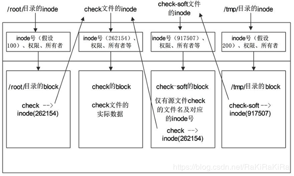
通过这个过程，我们就可以总结出**软链接的特点**（软链接的特点和 Windows 中的快捷方式完全一致）。

 - 不论是修改源文件（check），还是修改硬链接文件（check-soft)，另一个文件中的数据都会发生改变。
 - 删除软链接文件，源文件不受影响。而删除原文件，软链接文件将找不到实际的数据，从而显示文件不存在。
 - 软链接会新建自己的 inode 信息和 block，只是在 block 中不存储实际文件数据，而存储的是源文件的文件名及 inode 号。
 - 软链接可以链接目录。
 - 软链接可以跨分区。

11. **文件权限怎么看（rwx）**

12. **软中断与硬中断**

13. **文件的三种时间（mtime, atime，ctime），分别在什么时候会改变**

14. **Linux监控网络带宽的命令，查看特定进程的占用网络资源情况命令**

15. **优雅关闭**

16. **Linux如何创建空文件，创建目录指令，find如何查找用户名为work的文件**

17. **GDB调试**

18. **缺页异常 csapp 581**

19. **fork、vfork、pthread_create怎么实现？fork与vfork区别**
    **fork实现：**
    fork就是简单的把父进程的几乎所有地址空间和内核部分都拷贝一份，先创建task_struct 、thread_info 、内核栈，然后复制父进程的地址空间、已打开文件描述符、命名空间啊这些之类的...然后修改一些标志让自己与父进程变得不一样，分配得到一个有效PID。由于**写时复制技术**，实际开销就是创建并复制父进程的页表以及给子进程创建一个进程描述符。
    内核只为新生成的子进程创建虚拟空间结构，它们来复制于父进程的虚拟空间结构，但是不为这些段分配物理内存，它们**共享父进程的物理空间**，当父子进程中有更改相应段的行为发生时，再为子进程相应的段分配物理空间。在fork之后exec之前两个进程用的是相同的物理空间（内存区），**子进程的代码段、数据段、堆栈都是指向父进程的物理空间**，也就是说，**两者的虚拟空间不同，但其对应的物理空间是同一个。**其中任何一个进程要对共享的页面“写操作”，这时内核会复制一个物理页面给这个进程使用，同时修改页表。而把原来的**只读页面标记为“可写”，留给另外一个进程使用**。
    **写时拷贝思想：**父进程和子进程共享页帧而不是复制页帧。然而，**只要页帧被共享，它们就不能被修改，即页帧被保护**。无论父进程还是子进程何时**试图写**一个共享的页帧，就产生一个异常，这时内核就**把这个页复制到一个新的页帧中并标记为可写**。同时修改页表，而把原来的**只读页面标记为“可写”，留给另外一个进程使用**。

    **fork仅仅共享fd，以及fd对应的文件表项，还有各用户id 、组id、环境 、掩码等**。
    fork与vfork:
    1.fork父子进程交替运行，vfork保证子进程先运行，父进程阻塞，直到子进程结束（或子进程调用了exec或exit）.
    2.fork实现了写时拷贝. 而vfork直接让父子进程共用公用资源，避免多开辟空间拷贝,
    3,vfork必须使用exit或者excl退出.
    4.就算是fork使用了写时拷贝，也没有vfork性能高.

    子进程exec之后，会向父进程发送信号，这个时候父进程就可以开始运行了，如果子进程修改了父进程地址空间的话，父进程唤醒的时候就会发现自己的数据被改了，完整性丢失，所以这是不安全的

  20. **写时拷贝怎么实现？例子**
      **写时拷贝思想：**父进程和子进程共享页帧而不是复制页帧。然而，**只要页帧被共享，它们就不能被修改，即页帧被保护**。无论父进程还是子进程何时**试图写**一个共享的页帧，就产生一个异常，这时内核就**把这个页复制到一个新的页帧中并标记为可写**。原来的页帧仍然是写保护的：当其他进程试图写入时，内核检查写进程是否是这个页帧的唯一属主，如果是，就把这个页帧标记为对这个进程是可写的。
      **fork时**内核只为新生成的子进程创建虚拟空间结构，它们来复制于父进程的虚拟空间结构，但是不为这些段分配物理内存，它们**共享父进程的物理空间**，当父子进程中有更改相应段的行为发生时，再为子进程相应的段分配物理空间。在fork之后exec之前两个进程用的是相同的物理空间（内存区），**子进程的代码段、数据段、堆栈都是指向父进程的物理空间**，也就是说，**两者的虚拟空间不同，但其对应的物理空间是同一个。**其中任何一个进程要对共享的页面“写操作”，这时内核会复制一个物理页面给这个进程使用，同时修改页表。而把原来的**只读页面标记为“可写”，留给另外一个进程使用**。

  21. **用户态与内核态区别 内核做什么 **
      当一个进程在执行用户自己的代码时处于用户运行态（用户态），此时特权级最低，为3级，是普通的用户进程运行的特权级，大部分用户直接面对的程序都是运行在用户态。
      当一个进程因为系统调用陷入内核代码中执行时处于内核运行态（内核态），此时特权级最高，为0级。执行的内核代码会使用当前进程的内核栈，每个进程都有自己的内核栈。

  22. **用户态如何切换到内核态**

      （1）系统调用

      这是用户态进程主动要求切换到内核态的一种方式。用户态进程通过系统调用申请使用操作系统提供的服务程序完成工作。例如fork（）就是执行了一个创建新进程的系统调用。系统调用的机制和新是使用了操作系统为用户特别开放的一个中断来实现，如Linux的int 80h中断。

      （2）异常

      当cpu在执行运行在用户态下的程序时，发生了一些没有预知的异常，这时会触发由当前运行进程切换到处理此异常的内核相关进程中，也就是切换到了内核态，如缺页异常。

      （3）外围设备的中断

      当外围设备完成用户请求的操作后，会向CPU发出相应的中断信号，这时CPU会暂停执行下一条即将要执行的指令而转到与中断信号对应的处理程序去执行，如果前面执行的指令时用户态下的程序，那么转换的过程自然就会是 由用户态到内核态的切换。如硬盘读写操作完成，系统会切换到硬盘读写的中断处理程序中执行后边的操作等。

      这三种方式是系统在运行时由用户态切换到内核态的最主要方式，其中系统调用可以认为是用户进程主动发起的，异常和外围设备中断则是被动的。从触发方式上看，切换方式都不一样，但从最终实际完成由用户态到内核态的切换操作来看，步骤有事一样的，都相当于执行了一个中断响应的过程。系统调用实际上最终是中断机制实现的，而异常和中断的处理机制基本一致。

  23. **系统调用的底层过程，为什么慢**
      当程序中有系统调用语句，程序执行到系统调用时，首先**使用类似int 80H的软中断指令**，保存现场，去的系统调用号，在内核态执行，然后**恢复现场**，每个进程都会有两个栈，一个内核态栈和一个用户态栈。当执行int中断执行时就会由用户态，栈转向内核栈。系统调用时需要进行栈的切换。而且内核代码对用户不信任，**需要进行额外的检查**。系统调用的返回过程有很多额外工作，比如**检查是否需要调度**等。具体过程：
      （1）从当前进程的描述符中提取其内核栈的ss0及esp0信息。

      （2）使用ss0和esp0指向的内核栈将当前进程的cs,eip,eflags,ss,esp信息保存起来，这个过程也完成了由用户栈到内核栈的切换过程，同时保存了被暂停执行的程序的下一条指令。

      （3）将先前由中断向量检索得到的中断处理程序的cs,eip信息装入相应的寄存器，开始执行中断处理程序，这时就转到了内核态的程序执行了。

  24. **系统调用和调库区别**
      系统调用**:**从用户态进入内核态。

    **系统调用**(System call)是程序**向系统内核请求服务**的方式。可以包括硬件相关的服务(例如，访问硬盘等)，或者创建新进程，调度其他进程等。系统调用是程序和操作系统之间的**重要接口**。
    库函数：把一些常用的函数编写完放到一个文件里，编写应用程序时调用，这是由第三方提供的，发生在用户地址空间。**函数库中的函数可以没有调用系统调用，也可以调用多个系统调用**。
    在移植性方面，不同操作系统的**系统调用**一般是不同的，**移植性差**；而在所有的ANSI C编译器版本中，C库函数是相同的。
    在调用开销方面，**系统调用**需要在用户空间和内核环境间切换，**开销较大**；而库函数调用属于“过程调用”，开销较小。
​	**补充**1**：具体的执行过程**
**系统调用是发生在内核空间的，所以如果在用户空间使用系统调用进行文件操作，必然会引起用户空间到内核空间切换的开销。( 系统调用是一个很费时的操作)事实上，  即使在用户空间使用库函数对文件进行操作，因为文件总是存在于存储介质上，因此，读写操作都是对硬件(存储器)的操作，所以肯定会引起系统调用，也就是说，**库函数对文件的操作是通过系统调用来实现的**，  (即库函数封**装了系统调用的很多细节**)。例如C库函数的fopen()就是通过系统调用open ()来实现的。
补充**2**：**即使使用库函数也会有系统调用的开销，为什么不直接使用系统调用呢**?
这是因为，文件的读写操作通常是大量的数据(大量是底层实现而言)，这时，**使用库函数可以大大减少系统调用的次数。**这一结果源于**缓冲区**技术，在内核空间和用户空间，对文件操作都使用了缓冲区，例如用fwrite()写文件，都是先将内容写到用户空间缓冲区，当用户空间缓冲去写满或者写操作结束时，才将用户缓冲区的内容写到内核缓冲区，同样的道理，当内核缓冲区写满或者写结束时才将内核缓冲区的内容写到文件对应的硬件媒介上。

  23. **Linux虚拟地址空间（不全）**

用户地址空间中的蓝色条带对应于映射到物理内存的不同内存段，灰白区域表示未映射的部分。Linux通过对栈、内存映射段、堆的起始地址加上随机偏移量来打乱布局，以免恶意程序通过计算访问栈、库函数等地址。
待补充
3G以上内核,因为进程创建时,内核的页表全部拷贝到进程第768页目录项以上的,3G以下则是代码段(.init节,.text节,.rodata节),数据段(.data节,.bss节),堆(brk指针),栈从3G往下
**.bss不占据实际的磁盘空间**，只在段表中记录大小，在符号表中记录符号。**当文件加载运行时，才分配空间以及初始化。**

  24. **为什么要用虚拟地址**
（1）安全风险
每个进程都可以访问0-4G的任意的内存空间，这也就意味着任意一个进程都能够去读写系统相关内存区域，如果是一个木马病毒，那么他就能随意的修改内存空间，让设备直接瘫痪
（2）地址不确定
众所周知，编译完成后的程序是存放在硬盘上的，当运行的时候，需要将程序搬到内存当中去运行，如果直接使用物理地址的话，我们无法确定内存现在使用到哪里了，也就是说拷贝的实际内存地址每一次运行都是不确定的，比如：第一次执行a.out时候，内存当中一个进程都没有运行，所以搬移到内存地址是0x00000000，但是第二次的时候，内存已经有10个进程在运行了，那执行a.out的时候，内存地址就不一定了
（3）效率低下
如果直接使用物理内存的话，一**个进程就是作为一个整体（内存块）操作的**，如果出现物理内存不够用的时候，我们一般的办法是将不常用的进程（页）拷贝到磁盘的交换分区中，好腾出内存，但是**如果是物理地址的话，就需要将整个进程一起拷走**，这样，在内存和磁盘之间拷贝时间太长，效率较低。
  25. **分页技术**
  26. **IPC通信方式，解释一下**
  27. **防止硬盘上数据丢失**
  28. **服务器怎么提高并发量**
  29. **Netstat**
  30. **按下ctl+c 系统做了什么，kill呢**
信号的处理的实质是维护进程PCB中的特定数据：**Block 表、Pending 表和 handler 表**。
Block意味着只要这个位图中对应位有效后，对应的信号就被**阻塞**，无法正常递达， 
pending表的代表的意思是，信号我已经收到，但是还没有递达到正确位置，**从内核态转为用户态时**，信号会抵达。 
handler表代表的意思是每个信号对应的处理方式。假如我们捕捉信号，自定义信号处理动作，则对应的handler表就会发生变化。
这三个表都是使用位图实现的，为了解释上述结构，首先明确以下概念

    **抵达**：信号发送成功后实际执⾏信号的处理动作
    **未决**：信号从产⽣到递达之间的状态
    **阻塞**：标记信号暂时不应被处理（”人为暂停某个信号的处理“）
一般来讲，被阻塞的信号产⽣时将保持在未决状态,直到进程解除对此信号的阻塞,才执⾏递达的动作。
当一个信号进入阻塞态后，**在阻塞状态被修改前永远不会执行对应的方法**。
信号从产生到抵达总是伴随着 用户态与内核态的相互转换（高权限的任务由内核完成）
一般情况下的未决（没有被阻塞），正是表示信号产生「但内核还未转换到用户态」时的状态。
常规信号在递达之前产⽣多次只计⼀次,⽽实时信号在递达之前产⽣多次可以依次放在⼀个队列⾥。

对于2号信号（SIG_INT）/9号信号（SIG_KILL）
1. ⽤户输⼊命令,在Shell下启动⼀个前台进程。 
2. ⽤户按下Ctrl-C/输入对应kill,这个键盘输⼊产⽣⼀个硬件中断。 
3. 如果CPU当前正在执⾏这个进程的代码,则该进程的⽤户空间代码暂停执⾏,CPU从⽤户态切换到内核态处理硬件中断。 
4. 终端驱动程序将Ctrl-C / KILL解释成⼀个SIGINT/SIGKILL信号,记在该进程的PCB中(也可以说发送了⼀个SIGINT信号给该进程)。 
5. 当某个时刻要从内核返回到该进程的⽤户空间代码继续执⾏之前,⾸先处理PCB中记录的信号,发现有⼀个SIGINT/SIGKILL信号待处理,⽽这个信号的默认处理动作是终⽌进程,所以直接终⽌进程⽽不再返回它的⽤户空间代码执⾏。
  6. Linux内存管理
     New是对malloc的封装（1：malloc的实现），然后调用system call，接触系统的内存管理模块（堆管理，虚拟内存管理），页管理（物理内存），伙伴算法与slab。

31. 如何选择使用多线程还是多进程
    1、需要**频繁创建销毁的优先使用线程**；因为对进程来说创建和销毁一个进程代价是很大的。
    2、线程的切换速度快，所以在需要大量计算，**切换频繁时用线程**，还有耗时的操作使用线程可提高应用程序的响应
    3、因为对CPU系统的效率使用上线程更占优，所以可能要发展到**多机分布的用进程，多核分布用线程**；
    4、并行操作时使用线程，如C/S架构的服务器端并发线程响应用户的请求；
    5、需要更**稳定安全时，适合选择进程；需要速度时，选择线程更好**。

  

# 5操作系统
1. **进程与线程的区别和联系，协程呢**
   **从概念的角度说：**
   **进程：**指在系统中正在运行的一个应用程序；程序一旦运行就是进程；或者更专业化来说：进程是指程序执行时的一个实例，即它是程序已经执行到课中程度的数据结构的汇集。从内核的观点看，进程的目的就是担当分配系统资源（CPU时间、内存等）的基本单位。
   **线程：**系统分配处理器时间资源的基本单元，或者说进程之内独立执行的一个单元执行流。进程——资源分配的最小单位，线程——程序执行的最小单位。
   **体现在4个方面：**
   1.因为**进程拥有独立的堆栈空间和数据段**，所以每当启动一个新的进程必须分配给它**独立的地址空间**，建立众多的数据表来维护它的代码段、堆栈段和数据段，系统开销比较大，而线程不一样，**线程拥有独立的堆栈空间，但是共享数据段，它们彼此之间使用相同的地址空间**，共享大部分数据，切换速度也比进程快，效率高，但是正由于进程之间独立的特点，使得进程安全性比较高，也因为进程有独立的地址空间，一个进程崩溃后，在保护模式下不会对其它进程产生影响，而线程只是一个进程中的不同执行路径。**一个线程死掉就等于整个进程死掉。**
   2.体现在通信机制上面，正因为**进程之间互不干扰，相互独立**，进程的通信机制相对很复杂，譬如管道，信号，消息队列，共享内存，套接字等通信机制，而**线程由于共享数据段所以通信机制很方便**。
   3.属于同一个进程的**所有线程共享该进程的所有资源**，包括文件描述符。而不同过的进程相互独立。（clone(CLONE_VM | CLONE_FS | CLONE_FILES |CLONE_SIGHAND, 0)）

   线程使得CPU系统更加有效，操作系统会保证当线程数不大于CPU数目时，不同的线程运行于不同的CPU上。

   **而从Linux内核角度来说**，并没有线程这一概念，其仅仅是一个与其它进程共享某些资源的进程，**都拥有唯一隶属于自己的task_struct**，线程的创建也与普通进程创建类似，只不过在**调用clone()**的时候需要多传递一些参数来**指明需要共享的资源**，相当于轻量级进程：
   	线程：  clone(CLONE_VM | CLONE_FS | CLONE_FILES |CLONE_SIGHAND, 0)
   	fork：   clone(SIGCHLD, 0)
   	vfork: clone(CLONE_VFORK | CLONE_VM | SIGCHLD, 0)

   **进程与线程的选择取决以下几点**
   1、需要频繁创建销毁的优先使用线程；因为对进程来说创建和销毁一个进程代价是很大的。
   2、线程的切换速度快，所以在需要大量计算，切换频繁时用线程，还有耗时的操作使用线程可提高应用程序的响应
   3、因为对CPU系统的效率使用上线程更占优，所以可能要发展到多机分布的用进程，多核分布用线程；
   4、并行操作时使用线程，如C/S架构的服务器端并发线程响应用户的请求；
   5、需要更稳定安全时，适合选择进程；需要速度时，选择线程更好。

  2. **父进程fork后父子进程共享的内容**

    fork之后，子进程会拷贝父进程的**数据空间、堆和栈空间**（实际上是采用**写时复制**技术），二者**共享代码段**。 所以在子进程中修改全局变量（局部变量，分配在堆上的内存同样也是）后，父进程的相同的全局变量不会改变。
    **仅仅共享fd，以及fd对应的文件表项，还有各用户id 、组id、环境 、掩码等**。


下图为不同进程打开同一个文件
 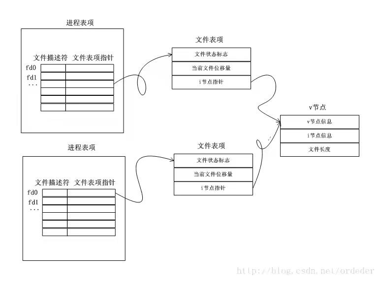
进程的fork与文件描述符的拷贝 进程的所打开文件和在fork后的结构图如下所示，子进程是共享父进程的文件表项。
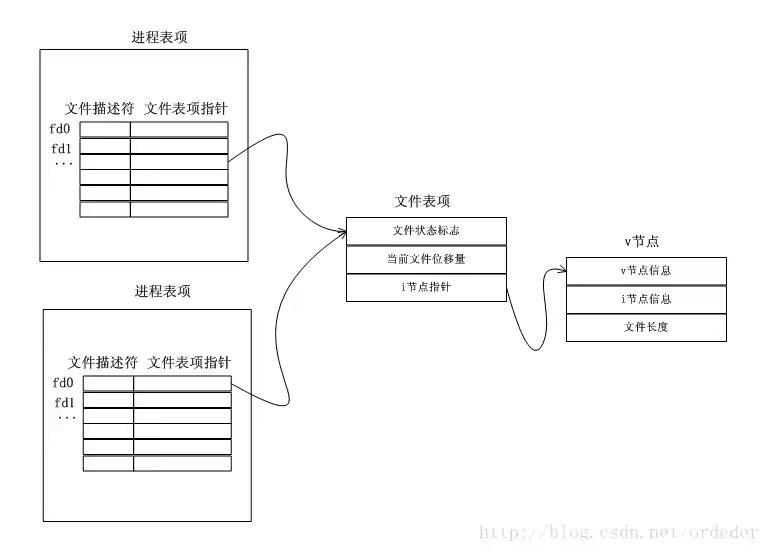
  3. **线程切换与进程切换需要保存什么信息**
进程切换以及线程切换**都**需要保存**CPU的硬件上下文**（CPU寄存器和程序计数器PC），只包括寄存器的切换，与栈和堆内存没有任何关系。在此基础上，**进程切换还需要**保存进程的**私有资源**（如虚拟内存（程序代码段，数据段，用户堆栈段，内核信息）），而**线程切换（一般认为是同一进程的两个线程）需要保存线程间的私有资源（如线程栈和相关寄存器状态）。**
  4. **进程切换为什么开销大（感觉不全，先看linux内核）**
**进程切换分两步：**
**1.切换页目录以使用新的线性地址空间**
**2.切换内核态堆栈和硬件上下文**
对于linux来说，线程和进程的最大区别就在于地址空间，对于线程切换，第1步是不需要做的，第2是进程和线程切换都要做的。
**切换的性能消耗：**
1、线程上下文切换和进程上下问切换一个最主要的区别是**线程的切换虚拟内存空间**依然是相同的，但是进程切换是不同的。这两种上下文切换的处理都是通过操作系统内核来完成的。内核的这种切换过程伴随的最显著的性能损耗是**将寄存器中的内容切换出**。
2、另外一个*隐藏的损耗*是上下文的切换会扰乱处理器的**缓存机制**。简单的说，一旦去切换上下文，处理器中所有**已经缓存的内存地址一瞬间都作废**了。还有一个显著的区别是当你改变虚拟内存空间的时候，处理的页表缓冲（processor's Translation Lookaside Buffer (TLB)）或者相当的神马东西会被全部刷新，这将**导致内存的访问在一段时间内相当的低效**。但是在线程的切换中，不会出现这个问题。

  5. 一**个进程可以创建多少线程，和什么有关**
  6. **进程和线程的空间分配，**
  7. **进程栈和线程栈的空间分配**
[https://www.cnblogs.com/luosongchao/p/3680312.html](https://www.cnblogs.com/luosongchao/p/3680312.html)
总结：
    1、进程的栈大小是在进程执行的时刻才能指定的，即不是在编译的时候决定的，也不是在链接的时候决定的
    2、进程的栈大小是随机确定的至少比线程栈要大，但是不到线程栈大小的2倍
    3、线程栈大小是固定的，也就是ulimit -a 显示的值,默认8mb，使用ulimit -s xxx修改线程默认栈大小

  8. **一个程序从开始运行到结束的完整过程**（四个过程）
1、预处理：根据#开头的命令，条件编译、头文件包含、宏替换，生成.i文本文件。
2、编译：编译器ccl将预处理后的文件翻译转换成汇编语言，生成.s文件
3、汇编：汇编器as汇编变为目标代码(机器代码).o的生成可重定位目标二进制文件
4、链接：链接器ld连接目标代码,生成可执行二进制程序，可以被加载到内存中执行

  9. **进程通信方法（Linux和windows下）**，线程通信方法（Linux和windows下）无名管道、有名管道FIFO，消息队列、共享内存、信号量、socket等，（应该进行简略阐述）
  10. **进程调度方法详细介绍**
      进程调度的实质是资源的分配，如何使系统能够保持较短的响应时间和较高的吞吐量，如何在多个可运行的进程中选取一个最值得运行的进程投入运行是调度器的主要任务。进程调度包括两个方面的内容：何时分配CPU 时间（调度时机）即调度器什么时候启动；如何选择进程（调度算法）即调度器该怎么做。进程调度主要可以分为非剥夺方式与剥夺方式两种。
      CPU密集程序要求低频高时，IO密集型要求高频。
      **非剥夺方式**：调度程序一旦把处理机分配给某进程后便让它一直运行下去，**直到进程完成或发生某事件而阻塞时**，才把处理机分配给另一个进程。 
      **剥夺方式**：当一个进程正在运行时，系统可以基于某种原则，**剥夺已分配给它的处理机，将之分配给其它进程**。剥夺原则有：优先权原则、短进程优先原则、时间片原则。
      Linux 从整体上区分**实时进程和普通进程**，因为实时进程和普通进程度调度是不同的，它们两者之间，实时进程应该先于普通进程而运行，然后，对于同一类型的不同进程，采用不同的标准来选择进程。**对普通进程**的调度策略是**动态优先调度，对于实时进程**采用了两种调度策略**，FIFO(先来先服务调度)和RR（时间片轮转调度）**。
      UNIX系统是单纯的**分时系统**，所以没有设置作业调度。UNIX系统的进程调度采用的算法是，**多级反馈队列调度法**。其核心思想是先从最高休先级就绪队列中取出排在队列最前面的进程，当进程执行完一个时间片仍未完成则剥夺它的执行，将它放入到相应的队列中，取出下一个就绪进程投入运行，对于同一个队列中的各个进程，按照时间片轮转法调度。多级反馈队列调度算法即能使高优先级的作业得到响应又能使短作业（进程）迅速完成。但是它还是存在某些方面的不足，当不断有新进程到来时，则长进程可能饥饿。
      **1、先来先服务调度算法**
      先来先服务(FCFS)调度算法是一种最简单的调度算法，该算法既可用于作业调度，也可用于进程调度。当在作业调度中采用该算法时，每次调度都是从后备作业队列中选择一个或多个最先进入该队列的作业，将它们调入内存，为它们分配资源、创建进程，然后放入就绪队列。在进程调度中采用FCFS算法时，则**每次调度是从就绪队列中选择一个最先进入该队列的进程**，为之分配处理机，使之投入运行。该进程**一直运行到完成或发生某事件而阻塞**后才放弃处理机。

      **2、短作业(进程)优先调度算法**
      短作业(进程)优先调度算法，是指对短作业或短进程优先调度的算法。它们可以分别用于作业调度和进程调度。短作业优先(SJF)的调度算法是**从后备队列中选择一个或若干个估计运行时间最短的作业**，将它们调入内存运行。而短进程优先(SPF)调度算法则是**从就绪队列中选出一个估计运行时间最短的进程**，将处理机分配给它，使它立即执行并**一直执行到完成，或发生某事件而被阻塞**放弃处理机时再重新调度。

      **3、时间片轮转法**
      在早期的时间片轮转法中，系统将所有的就绪进程按先来先服务的原则排成一个队列，每次调度时，把CPU分配给队首进程，并令其执行一个时间片。时间片的大小从几ms到几百ms。当执行的时间片用完时，**由一个计时器发出时钟中断请求，调度程序便据此信号来停止该进程的执行，并将它送往就绪队列的末尾；然后，再把处理机分配给就绪队列中新的队首进程，同时也让它执行一个时间片**。这样就可以保证就绪队列中的所有进程在一给定的时间内均能获得一时间片的处理机执行时间。换言之，系统能在给定的时间内响应所有用户的请求。

      **4、多级反馈队列调度算法**
      前面介绍的各种用作进程调度的算法都有一定的局限性。如短进程优先的调度算法，仅照顾了短进程而忽略了长进程，而且如果并未指明进程的长度，则短进程优先和基于进程长度的抢占式调度算法都将无法使用。而多级反馈队列调度算法则不必事先知道各种进程所需的执行时间，而且还可以满足各种类型进程的需要，因而它是目前被公认的一种较好的进程调度算法。在采用多级反馈队列调度算法的系统中，调度算法的实施过程如下所述：
      1）应**设置多个就绪队列，并为各个队列赋予不同的优先级**。第一个队列的优先级最高，第二个队列次之，其余各队列的优先权逐个降低。该算法赋予各个队列中进程执行时间片的大小也各不相同，在**优先权愈高的队列中，为每个进程所规定的执行时间片就愈小**。例如，第二个队列的时间片要比第一个队列的时间片长一倍，第i+1个队列的时间片要比第i个队列的时间片长一倍。
      2）**当一个新进程进入内存后，首先将它放入第一队列的末尾**，按FCFS原则排队等待调度。当轮到该进程执行时，如它能在该时间片内完成，便可准备撤离系统；**如果它在一个时间片结束时尚未完成，调度程序便将该进程转入第二队列的末尾**，再同样地按FCFS原则等待调度执行；如果它在第二队列中运行一个时间片后仍未完成，再依次将它放入第三队列，……，如此下去，当一个长作业(进程)从第一队列依次降到第n队列后，在第n队列便采取按时间片轮转的方式运行。
      3）仅当第一队列空闲时，调度程序才调度第二队列中的进程运行；**仅当第1～(i-1)队列均空时，才会调度第i队列中的进程运行**。如果处理机正在第i队列中为某进程服务时，又有新进程进入优先权较高的队列(第1～(i-1)中的任何一个队列)，则此时**新进程将抢占正在运行进程的处理机**，即第i队列中某个正在运行的进程的时间片用完后，由调度程序选择优先权较高的队列中的那一个进程，把处理机分配给它。

      **5、优先权调度算法**
      为了照顾紧迫型作业，使之在进入系统后便获得优先处理，引入了最高优先权优先(FPF)调度算法。此算法常被用于**批处理系统**中，作为作业调度算法，也作为多种操作系统中的进程调度算法，还可用于实时系统中。当把该算法用于作业调度时，系统将从后备队列中选择若干个优先权最高的作业装入内存。当用于进程调度时，该算法是**把处理机分配给就绪队列中优先权最高的进程**，这时，又可进一步把该算法分成如下两种。
      1) 非抢占式优先权算法
      在这种方式下，系统**一旦把处理机分配给就绪队列中优先权最高的进程后，该进程便一直执行下去，直至完成**；或因发生某事件使该进程放弃处理机时，系统方可再将处理机重新分配给另一优先权最高的进程。这种调度算法主要用于批处理系统中；也可用于某些对实时性要求不严的实时系统中。
      2) 抢占式优先权调度算法
      在这种方式下，系统同样是把处理机分配给优先权最高的进程，使之执行。但在其执行期间，**只要又出现了另一个其优先权更高的进程，进程调度程序就立即停止当前进程(原优先权最高的进程)的执行，重新将处理机分配给新到的优先权最高的进程**。因此，在采用这种调度算法时，是**每当系统中出现一个新的就绪进程i时，就将其优先权Pi与正在执行的进程j的优先权Pj进行比较**。如果Pi≤Pj，原进程Pj便继续执行；但如果是Pi&gt;Pj，则立即停止Pj的执行，做进程切换，使i进程投入执行。显然，这种抢占式的优先权调度算法能更好地满足紧迫作业的要求，故而常用于要求比较严格的实时系统中，以及对性能要求较高的批处理和分时系统中。

  11. **页面置换方法详细介绍**
  12. **能否实现一个LRU算法**
  13. **死锁的必要条件（怎么检测死锁，解决死锁问题）**
  14. **哲学家就餐，银行家，读者写者，生产者消费者（怎么加锁解锁，伪代码）**
  15. **海量数据的bitmap使用原理**
  16. **布隆过滤器原理与优点**
  17. **布隆过滤器处理大规模问题时的持久化，包括内存大小受限、磁盘换入换出问题**
  18. **同步IO和异步IO**

    同步I/O指处理I/O操作的进程和处理I/O操作的进程是同一个。
    异步I/O中I/O操作由操作系统完成，并不由产生I/O的用户进程执行。
  19. **vfs构造和好处**
      Linux以文件的形式对计算机中的数据和硬件资源进行管理，也就是彻底的一切皆文件。种类繁多的文件被Linux使用目录树进行管理， 所谓的目录树就是以根目录（/）为主，向下呈现分支状的一种文件结构。Linux把对不同文件系统的访问交给了VFS（虚拟文件系统），VFS能访问和管理各种不同的文件系统。
      VFS通过建立一个抽象层衔接各种文件系统，它定义了所有文件系统都必须支持的基本的接口和数据结构，如“如何打开文件”，而使实际文件系统在同一的接口和数据结构下隐藏了具体的实现细节。

  20. **文件系统**
      我们知道一般操作系统的文件数据除了文件实际内容外， 还带有很多属性，例如 Linux 操作系统的文件权限(rwx)与文件属性(拥有者、群组、 时间参数等)，文件系统**通常会将属性和实际内容这两部分数据分别存放在不同的区块**。
      每个区块又分为超级块，文件系统描述块，inode位图，block位图，inode table，data block。

      

      

      在基于inode的文件系统中，**权限与属性放置到 inode 中，实际数据放到 data block 区块中**，而且inode和data block都有编号

      ### inode table

      1. 主要**记录文件的属性以及该文件实际数据是放置在哪些block**中，它记录的信息至少有这些：
         1. 大小、真正内容的block号码（一个或多个）
         2. 访问模式(read/write/excute)
         3. 拥有者与群组(owner/group)
         4. 各种时间：建立或状态改变的时间、最近一次的读取时间、最近修改的时间
         5. 没有文件名！文件名在目录的block中！
      2. 一个文件占用一个 inode，每个inode有编号
      3. Linux 系统存在 inode 号被用完但磁盘空间还有剩余的情况
      4. 注意，这里的文件不单单是普通文件，目录文件也就是文件夹其实也是一个文件，还有其他的也是
      5. inode 的数量与大小在格式化时就已经固定了，每个inode 大小均固定为128 bytes (新的ext4 与xfs 可设定到256 bytes)
      6. 文件系统能够建立的文件数量与inode 的数量有关，存在空间还够但inode不够的情况
      7. 系统读取文件时需要先找到inode，并分析inode 所记录的权限与使用者是否符合，若符合才能够开始实际读取 block 的内容
      8. inode 要记录的资料非常多，但偏偏又只有128bytes ， 而inode 记录一个block 号码要花掉4byte ，假设我一个文件有400MB 且每个block 为4K 时， 那么至少也要十万条block 号码的记录！inode 哪有这么多空间来存储？为此我们的系统很聪明的将inode 记录block 号码的区域定义为12个直接，一个间接, 一个双间接与一个三间接记录区（详细见附录）

      ### data block

      1. **放置文件内容数据的地方**
      2. 在格式化时block的大小就固定了，且每个block都有编号，以方便inode的记录
         1. 原则上，block 的大小与数量在格式化完就不能够再改变了(除非重新格式化)
      3. 在Ext2文件系统中所支持的block大小有1K, 2K及4K三种，由于block大小的区别，会导致该文件系统能够支持的最大磁盘容量与最大单一文件容量各不相同：
         1. Block 大小 1KB 2KB 4KB
         2. 最大单一档案限制 16GB 256GB 2TB
         3. 最大档案系统总容量 2TB 8TB 16TB
      4. 每个block 内最多只能够放置一个文件的资料，但一个文件可以放在多个block中（大的话）
      5. 若文件小于block ，则该block 的剩余容量就不能够再被使用了(磁盘空间会浪费)
         1. 所以如果你的档案都非常小，但是你的block 在格式化时却选用最大的4K 时，可能会产生容量的浪费
         2. 既然大的block 可能会产生较严重的磁碟容量浪费，那么我们是否就将block 大小定为1K ？这也不妥，因为如果block 较小的话，那么大型档案将会占用数量更多的block ，而inode 也要记录更多的block 号码，此时将可能导致档案系统不良的读写效能
         3. 事实上现在的磁盘容量都太大了，所以一般都会选择4K 的block 大小

      ### superblock

      1. 记录整个文件系统相关信息的地方，一般大小为1024bytes，记录的信息主要有：
         1. block 与inode 的总量
         2. 未使用与已使用的inode / block 数量
         3. 一个valid bit 数值，若此文件系统已被挂载，则valid bit 为0 ，若未被挂载，则valid bit 为1
         4. block 与inode 的大小 (block 为1, 2, 4K，inode 为128bytes 或256bytes)；
         5. 其他各种文件系统相关信息：filesystem 的挂载时间、最近一次写入资料的时间、最近一次检验磁碟(fsck) 的时间
      2. Superblock是非常重要的， 没有Superblock ，就没有这个文件系统了，因此如果superblock死掉了，你的文件系统可能就需要花费很多时间去挽救
      3. 每个块都可能含有superblock，但是我们也说一个文件系统应该仅有一个superblock 而已，那是怎么回事？事实上除了第一个块内会含有superblock 之外，后续的块不一定含有superblock，而若含有superblock则该superblock主要是做为第一个块内superblock的备份，这样可以进行superblock的救援

      ### Filesystem Description

      1. 文件系统描述
      2. 这个区段可以描述每个block group的开始与结束的block号码，以及说明每个区段(superblock, bitmap, inodemap, data block)分别介于哪一个block号码之间

      ### block bitmap

      1. 块对照表
      2. 如果你想要新增文件时要使用哪个block 来记录呢？当然是选择「空的block」来记录。那你怎么知道哪个block 是空的？这就得要通过block bitmap了，它会**记录哪些block是空的**，因此我们的系统就能够很快速的找到可使用的空间来记录
      3. 同样在你删除某些文件时，那些文件原本占用的block号码就得要释放出来， 此时在block bitmap 中对应该block号码的标志位就得要修改成为「未使用中」

      ### inode bitmap

      1. 与block bitmap 是类似的功能，只是block bitmap 记录的是使用与未使用的block 号码， 至于inode bitmap 则是**记录使用与未使用的inode 号码**

  21. **软链接与硬链接的inode**
      软链接会有新的inode和数据块，数据块中存储着源文件的inode。
      而硬链接是直接指向源文件的inode

  22. **文件读写使用的系统调用底层实现**
      

      
      **查找一个文件需要现根据路径一步步找到目录项，再找到inode，计算内容偏移计算对应页，再到数据块**

      read/write：
        1、进程发起读文件请求。
        2、内核通过查找进程文件符表，定位到内核已打开文件集上的文件信息，从而找到此文件的inode。
        3、inode在address_space上查找要请求的文件页是否已经缓存在页缓存中。如果存在，则直接返回这片文件页的内容。
        4、如果不存在，则通过inode定位到文件磁盘地址，将数据从磁盘复制到页缓存。之后再次发起读页面过程，进而将页缓存中的数据发给用户进程。

      **读取/etc/passwd的过程**：（**忽略了最重要的页命中部分**）

      0. 系统中断，进入内核态
         0x80 中断处理程序接管执行后，先检察其系统调用号，然后根据系统调用号查找系统调用表，并从系统调用表中得到处理 read 系统调用的内核函数 sys_read ，最后传递参数并运行 sys_read 函数。至此，内核真正开始处理 read 系统调用

      1. 读取/的inode：

         通过挂载点的信息找到inode号码为128的根目录inode，且inode规定的权限让我们可以读取该block的内容(有r与x)

      2. 读取/的block：

         经过上个步骤取得block的号码，并找到该内容有etc/目录的inode号码(33595521)

      3. 读取etc/的inode：

         读取33595521号inode得知具有r与x的权限，因此可以读取etc/的block内容

      4. 读取etc/的block：

         经过上个步骤取得block号码，并找到该内容有passwd文件的inode号码(36628004)

      5. 读取passwd的inode：

         读取36628004号inode得知具有r的权限，因此可以读取passwd的block内容

      6. 读取passwd的block：

         最后将该block内容的资料读出来

  23. **线程池的了解、优点、调度处理方式和保护任务队列的方式**

  24. **怎么回收线程**

  25. **守护进程代码**

      ```cpp
      void Daemon()
      {
        // 重设文件权限掩码
        // 继承来的文件模式创建屏蔽字可能会拒绝设置某种权限，而守护进程需要创建的文件要具有读写权限。
        umask(0);
      
        // 使父进程忽略子进程结束信号
        // 守护进程中父进程将自己结束，使子进程挂在init下成为僵尸进程
        signal(SIGCHLD, SIG_IGN);
      
        //调用setsid函数之前，当前进程不允许是进程组的Leader,则需要将父进程退出。
        //1）在父进程中，fork返回新创建子进程的进程ID；
        //2）在子进程中，fork返回0；
        //3）如果出现错误，fork返回一个负值；
        pid_t pid = fork();
        if(pid < 0)
        {
          std::cout << "fork ERROR" << std::endl;
          exit(-1);
        }
        //父进程退出，子进程独立运行
        else if(pid > 0)
        {
          exit(0);
        }
      
        //之前parent和child运行在同一个session里,parent是会话（session）的领头进程,
        //parent进程作为会话的领头进程，如果exit结束执行的话，那么子进程会成为孤儿进程，并被init收养。
        //执行setsid()之后,child将重新获得一个新的会话(session)id。
        //这时parent退出之后,将不会影响到child了。
        // 作用：
        //1. 让子进程摆脱原会话的控制。
        //2. 让子进程摆脱原进程组的控制。
        //3. 让子进程摆脱原控制终端的控制。
        setsid();
      
        // 基于安全性，一般会进行两次fork,也可以只进行一次
        // 第一次fork:是为了调用setsid函数，将子进程自成一个独立会话，成为一个进程组，且不受控制终端的控制。
        // 第二次fork:由于当前的子进程为独立会话且为会话组长，独立的进程组，
        // 不受控制终端的控制且可打开控制终端，则需再进行一次fork，之后会话sid与id不同，其便不可以打开控制终端。
        pid_t pid2 = fork();
        if(pid2 < 0)
        {
          std::cout << "fork ERROR" << std::endl;
          exit(-1);
        }
        //父进程退出，子进程独立运行
        else if(pid2 > 0)
        {
          exit(0);
        }
      
        // 关闭不需要的与终端相关的文件描述符，或者重定向到/dev/null中
        // 可使得守护进程不再有父进程继承来的文件描述符。
        int fd = open("/dev/null", O_RDWR, 0);
        if(fd != -1)
        {
          dup2(fd, STDIN_FILENO);
          dup2(fd, STDOUT_FILENO);
          dup2(fd, STDERR_FILENO);
        }
        if(fd > 2)
          close(fd);
      }
      ```

      

  26. **僵尸进程问题（可以设置sigchld的函数为wait，由init去收尸，或双fork） 孤儿进程 守护进程**
      **守护进程：**
      运行在后台的一种特殊进程，独立于控制终端并周期性地执行某些任务。守护进程不受用户登陆与注销的影响，它一直在运行着。
      利用ps -axj | more 查看所有用户的作业。PPID为1的进程为孤儿进程，**守护进程也是孤儿进程，**其中凡是**TPGID为-1的都是没有控制终端的进程**，也就是守护进程。
      创建守护进程步骤：

      1. umask（0）：调用umask将文件模式创建屏蔽字设置为0。原因：又继承来的文件模式创建屏蔽字可能会拒绝设置某种权限，而守护进程需要创建的文件要具有读写权限。
      2. 调用fork，创建子进程，而调用setsid函数之前，当前进程不允许是进程组的Leader,则需要将父进程退出。
      3. 调用setsid函数创建一个会话
      4. 忽略SIGCHLD信号，子进程退出时不再给父进程发信号。signal(SIGCHLD,SIG_IGN);
      5. 将当前工作目录更改为根目录。原因：因为从当前父进程继承的当前目录可能在装配文件内，而守护进程要在计算机内长期存在，所以不能卸载，而要是装在装配文件中，则装配文件没办法卸载。
      6. **关闭不需要的文件描述符，或者重定向到/dev/null中** 。目的：可使得守护进程不再有父进程继承来的文件描述符。

      **僵尸进程：**

      ​	一个进程 fork 子进程，他们的运行时异步的。即父进程无法预知子进程会在什么时候结束。
      ​	在每个进程退出的时候，内核释放该进程所有的资源，包括打开的文件，占用的内存。但是仍然保留了一些信息（如进程号pid 退出状态 运行时间等）。这些保留的信息直到进程通过调用wait/waitpid时才会释放。
      **子进程退出，而父进程没有wait/waitpid子进程**，那么子进程的进程信息仍保存在系统中，比如**进程号就会被一直占用**，这样的进程称为**僵尸进程**。
      ​	我们可以使用信号函数sigaction为SIGCHLD设置wait处理函数。这样子进程结束后，父进程就会收到子进程结束的信号。并调用wait回收子进程的资源。
      ​	signal(SIGCHLD,sig_child);
      ​	或使用双fork直接使其变成孙进程 然后退出子进程，由init接管
      **孤儿进程：**
      ​	一**个父进程退出，而它的一个或多个子进程还在运行**，这些子进程称为**孤儿进程**。（孤儿进程将由 **init 进程收养**并对它们完成状态收集工作），**无危害**
      ​	如果子进程后结束，即**父进程先结束了**，但没有调用wait/waitpid来等待子进程的结束，**此时子进程还在运行，父进程已经结束**。那么并**不会产生**僵尸进程。因为每个进程结束时，系统都会扫描当前系统中运行的所有进程，看看有没有哪个进程时刚刚结束的这个进程的子进程，如果有，就**有init来接管它，成为它的父进程，发现并释放它所占有的资源**。
      ​	同样的在产生僵尸进程的那种情况下，即子进程结束了但父进程还在继续运行（并未调用wait/waitpid）这段期间，假如父进程异常终止了，那么该子进程就会自动被init接管。那么它就不再是僵尸进程了。应为**intit会发现并释放它所占有的资源。**（当然如果进程表越大，init发现它接管僵尸进程这个过程就会变得越慢，所以在init为发现他们之前，僵尸进程依旧消耗着系统的资源）
      ​	利用ps -axj | more 查看所有用户的作业。PPID为1的进程为孤儿进程，**守护进程也是孤儿进程。**

  27. **多线程同步**（尤其是如果项目中用到了多线程，很大可能会结合讨论）

  28. **memcache了解**

  29. **异常和中断的区别**

  30. **中断处理流程**

  31. **缺页中断**

  32. **一般情况下在Linux/windows平台下栈空间的大小**

  33. **异常类型**

  34. **弱类型、强类型、动态类型**

  35. **自旋锁**

  36. [**伙伴算法和slab算法**](https://blog.csdn.net/zhouwei1221q/article/details/48242535)

  37. **线程是如何绑定到具体的cpu**

  38. **malloc函数具体实现原理**

      https://blog.csdn.net/RaKiRaKiRa/article/details/101482556

  39. **进程状态转换**
      就绪：进程已处于准备好运行的状态，即进程已分配到除CPU外的所有必要资源后，只要再获得CPU，便可立即执行。
      执行：进程已经获得CPU，程序正在执行状态。
      阻塞：正在执行的进程由于发生某事件（如I/O请求、申请缓冲区失败等）暂时无法继续执行的状态。
                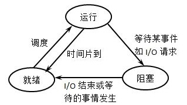

      

  40. **进程的堆栈与堆栈帧，及如何查看**
      [https://blog.csdn.net/daleiwang/article/details/50579776](https://blog.csdn.net/daleiwang/article/details/50579776)

  41. **虚拟内存与地址映射**

  42. **PCB布局**


算法
  1. 红黑树的了解（平衡树，二叉搜索树），使用场景
  2. 红黑树在STL上的应用
  3. 了解并查集吗？（低频）
  4. 贪心算法和动态规划的区别
  5. 判断一个链表是否有环，如何找到这个环的起点
  6. 实现一个strcpy函数（或者memcpy），如果内存可能重叠呢
  7. 实现一个循环队列
  8. 排序算法（写快排，归并排序，堆排序），算法的时间复杂度，空间复杂度，是否稳定等
  9. 快排存在的问题，如何优化
  10. 反转一个链表
  11. Top K问题（可以采取的方法有哪些，各自优点？）
  12. Bitmap的使用，存储和插入方法
  13. 二叉树的先序、中序、后序遍历（非递归实现）
  14. 二叉树的公共祖先（简单地说，剑指offer上的题大都是高频题）
        1. n中有多少个1
  15. 字典树的理解以及在统计上的应用
  16. 数组的全排列
  17. N个骰子出现和为m的概率
  18. 海量数据问题（可参考左神的书）
  19. 一致性哈希

# 7智力题与杂题
  1. 100层楼，只有2个鸡蛋，想要判断出那一层刚好让鸡蛋碎掉，给出策略
  2. 毒药问题，n拼毒药，要快速找出哪一瓶有毒，需要几只小白鼠
  3. 博弈论问题
  4. 先手必胜策略问题：n本书，每次能够拿X-X本，怎么拿必胜
  5. 放n只蚂蚁在一条树枝上，蚂蚁与蚂蚁之间碰到就各自往反方向走，问总距离或者时间。
  6. 瓶子换饮料问题：多少个瓶子能够换1瓶饮料，问最多能喝几瓶
  7. N2匹马，N个跑道，前N名
  8. 过河问题
  9. GeoHash编码问题
  10. 有100本书，每次拿1-5本书，要先手赢，怎么拿？


# 内核
  1. 内存管理：
1.内存的硬件访问原理及分页管理（mmu、页表、ZONE、Buddy、CMA）
2.内存的动态申请与释放（slab、kmalloc、vmalloc、malloc、Lazy分配机制、free）
3.进程的内存消耗与泄露（VMA、vss、uss、pss、rss、pagefault、OOM、内存泄露怎么检测以及处理）
4.内存与io的交换（pagecache、free命令、read/write/mmap、file-backed页面/匿名页、swap、LRU）
5.内存工程上的优化（DMA与cache的一致性、进程的cgroup、内存的cgroup、dirty页的回收、内存的回收、swappniess、getdelays、vmstat工具）

  一.内存的硬件访问原理及分页管理（mmu、页表、ZONE、Buddy、CMA）
1.cpu如何访问到内存？
2.mmu的作用？
3.页表的内容？
4.物理内存分为几个zone?为什么要分zone？
5.什么是buddy算法？buddy算法有哪些问题？怎么查看buddy管理的物理内存资源？
6.什么是CMA算法？
7.内存是按页管理的，文件系统是按block管理的，buddy算法适用于每个zone，用于管理空闲页面，zone是物理内存的概念。
8.为什么要分用户空间和内核空间？
9.进程只需要虚拟地址连续，物理地址连不连续无所谓，但DMA对连续有要求。

  二.内存的动态申请与释放（slab、kmalloc、vmalloc、malloc、free、Lazy分配机制、OOM）
1.slab是什么？为什么要有slab?和buddy什么关系？malloc与buddy的关系？怎么查看slab为内核提前分配的内存？举例子
2.kmalloc、vmalloc、malloc的区别？页表什么时候建立？从哪个zone拿内存？分别映射到哪里？vmalloc映射区的作用？怎么看vmalloc映射区？
3.lazy行为是什么？适用于哪些场景？为什么要有lazy？lazy不止针对于应用的堆，还包括代码段、数据段等。
4.什么是OOM？出现OOM，内核怎么处理？怎么查看进程的oom_score?
5.mallopt函数作用？
6.映射讲的是建立页表关系，占用讲的是内存命中。
7.malloc基于brk、mmap系统调用。

  三.进程的内存消耗与泄露（VMA、vss、uss、pss、rss、pagefault、内存泄露怎么检测以及处理）
1.进程的VMA是什么？
2.一个进程究竟消耗了多少内存?vss、rss、uss、pss?怎么查看？pmap pid cat /proc/pid/maps or smaps smem
3.malloc成功后并未拿到内存（lazy行为），但对进程产生了什么影响？VMA+页表
4.一个进程的内存消耗从来不说进程在内核空间的消耗，而是在虚拟地址空间0-3g对应的物理内存的那部分消耗。
5.内存如何被多个进程瓜分？图？
6.pagefault(缺页中断)的三种可能性？major与minor的区别？
7.应用内存泄露的原因？界定方法？位置的检测方法？

  四.内存与io的交换（pagecache、free命令、read/write/mmap、file-backed页面/匿名页、swap、LRU）
1.lazy行为不仅仅针对堆，代码段、栈等都是边写边pagefault，边写边拿到。
2.什么是file-backed页面？什么是匿名页？如何在内存与磁盘间交换？
3.swap什么意思？什么是硬盘的swap分区？
4.应用程序读写文件的两种方法？区别？过程？read/write/mmap
5.什么是pagecache,有什么用？pagecache两种形式？buffers cached
6.free命令的作用？每一项含义？
7.LRU？最近最少使用原则
8.嵌入式下不使用swap分区的原因？使用ZRAM的原理？牺牲了什么？
9.内核2号进程kthreadd进程负责文件系统的页面以及匿名页面的回收，每个zone有3个水位，high、low、min水位，当空闲内存大于high水位时，停止回收，当处于high水位和low水位之间时后台开始慢慢回收，当低于min水位时，内核会堵住应用程序，快速内存回收。
10.cat/proc/sys/vm/swappiness swappiness 反应是否积极的使用swap空间

  五.内存工程上的优化（DMA与cache的一致性、进程的cgroup、内存的cgroup、dirty页的回收、内存的回收、swappniess、getdelays、vmstat工具）
1.DMA与cache的一致性指什么？怎么解决？DMA_alloc_coherent(）分配，cache的硬件同步单元
2.进程的cgroup作用？配置group的优先级、cpu的最大占用率过程
3.内存的cgroup作用？配置group的swappniess、最大内存消耗过程
4.dirty页为什么要写回？怎么写回？时间：dirty_expire_centisecs 默认30s，线程周期性（dirty_writeback_centisecs）起来回写，空间上按比例：dirty_background_ratio,dirty_ratio
5.内存回收的3个水位及回收过程？
6.vmstat工具：分析硬盘压力、swap压力、写文件压力等
7.getdalays工具：评估程序的等待cpu、mem、swap、io的时间，可以知道程序哪慢

进程线程管理以及调度：
1.进程是什么？有哪些资源？pidmax怎么查？
2.task_struct如何被管理？分别适合哪些场景？
3.进程的生命周期图？6态之间的关系？
4.什么是内存泄漏？进程活着才有内存泄漏
5.作业控制的命令？ctrl z bg fg cpulimit作用？原理？
6.fork例子中printf打印几次？fork后进程处于就绪态
7.什么是僵尸进程？怎么处理？可以设置sigchld的函数为默认，由init去收尸
8.&amp;、killall、pstree
9.fork、vfork、pthread_create怎么实现？
10.写时拷贝怎么实现？例子
11.进程0进程1的作用
12.睡眠和等待队列的实现？
13.什么是孤儿进程？怎么托孤？subreaper
14.top -H
15.两组矛盾：吞吐vs响应   io消耗型vscpu消耗型 arm big-Little架构cpu
16.调度策略：实时进程 sched_rr sched_fifo普通进程 nice值 +-5的奖励 cfs完全公平调度
17任务频繁切换导致哪些问题？
18.nice低的好处？默认为0
19.nice renice chrt
20.多核时的负载均衡分rt进程和普通进程，rt进程平分到各个核上，普通进程周期性负载均衡，fork时负载均衡

文件系统：
一.应用程序发起io行为，最终怎么走到硬盘？
1.应用程序首先和pagecache打交道
2.pagecache和硬盘打交道（真正去做io行为，称为block io子系统）
二.free命令下buffer和cached的区别？
三.O_DIRECT和O_SYNC的区别？
四.IO电梯调度器的策略？deadline、cfs、noop
五.块设备的读写过程及性能怎么分析（哪个地方比较慢）？ftrace、blktrace的作用？怎么使用？
1.blktrace -d /dev/sda1 -o - |blkparse -i - &gt;1.trace
2.ftrace跟踪块设备读写时的函数及执行时间，函数级别的，而blktrace是针对io的流程，什么时候进plug，什么时候进io调度器等。
六.ionice、iotop、iostat
ionice -c 2 -n 0 cat /dev/sda &gt; /dev/null&amp;
ionice -c 2 -n 7 cat /dev/sda &gt; /dev/null&amp;
iotop
iostat

1.EXT系列文件系统布局以group为单位？（/a/b b在硬盘上如何存放的？）
2.append一个文件的全流程（删除一个文件的流程）
3.掉电会导致哪两种问题？分别举例子！为什么会出现不一致？
4.怎么保证文件系统的一致性？fsck 日志
5.修改文件系统，造成文件系统不一致？现象，怎么解决？
6.fsck原理？
7.日志怎么保证文件系统一致性？
8.EXT4文件系统工具：mkfs、dumpe2fs、
blkcat、dd、debugfs blktrace

1.vfs和文件系统的关系？
2.文件系统是如何组织起来的？
3.vfs的数据结构有哪些？作用？
4.目录是什么？怎么访问/usr/bin/emaxs
5.软链接和硬链接区别？怎么创建ln aa bb，ln -s  cc bb
6.应用程序read到vfs到pagecache到读写硬盘的\*\*\*作过程？
7.dmesg两个作用 内核启动信息 prink打印的信息
dmesg -c  dmesg  &gt; 文件
8.simplefs怎么做的，有哪些数据结构，流程是什么？

IO模型：
1.阻塞io可以被信号打断以及阻塞io的实现
2.网络模型包括：一个连接，一个进程或线程、一个进程或线程处理多个连接（select/epoll）优缺点及实现方式
3.signal io及aio的实现
4.epoll+任务队列+线程池的实现代码（互斥锁和条件变量的使用）
5.epoll的事件类型：EPOLLIN、EPOLLOUT、EPOLLET、EPOLLLT
6.条件变量的唤醒：phread-cond-singal、phread-cond-broadcast 区别

1.为什么有那么多种io模型？
2.5种io模型的特点，怎么使用？
3.vfs是什么，什么作用？有哪些数据结构？
4.硬盘是如何组织成文件系统的，文件系统是怎么样的架构？
5.软链接硬链接区别？
6.读取/usr/bin/xxx的全流程
7.ext2/3/4的布局格式
8.从上到下发起一次block io的全流程
