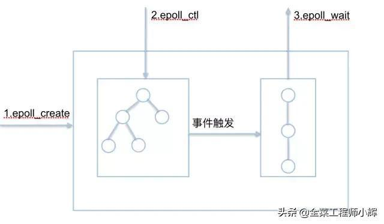

## 总结

​	epoll把epoll实例创建、events增删改还有events轮询都分开了，这样的话epoll实例就可以被同一个进程中的所有线程共享。epoll跟poll一样，使用链表节点记录监听events，但是它有三个链表型结构（就绪链表、辅助链表、红黑树），首先想**要监听的events的节点被放到红黑树里(epoll_ctl, 注册唤醒回调ep_poll_callback)**，这样可以加快events节点的访问。
​	**events就绪之后会被挂载到就绪链表里去**。当epoll_wait**从内核空间向用户空间写出就绪events的时候，会遍历就绪链表通过文件poll方法获取发生的revents**，没有关心的events发生则无视（**所以LT中处理完成的事件不会使得epoll_wait返回**）。同时这个时候可能还会发生新的就绪events，这个时候已就绪的events不再添加到就绪链表里去，而是使用辅助链表**eventpoll.ovflist**... 

​	在epoll_wait调用中，epoll会**遍历就绪队列**里的每一个events节点，然后通过**文件的poll方法**再次获取事件的**最新状态revents**，然后把**该events节点从就绪链表中删除**。然后返回关心的事件。

​	当revents中包含我们关心的事件events的话，**LT模式还会把该节点重新加入到就绪队列里**，而ET模式也就是edge边界模式不会。这么做有什么影响呢，举个例子，假设我们监听一个管道可读，当事件就绪之后，我们只读了部分内容，还有部分内容没有读。**当我们再次epoll_wait的时候，对LT模式来说，就绪队列里还有这个事件的节点，再次获取状态，还是可读的，所以还是不从就绪队列里删除，然后返回这个这个事件**；

​	对ET模式来说，就绪队列里没有这个事件的节点了，所以也就不会再对它进行通知了。

​	那LT模式中的这个事件节点什么时候被删除呢，**假设第一次epoll_wait的时候，我们把管道里的内容全部读完了，再最后一次epoll_wait返回时仍会放回就绪链表，但下次epoll_wait返回前遍历到这个节点然后重新获取它的状态的时候，它已经不再就绪了，因为管道空了**，**这个时候LT模式就不会再把这个节点重新添加到就绪队列里了，这时若没有其他事件，epoll_wait并不会返回，仅仅是在内核中有一些处理**。

## epoll数据结构

epoll的核心是3个API，核心数据结构是：1个红黑树和1个链表

1.执行epoll_create时，创建了红黑树和就绪list链表，并返回一个文件描述符。

2.执行epoll_ctl时，如果增加fd（socket），则检查在红黑树中是否存在，存在立即返回，不存在则添加到红黑树上，然后向内核注册回调函数，用于当中断事件来临时向准备就绪list链表中插入数据。

3.执行epoll_wait时判断并准备就绪链表里的数据即可。

## epoll为什么高效（相比select）

- **用户态将文件描述符传入内核的方式**
  - select/poll每次调用都要传递所要监控的所有fd给select/poll系统调用（这意味着每次调用都要将fd列表从用户态拷贝到内核态，当fd数目很多时，这会造成低效）。
  - epoll只有**在epoll_ctl的时候把注册的fd从用户空间复制到内核空间**，在每次epoll_wait的时候把活跃事件数从内核空间复制到用户空间，故**epoll_wait的复杂度为O(1)**。
  - 执行epoll_create会在内核的高速cache区中建立一颗红黑树以及就绪链表(该链表存储已经就绪的文件描述符)，并且向内核注册了一个文件系统，用于存储上述的被监控的fd。
    - 在内核注册用户执行的epoll_ctl函数添加文件描述符时，会在红黑树上增加相应的结点。
    - 在调用epoll_create之后，内核已经在内核态开始准备数据结构存放要监控的fd了。每次epoll_ctl只是对这个数据结构进行简单的维护。

- 此外，内核使用了**slab机制**，为epoll提供了快速的数据结构：
  - 在内核里，一切皆文件。所以，**epoll向内核注册了一个文件系统，用于存储上述的被监控的fd**。当你调用epoll_create时，就会在这个虚拟的epoll文件系统里创建一个file结点。当然这个file不是普通文件，它只服务于epoll。**epoll在被内核初始化时（操作系统启动），同时会开辟出epoll自己的内核高速cache区**，用于安置每一个我们想监控的fd，这些fd会以红黑树的形式保存在内核cache里，以支持快速的查找、插入、删除。这个内核高速cache区，就是建立连续的物理内存页，然后在之上建立slab层，简单的说，就是物理上分配好你想要的size的内存对象，每次使用时都是使用空闲的已分配好的对象。 

- **epoll每次返回的都是有事件发生的事件，不是所有事件，所以比较高效**

  - select、poll、epoll虽然都会返回就绪的文件描述符数量，但是select和poll并不会明确指出是哪些文件描述符就绪，而epoll会。
  - 造成的区别就是，系统调用返回后，调用**select和poll的程序需要遍历监听的整个文件描述符组**找到是谁处于就绪，而epoll则直接处理即可。

  

## ET与LT

​	当revents中包含我们关心的事件events的话，**LT模式会把该节点重新加入到就绪队列里**，而ET模式也就是edge边界模式不会。这么做有什么影响呢，举个例子，假设我们监听一个管道可读，当事件就绪之后，我们只读了部分内容，还有部分内容没有读。**当我们再次epoll_wait的时候，对LT模式来说，就绪队列里还有这个事件的节点，再次获取状态，还是可读的，所以还是不从就绪队列里删除，然后返回这个这个事件**；

​	对ET模式来说，就绪队列里没有这个事件的节点了，所以也就不会再对它进行通知了。

​	那LT模式中的这个事件节点什么时候被删除呢，**假设第一次epoll_wait的时候，我们把管道里的内容全部读完了，再最后一次epoll_wait返回时仍会放回就绪链表，但下次epoll_wait返回前遍历到这个节点然后重新获取它的状态的时候，它已经不再就绪了，因为管道空了**，**这个时候LT模式就不会再把这个节点重新添加到就绪队列里了，这时若没有其他事件，epoll_wait并不会返回，仅仅是在内核中有一些处理**。

​	即如果是LT模式，那么每次向用户交付events之后，再次把该epitem挂载到eventpoll中的就绪队列上，下一次epoll_wait()时不休眠直接进入到ep_send_events_proc()中来，通过获取资源文件的最新状态然后与我们关心的events比较：

1. 如果资源状态还是满足我们关心的events（可能是资源又就绪了，也有可能是上次就绪的资源未消费完），那么还是把它再次交付；
2. 如果不再满足我们关心的events（上一次的就绪资源已经消费完并且还没有再次就绪），那么将它从就绪队列上卸载之后（下一轮的ep_send_events_proc中，当epoll_wait**从内核空间向用户空间写出就绪events的时候，会遍历就绪链表并获取发生的关心的events**，没有关心的events发生则并不进行返回）可就不再重新挂载了...

## EPOLLONSHOT

​	在线程池模式下，**一个socket可能同时被多个线程处理**

​	如果对描述符socket注册了EPOLLONESHOT事件，那么操作系统最多触发其上注册的一个可读、可写或者异常事件，且只触发一次。。想要下次再触发则必须使用epoll_ctl重置该描述符上注册的事件，包括EPOLLONESHOT 事件。

​	EPOLLONESHOT：**只监听一次事件**，当监听完这次事件之后，如果还需要继续监听这个socket的话，需要再次把这个socket加入到EPOLL队列里 
​	一般用于ET，epoll_wait 返回， 处理fd的读事件，一直读一直读，读到没有数据 （ errno==EAGAIN） ，这时才通过epoll_ctl重新监听fd上的事件