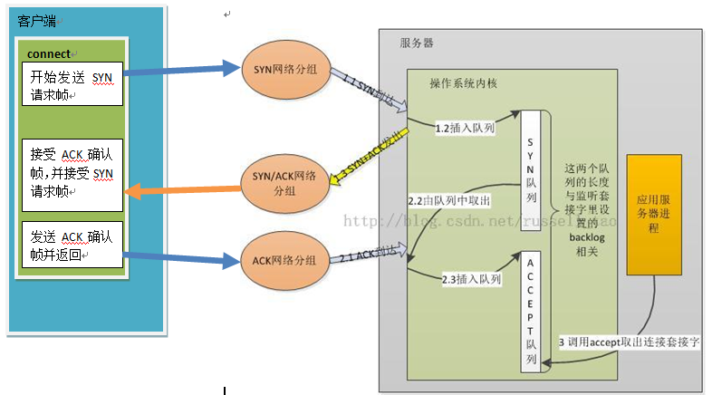

## 连接队列

服务器在通过`accept()`提取一个连接前，向服务器发起的连接应该有两个状态：

- **连接尚未完成**但已经收到了客户端的SYN请求报文（此时刚刚完成第一次握手，连接处于SYN_RCVD）
- 连接**已经完成三次握手**但还没有被应用程序通过`accept()`获取（连接已经处于ESTABLISHED）

这两个状态的连接必须分别存储，所有操作系统为该接口维护了两个连接队列，分别是**SYN队列和ACCEPT队列**。

## 队列长度

现代操作系统中，应用程序仅可以更改第二个队列的连接数目（ESTABLISHED状态的连接）。 

连接进入连接队列有以下规则

### 全局

当一个**连接请求**到达（即第一次握手），系统会检查SYN_RCVD的连接数量是否超过`net.ipv4.tcp_max_syn_backlog`，若超过则拒绝

### 节点

每个被监听的节点都有一个用于存储三次握手成功的连接的accept队列，该队列为固定大小，由`int listen(int sockfd, int backlog)`中的backlog指定。

若该队列已满，则服务器端的TCP会忽略进入的SYN报文。

## 连接过程



#### connect

```c
int connect(int sockfd, const struct sockaddr *addr, socklen_t addrlen);
```

客户端调用connect向sockfd发起连接，进行第一次握手。

如果sockfd为阻塞socket，那么connect有两种情况：

- 失败：返回-1
- 阻塞直到收到第二次握手并发出第三次握手后返回0

如果sockfd为非阻塞socket，那么connect有三种情况:

- 还未收到回复，返回EINPROGRESS
- 收到第二次握手并发出第三次握手，返回0
- 失败：根据情况返回EFAULT，EINTR，ENETUNREACH，ETIMEDOUT等

### listen

```c
int listen(int sockfd, int backlog);
```

用于监听sockfd上是否有连接到来，当调用listen后，内核就会建立两个队列，一个**SYN队列**，表示接受到请求，但未完成三次握手的连接；另一个是**ACCEPT队列**，表示已经完成了三次握手的队列。

listen()成功时返回0，错误时返回-1。

backlog最开始是：已完成和未完成之和最大值。现在是：制定给定套接字上内核为之排队的最大已完成连接数。


### accept

```c
 int accept (int sockfd, struct sockaddr *addr, socklen_t *addrlen)
```

accept()第一个参数是监听套接字，返回值是一个已连接套接字，这个已连接套接字是从ACCEPT队列的队首中取出的。

如果sockfd为阻塞socket，那么accept有三种情况：

- 失败：返回-1
- 从ACCEPT队列的队首中取出一个已连接套接字并返回
- ACCEPT队列为空，阻塞直到收到第三次握手后返回已连接套接字

如果sockfd为非阻塞socket，那么accept有三种情况:

- ACCEPT队列为空，返回EWOULDBLOCK
- 从ACCEPT队列的队首中取出一个已连接套接字并返回
- 失败：根据情况返回EFAULT，EINTR，ENETUNREACH，ETIMEDOUT等


## SYN攻击

由上文可以知道每个监听端口都会维护两个**固定大小**的连接队列——syn队列和accept队列。

syn队列存储着仅完成第一次握手的半连接，如果服务器维护大量的半连接会在**耗尽自身内存**后**拒绝为后续的合法连接请求服务**。

像这样，恶意用户通过伪造syn包的ip地址和端口号向服务器不断发送连接请求发起大量半连接的攻击称为**SYN泛洪攻击**。

