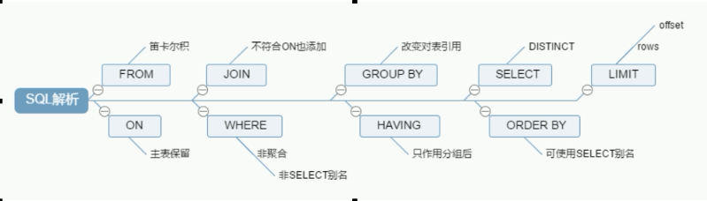

## SQL执行顺序

### 手写

```mysql
SELECT DISTINCT < select_list >
FROM < left_table >
< join_type > JOIN < right_table > 
ON < join_condition >
WHERE < where_condition >
GROUP BY < group_by_list >
HAVING < having_condition >
ORDER BY < order_by_condition >
LIMIT < limit_number >
```

### 机读

```mysql
FROM < left_table >
ON < join_condition >				# star
< join_type > JOIN < right_table >
WHERE < where_condition >
GROUP BY < group_by_list >
HAVING < having_condition >
SELECT 								# star
DISTINCT < select_list >			# star
ORDER BY < order_by_condition >
LIMIT < limit_number >
```

### 总结



## join图


