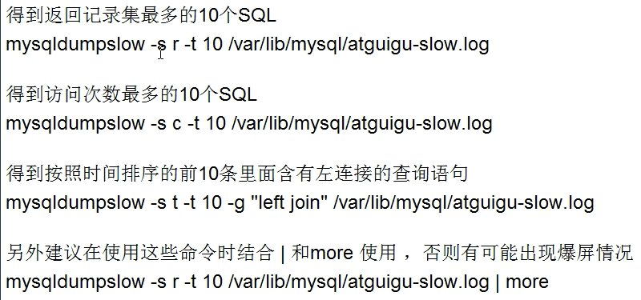
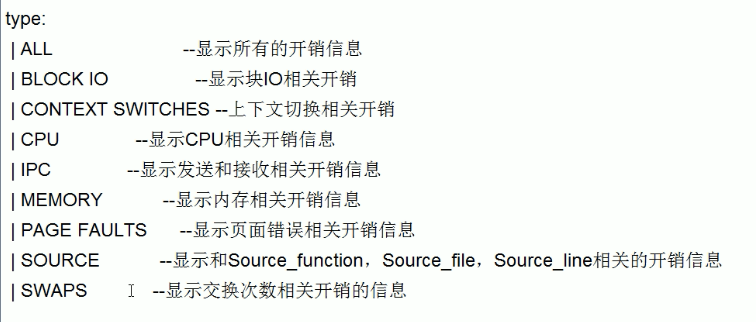

## 步骤总结

1. 观察，至少跑1天，看生产的慢sql情况
2. 开启慢查询，设置阈值，比如超过5s的就是慢sql，将其抓取
3. explain + 慢sql分析
4. show profile

或

1. 慢查询的开启并捕获
2. explain+慢sql分析
3. show profile 查询sql在mysql服务器里面的执行细节和生命周期情况
4. sql数据库服务器的参数调优（运维）

## 慢查询

慢查询日志是MySQL提供的一种日志记录，它用来记录在MySQL中响应时间查过阈值的语句，具体指运行时间超过long_query_time值的sql会被记录到慢查询日志中

long_query_time默认为10，意思是运行10秒以上的语句

由他来查看哪些sql超过了我们的最大忍耐时间，之后结合explain进行分析。

### 开启与设置

默认情况下Mysql不开启慢查询日志

通过`SHOW VARIABLES LIKE '%slow_query_log%'`查看

通过`set global slow_query_log=1;`开启

通过`set global slow_query_log=0;`关闭

通过`set global long_query_time=3;`设置慢查询阈值3s（也可以通过修改my.cnf）【**需要重新连接或新开一个回话才能看到修改值**】

### 记录

超过阈值（可以相等）的sql查询都存于`var/lib/mysql/hostname-slow.log`

可以通过`show global status like '%slow_queries%';`查看目前有多少慢查询被记录

使用mysqldumpslow分析

在生产环境中可能有大量的sql，手工分析较为困难。mysql提供了日志分析工具**mysqldumpslow**。

#### 常用option

- -s：order的顺序
  - c：访问次数，即计数
  - l：锁定时间
  - r：返回记录
  - t：查询时间
  - al：平均锁定时间
  - ar：平均返回记录数
  - at：平均查询时间
    - 如按出现次数排序可以-s c
    - 如按消耗时间排序可以-s t
- -t：返回前面多少条的记录
- -g：后面搭配一个正则表达式

## show profile

它是mysql提供可以用来分析当前会话中语句执行的资源消耗情况。

可以用于sql的调优测量。

默认状况下参数出于关闭状态，并保存15次运行结果

#### 步骤

1. 开启 `set profiling = on;`
2. 运行sql，show profile会自动记录
3. 输入`show profiles`查看结果
4. `show profile [cpu, block io] for query Num;`进行诊断,Num由show profiles显示，得到对应query的完整生命周期和每步时间,可选参数如下
   
5. 分析问题
   - converting HEAP to MyISAM查询结果太大，内存都不够用了使用了磁盘
   - Creating tmp table 使用了临时表（拷贝数据到临时表，用完再删除）
   - Copying to tmp table on disk把内存临时表复制到了磁盘，危险行为！
   - locked

## 全局查询日志

只用于测试，不能用于生产，他会将所有的sql记录下来

`set global general_log = 1;`  开启

`set global log_output='TABLE';`记录在表里

`select * from mysql.general_log;`查看