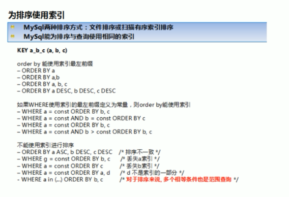

## 小表驱动大表

永远使用**小表驱动大表**，即小的数据集驱动大的数据集

类似嵌套循环Nested Loop

类似

```matlab
for i = 1:5
	for j = 1:1000
	.......
	end
end
```


例如查询出现在b表的a表成员信息

#### a数据量大于b数据量

```mysql
SELECT *
FROM a
WHERE a.id in(
	SELECT id
    FROM b
);
#相当于
for a.id in a
	for b.id in b
		if(a.id == b.id)
			get(a.id)
		end
	end
end

```

#### a数据量小于b数据量

```mysql
SELECT *
FROM a
WHERE EXISTS(
	SELECT true
    FROM b
    WHERE b.id = a.id
);
#相当于
for b.id in b
	for a.id in a
		if(a.id == b.id)
			get(a.id)
		end
	end
end

```

#### exists

1. EXISTS(subquery)只返回TRUE或者FALSE，因此子查询中的SELECT * 也可以是SELECT 1或者SELECT 'X'，官方说法是实际执行时会忽略SELECT清单，因此没有区别。
2. EXISTS子查询的实际执行过程可能经过了优化而不是我们理解上的逐条对比，如果担忧效率问题，可进行实际校验。
3.  EXISTS子查询旺旺可以用条件表达式，其他子查询或者JOIN来替代，何种最优需要具体问题具体分析。

#### 总结

in后面跟的是小表，exists后面跟的是大表。

简记：**in小，exists大**  。

对于exists

`select .....from table where exists(subquery);`

可以理解为：*将主查询的数据放入子查询中做条件验证，根据验证结果（true或false）来决定主查询的数据是否得以保留。*

 

## 排序（order by）优化

### 尽可能避免fileSort

尽可能在索引列上完成排序操作，遵照索引建的最佳左前缀 

尽量使用index方式进行排序，避免使用FileSort  

`ORDER BY`满足两情况会使用Index方式排序：

- ORDER BY语句使用索引最左前列
- 使用WHERE子句与ORDER BY子句条件列组合满足索引最左前列
  - 对于index(a, b, c)，`where a = 1 and b > 2 order by b, c`也触发！


### 如果不在索引列上。filesort有两种

当query的字段大小总和小于max_length_for_sort_data而排序字段不是TEXT|BLOB类型时，会使用单路排序，否则双路排序

#### 双路排序

MYSQL4.1之前用双路排序，两次扫描磁盘才最终得到数据。

1. 读取行指针和orderby列，对他们进行排序
2. 然后扫描已经排序号的列表，按照列表的值重新从列表中读取对应的数据输出

即从磁盘取排序字段到buffer，再在buffer进行排序，再按序取其他字段。

#### 单路排序

从磁盘读取查询需要的所有列，按照order by列在buffer对它们进行排序，然后扫描排序后的列表进行输出。

它的效率更快，避免了第二次读取数据，并且把随机IO变成了顺序IO

但这种方法会使用更多空间，因为她把每一行都保存在内存中了，**如果总大小超过了sort_buffer大小，则会进行对路并归排序，导致多次IO**


### 优化策略

- 增大sort_buffer_size参数
- 增大max_length_for_sort_data


### 总结

- order by时select *是大忌，应只是用query需要的字段
- 尝试提高sort_buffer_size参数和max_length_for_sort_data，尝试提高排序效率


### 例题




## group by优化

- groupby实质是先排序后进行分组，遵照索引建的最佳左前缀
- 当无法使用索引列，增大max_length_for_sort_data参数的设置+增大sort_buffer_size参数的设置
- where高于having,能写在where限定的条件就不要去having限定了。