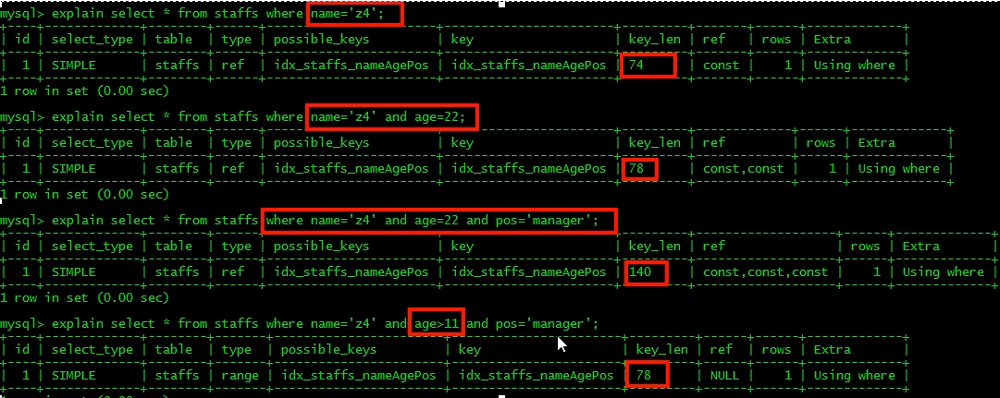
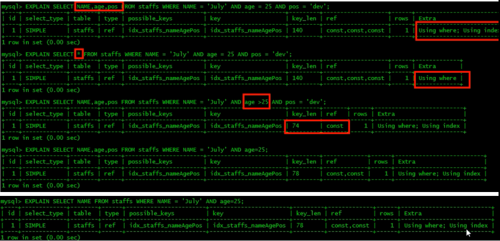

## 索引失效

### 最左前缀匹配

如果索引了多列，要遵守最左前缀匹配，指查询从索引的最左前列开始并不跳过索引中的列。

对于联合索引的多个索引段，会与查询语句中where**从左自右**一对一的进行匹配，**当匹配不上或遇到范围查询**（>、<、between、like）就停止匹配时**则停止匹配**。范围搜索会进行匹配。

它代表着首先必须**用到索引的第一个字段才会触发索引**。

mysql查询优化器会判断纠正语句该以什么样的顺序执行效率最高，故实际上**and前后是可以乱序**的，**优化器会尽可能保证匹配的索引更多**。

如创建复合(a,b,c,d)，搜索条件是`b = 1 AND d = 2 AND a = 3 AND e = 4 AND c < 5`时，优化器首先会将顺序根据索引范围优化为`a = 3 AND b = 1 AND c < 5 AND d = 2 AND e = 4`，然后仅仅使用(a,b,c)进行索引。

**b+树的数据项（key）是*复合*的数据结构**，比如(name,age,sex)的时候，**b+数是按照从左到右的顺序来建立搜索树的**，比如当(张三,20,F)这样的数据来检索的时候，b+树会优先比较name来确定下一步的所搜方向，如果name相同再依次比较age和sex，最后得到检索的数据；但当(20,F)这样的没有name的数据来的时候，b+树就不知道下一步该查哪个节点，因为建立搜索树的时候name就是第一个比较因子，必须要先根据name来搜索才能知道下一步去哪里查询。比如当(张三,F)这样的数据来检索时，b+树可以用name来指定搜索方向，但下一个字段age的缺失，所以只能把名字等于张三的数据都找到，然后再匹配性别是F的数据了， 这个是非常重要的性质，即索引的最左匹配特性。

### 不在索引列上做任何操作

在索引列上的任何操作（如计算、函数、（自动or手动）类型转换），都会导致索引失效而转向全表扫描

例如

`SELECT * FROM staffs WHERE left(name, 4) = 'July'`

### 索引不能使用查询中范围条件右边的列

这点已经在最左前缀匹配中说过。

对于联合索引的多个索引段，会与查询语句中where**从左自右**一对一的进行匹配，**当匹配不上或遇到范围查询**（>、<、between、like）就停止匹配时**则停止匹配**。*范围搜索会进行匹配。*

### 尽量使用覆盖索引，少select *

尽量使用覆盖索引，即只访问索引的查询，索引列与查询列（列顺序按查询顺序排列）一致，即使仅仅使用一部分索引列也可以触发。

**这时候extra会显示`Using index`**

### 使用不等于(!=或<>)会无法使用索引，仅全表扫描

### 使用is null和is not null也会无法使用索引

建议以后不要使用空值，如果可以的话用-1等特殊值代替

### like用通配符开头会导致索引失效

`SELECT * FROM staffs WHERE name LIKE '%July'`会全表扫描

`SELECT * FROM staffs WHERE name LIKE 'July%'`会范围扫描（range）

如果一定要使用类似 LIKE '%July%'，可以使用**覆盖索引**避免全表扫描变成index扫描。这时LIKE作为一个范围

### 字符串不加单引号 索引失效  

因为不加字符串会进行类型的强制转换，相当于加了个函数