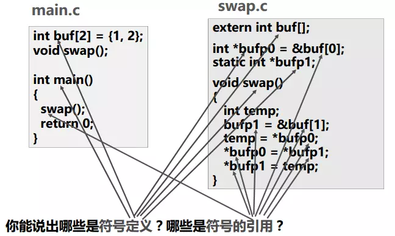
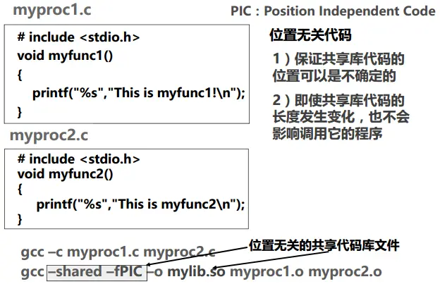
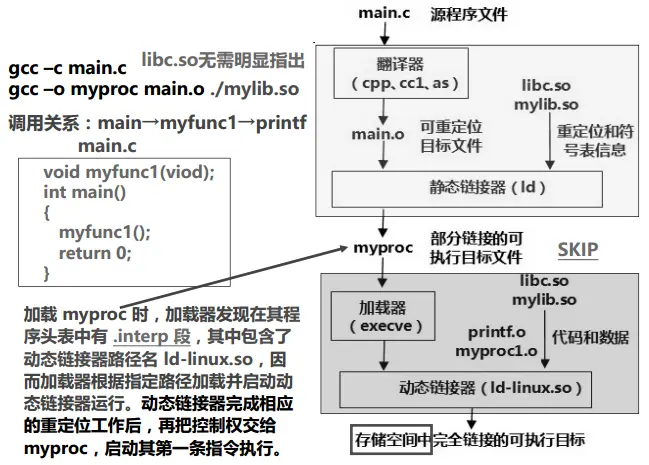

## 可执行文件的生成


### 预处理 gcc -E

- 删除 #define 并展开宏定义
- 处理所有的条件预编译指令，如 "#if"，"#ifdef"，"#endif"等
- 插入头文件到 "#include" 处，可以递归方式进行处理
- 删除所有的注释
- 添加行号和文件名标识，以便编译时编译器产生调试用的行号信息
- 保留所有 #pragma 编译指令（编译器需要用）

经过预编译处理后，得到的是预处理文件（如，hello.i），它还是一个可读的文本文件，但不包含任何宏定义。

### 编译 gcc -S

编译过程就是将预处理后得到的预处理文件（如hello.i）进行词法分析、语法分析、语义分析、优化后，生成**汇编代码文件**。
经过编译后，得到的汇编代码文件（如，hello.S）还是一个可读的文本文件。


### 汇编 gcc -c

汇编器将编译得到的汇编代码文件转换成**机器指令**序列。
汇编的结果是一个可重定位目标文件（如，hello.o）其中包含的是不可读的二进制代码。


### 链接

链接过程将多个可重定位目标文件合并以生成可执行目标文件。主要任务是符号解析和 重定位。

## ELF

<https://www.jianshu.com/p/a90a3015b1e5>


## 符号与符号表



注意：局部变量temp分配在栈中，不会在函数外部被引用，因此不是符号定义。

### 符号表

每个可重定位文件和可执行文件都有三个符号表

#### Global symbols

模块内部定义的全局符号：由模块m定义并能被其他模块引用的符号，包含非static函数和非static全局变量

#### External symbols

外部定义的全局符号：由其他模块定义并被模块m引用的全局符号，即在其他文件中的函数或变量声明时加了extern

#### Local symbols

本模块的局部符号：仅由模块m定义和引用的本地符号，在模块m中定义的带static函数和static全局变量


### 符号定义

指被分配了存储空间。如果是函数名则指代码所在区；如果是变量名则指其所在的静态数据区。

所有定义的符号的值就是其目标所在的首地址。

**符号的解析**就是将符号引用和符号定义建立关联后，将符号引用的地址重定位为相关联的符号定义的地址。


## 静态链接

静态链接器以一组**可重定位目标文件**（又汇编器获得）和命令行参数为输入，生成一个**可执行目标文件**。

可执行目标文件包含的代码和数据可以被直接复制到内存并执行，代码和数据的地址是虚拟地址空间中的地址。

而可重定位目标文件中的地址是从0开始的。

链接器主要有两个任务：

- **<font color=red>符号解析</font>** ：在目标文件中定义和引用符号，目的是将每个**符号引用**（对函数的调用和变量的使用）正好与一个**符号定义**（在符号表记录的一个地址，如果是函数名则指代码所在区，如果是变量名则指其所在的静态数据区；局部变量分配在栈中，不会在函数外部被引用，因此不是符号定义）**关联**起来。
- **<font color=red>重定位</font>**    ：把多个文件的代码段和数据段合并，把每个**符号定义与一个虚拟地址的内存位置关联**起来，修改所有对该符号的引用（在符号表）使得他们指向该内存位置。


### 符号解析

符号解析过程使用了三个集合，分别是

- E：将被合并以组成可执行文件的所有目标文件集合；
- U：当前所有未解析的引用符号的集合
- D：当前所有定义的符号的集合

解析过程如下：

- 按照命令行给出的顺序扫描.o和.a文件
- 扫描期间对于每个文件将当前未解析的符号引用记录到U中，将文件加入E
- 每遇到一个新的.o或.a中的模块，都试图用其来解析U中的符号，匹配到U中的符号则移至D
- 如果扫描到最后，U中还有未被解析的符号，则发生错误
   避免该问题的方法就是将静态库放在编译命令的最后。

### 重定位


1. 合并相同的节
2. 对符号定义进行重定位（确定其在虚拟地址空间的地址）
3. 对符号引用进行重定位（填入对应符号定义的地址），修改.text节和.data节中对每个符号的引用（地址），需要用到 .rel.text 和 .rel.data节中保存的重定位信息


## 动态链接

动态链接可以按以下两种方式进行：

1. 在第一次加载并运行时（load-time linking）：由动态链接器（ld-linux.so）自动处理
2. 在程序已经开始运行后进行（run-time linking）：通过调用dlopen()等接口来实现


### 加载时动态链接






##### 运行时动态链接

```c
#include <stdio.h>
#include <dlfcn.h>

int main()
{
    void *handle;
    void (*myfunc1)();
    char *error;
    /* 动态装入包含函数myfunc1()的共享库文件 */
    handle = dlopen("./mylib.so", RTLD_LAZY);
    if (!handle) {
        fprintf(stderr, "%s\n", dlerror());
        exit(1);
    }
    /* 获得一个指向函数myfunc1()的指针myfunc1*/
    myfunc1 = dlsym(handle, "myfunc1");
    if ((error = dlerror()) != NULL) {
        fprintf(stderr, "%s\n", error);
        exit(1);
    }
    /* 现在可以像调用其他函数一样调用函数myfunc1() */
    myfunc1();
    /* 关闭（卸载）共享库文件 */
    if (dlclose(handle) < 0) {
        fprintf(stderr, "%s\n", dlerror());
        exit(1);
    }
    return 0;
}
```

上面提到位置无关代码（**PIC**，全称：Position-Independent Code），这是动态链接中一个重要的概念.


### 动态链接文件的符号地址定位（没太看懂）

#### 变量


#### 函数